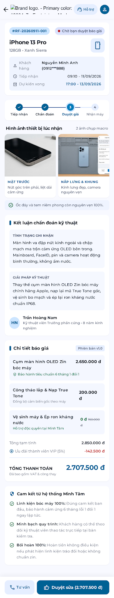

# RepairFlow

RepairFlow is a workflow management system for personal device repair shops and independent technicians. This README is the review entry point: it explains the product first, then records what has actually been implemented and how it was verified.

## Part 1 — Product overview

### Product goal

RepairFlow manages a repair order from device intake through diagnosis, quotation, customer approval, repair, quality control, handover, and warranty.

The product creates a clear evidence trail for four questions:

1. What condition was the device in when it was received?
2. What did the technician diagnose and propose?
3. Which quotation version did the customer approve?
4. What work, quality checks, handover details, and warranty were recorded?

RepairFlow does not diagnose faults automatically or decide prices automatically. The technician remains responsible for the diagnosis, repair plan, parts, labor, and estimated completion time. The system records, explains, approves, and preserves those decisions.

### Problem being solved

Small repair businesses often rely on paper notes, chat messages, phone calls, or memory. This creates several risks:

- Disagreement about the device condition before repair.
- Unclear status and next action for customers and staff.
- Quotations that do not clearly explain parts, labor, or replacement reasons.
- Missing repair history by customer or device.
- Lost handover details and warranty information.

### Main product flow

```text
Intake
  → Record condition and photos
  → Diagnose
  → Create quotation
  → Customer approves or rejects through a customer link
  → Perform repair
  → Quality check
  → Handover
  → Activate warranty
```

### Main users

| User | Main purpose |
| --- | --- |
| Receptionist / Front Desk | Business responsibility for creating orders, recording customer/device details, intake condition, accessories, photos, and handover; no separate login in MVP. |
| Technician | Business responsibility for diagnosis, quotations, repair work, checklists, and quality checks; represented by a staff profile, not a separate login in MVP. |
| Manager / Owner | Login through the management session, monitor the dashboard, assign staff, handle overdue orders, and review history/audit data. |
| Customer | Open a link without an account, review the diagnosis and quotation, and approve or reject the proposal. |

### MVP access model

Only Owner/Manager can log in and call the internal management API. Receptionist and Technician remain operational staff profiles used for assignment and audit attribution; they do not receive passwords, credentials, or sessions in the MVP. Customers use an expiring/revocable public link token and do not create an account.

### MVP scope

The MVP focuses on one workspace or repair shop and one complete repair scenario:

- Customer, device, and repair order management.
- Intake checklist, accessories, and before-repair evidence.
- Diagnosis and versioned quotations.
- Time-limited customer links and customer approval/rejection.
- Repair checklist, quality check, handover, and warranty.
- Timeline, audit trail, and customer/device history.

The MVP does not include inventory, payment/accounting, AI diagnosis, automatic price recommendations, multi-branch management, or long-lived customer accounts.

---

## Part 2 — Current implementation status

### 2.1. Đã hoàn thành

| Hạng mục | Tiến độ hiện tại |
| --- | --- |
| Runtime server | FastAPI + Uvicorn foundation tại `src/app/` |
| Database | PostgreSQL `18-alpine` chạy bằng Docker Compose |
| Migration | 6 migration versioned bằng SQL tại `src/db/migrations/versions/` |
| Schema baseline | 20 bảng được tạo theo migration hiện tại |
| Migration rerun | Idempotent; chạy lại không tạo bản ghi migration/trùng bảng |
| Health endpoint | `GET /health` trả HTTP 200 |
| Test baseline | 4 test hiện có đều pass khi chạy đúng `PYTHONPATH` |
| UI baseline | Prototype và mock flow hiện có được giữ làm baseline |
| Access direction | Owner/Manager đăng nhập; Customer, Receptionist, Technician không có tài khoản riêng |

### 2.2. Đang bị chặn

| Mức | Blocker | Ảnh hưởng |
| --- | --- | --- |
| P0 | Gate D0 chưa đạt; decision backlog còn 44 P0 và 29 P1 | Chưa được tự chốt business rule để build toàn bộ flow |
| P0 | API contract chưa freeze | Server/UI chỉ dùng working fixture và semantics đã được chốt; chưa tích hợp theo contract chính thức |
| P0 | Business API chưa có | Chưa có login/session, customer/device/order, quote, public decision, repair, QC, handover và warranty endpoint |
| P0 | UI chưa nối server thật | Dashboard, detail và customer flow vẫn còn phụ thuộc mock |
| P1 | Shared fixture và seed demo chưa hoàn thiện | Chưa thể kiểm thử end-to-end nhất quán giữa Codex và Antigravity |
| P1 | Deployment ngoài local chưa thuộc v0 | Chưa có release, staging/production status hoặc runbook |

### 2.3. Gate tiếp theo

Hiện tại chỉ nên hoàn thiện C0: fixture dùng chung, UI adapter boundary và test
harness. Chỉ mở C1 sau khi Product chốt các decision P0 trong
[`docs/v0/requirements-closure.md`](docs/v0/requirements-closure.md) và Gate D0
đạt. Sau đó triển khai từng cặp server/UI theo
[`plans/000-repairflow-v1-implementation.md`](plans/000-repairflow-v1-implementation.md).

## 3. Implemented changes

### 3.1. PostgreSQL 18

Docker Compose uses:

    image: postgres:18-alpine

The PostgreSQL 18 volume is mounted at:

    /var/lib/postgresql

Configuration file: [docker-compose.yml](docker-compose.yml)

### 3.2. SQL migrations

The current schema source of truth is the following directory:

[src/db/migrations/versions](src/db/migrations/versions)

| Version | Responsibility |
| --- | --- |
| `0001_identity.sql` | Workspaces, users, and memberships |
| `0002_customers_devices_orders.sql` | Customers, devices, and repair orders |
| `0003_evidence_diagnosis_quotes.sql` | Evidence, diagnosis, quotations, and quotation items |
| `0004_public_links_decisions.sql` | Customer links and customer decisions |
| `0005_execution_handover.sql` | Work logs, checklists, handover, and warranty |
| `0006_status_audit_indexes.sql` | Status history, audit logs, constraints, and indexes |

The Python migration runner only discovers and executes these SQL files. It records applied versions in `schema_migrations`, uses an advisory lock, and skips versions that have already been applied.

Migration runner: [src/db/migrate.py](src/db/migrate.py)

### 3.3. FastAPI health endpoint

The current API source is in [src/app](src/app).

Current endpoint:

    GET /health

Expected success envelope:

    {
      "data": {
        "status": "ok",
        "service": "repairflow-api",
        "apiVersion": "v1"
      },
      "meta": {
        "requestId": "req_<uuid>"
      }
    }

## 4. Run and verification instructions

### 4.1. Install Python dependencies

    python -m venv .venv

    # PowerShell
    .venv\\Scripts\\Activate.ps1

    pip install -r requirements-dev.txt

Do not commit `.env` or real passwords. Use [.env.example](.env.example) for local configuration.

### 4.2. Start PostgreSQL

    docker compose up -d db
    docker compose ps

The database is ready when the container reports `healthy`.

### 4.3. Run migrations

    python -m src.db.migrate

The first run applies the six SQL migrations. A later run must report that the database is already up to date and must not create duplicate migration records.

### 4.4. Start the API

    python -m src.app

The API runs at `http://127.0.0.1:8000` by default.

Verify the health endpoint at:

    GET http://127.0.0.1:8000/health

### 4.5. Run tests

PowerShell trong môi trường hiện tại:

    $env:PYTHONPATH = (Get-Location).Path
    pytest

Verified result:

    4 passed

Current test coverage:

- [tests/test_health.py](tests/test_health.py): health response, request ID, and error envelope.
- [tests/test_migrations.py](tests/test_migrations.py): migration ordering and PostgreSQL DDL checks.

## 5. Review documentation

| Order | Document | Review purpose |
| ---: | --- | --- |
| 1 | [docs/README.md](docs/README.md) | Quy tắc để LLM đọc/viết tài liệu đúng phase và đúng phạm vi. |
| 2 | [docs/v0/README.md](docs/v0/README.md) | Mục lục và quy tắc tài liệu của phase v0. |
| 3 | [docs/v0/requirements-closure.md](docs/v0/requirements-closure.md) | Các điểm nghiệp vụ/cơ chế còn mở, scenario và Gate D0. |
| 4 | [docs/v0/usecase.md](docs/v0/usecase.md) | User story, actor, main flow, alternative flow và acceptance criteria. |
| 5 | [docs/v0/architecture-and-requirements.md](docs/v0/architecture-and-requirements.md) | Kiến trúc, role, state machine, security và audit rule. |
| 6 | [docs/v0/database-requirements.md](docs/v0/database-requirements.md) | ERD, bảng, constraint, index và transaction rule. |
| 7 | [docs/v0/ui-requirements.md](docs/v0/ui-requirements.md) | UI flow, màn hình, trạng thái và acceptance criteria. |
| 8 | [plans/000-repairflow-v1-implementation.md](plans/000-repairflow-v1-implementation.md) | Plan triển khai v1 theo cluster, chỉ dùng khi Product đã yêu cầu. |
| 9 | [plans/002-api-server-codex.md](plans/002-api-server-codex.md) | Task packet triển khai server cho Codex. |
| 10 | [plans/003-ui-antigravity.md](plans/003-ui-antigravity.md) | Task packet triển khai UI cho Antigravity. |

## 6. Repository structure

```text
.
├── README.md
├── docker-compose.yml
├── requirements.txt
├── requirements-dev.txt
├── src/
│   ├── app/                         # FastAPI application
│   └── db/
│       ├── database.py              # SQLAlchemy engine and session
│       ├── migrate.py               # SQL migration runner
│       └── migrations/versions/     # Six versioned SQL migrations
├── tests/                           # pytest tests
├── docs/
│   └── v0/                          # Tài liệu thảo luận/chốt của phase hiện tại
├── plans/                           # Chỉ chứa LLM implementation tasks khi được yêu cầu
├── server/                          # Previous scaffold; not the current FastAPI entrypoint
├── src/ui/                          # UI prototype and mock data
└── assets/                          # Product and prototype assets
```

The current FastAPI entrypoint is [src/app/__main__.py](src/app/__main__.py). The `server/` directory is not the active FastAPI entrypoint.

## 7. Evidence images

These images are embedded directly for product and UI review:

### Product scope


### Internal UI screen 1


### Internal UI screen 2


### Customer approval screen



The images represent the UI prototype. PostgreSQL, migration, test, and FastAPI results are verified by the commands and test output described in Section 4.

## 8. Chưa triển khai trong local MVP

Các phần sau chưa nằm trong baseline local hiện tại:

- Owner/Manager authentication and management session management.
- Workspace isolation and API-enforced management permissions.
- Customer, device, and repair-order endpoints.
- Diagnosis, quotation versioning, and customer approval APIs.
- Repair work logs, quality checks, handover, and warranty APIs.
- UI integration with the real API instead of mock data.
- Deployment ngoài local, backup/restore và monitoring; các nội dung này để phase sau.

## 9. Current review checklist

- [x] PostgreSQL `18-alpine` starts healthy.
- [x] Volume mount uses `/var/lib/postgresql`.
- [x] Six versioned SQL migrations are present.
- [x] Twenty tables are created successfully.
- [x] Rerunning the migration runner does not create duplicates.
- [x] `pytest` passes four tests.
- [x] FastAPI `/health` returns HTTP 200.
- [ ] Gate D0 requirements closure is complete.
- [ ] Business API and Owner/Manager authentication are complete.
- [ ] UI is connected to the real API.
- [ ] Deployment ngoài local chưa thuộc phạm vi v0.
