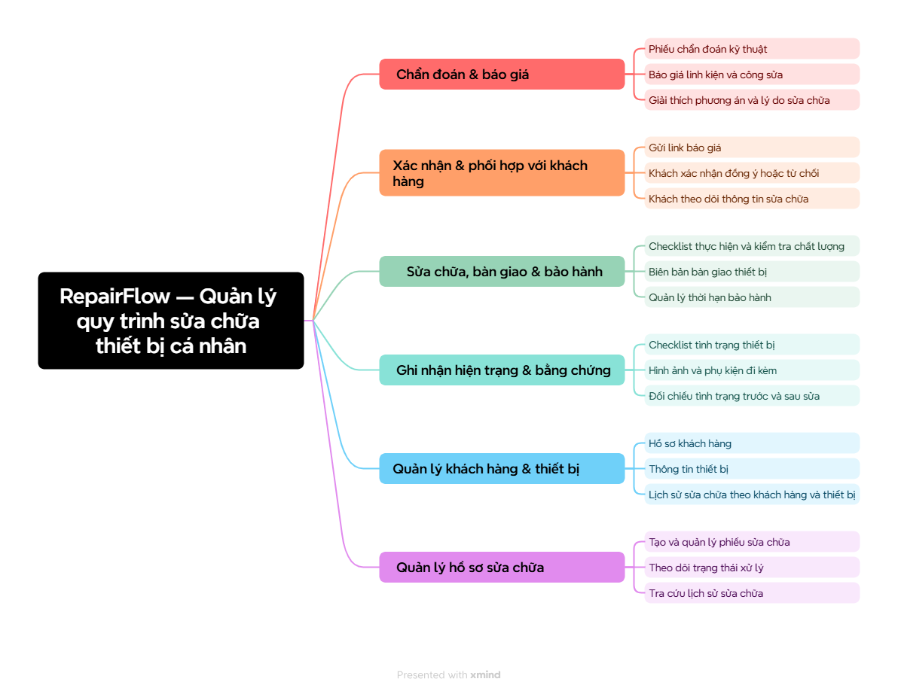
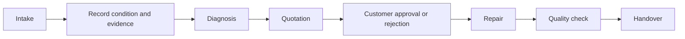

# RepairFlow

> Evidence-first repair operations for personal device repair shops.

RepairFlow manages a repair order from device intake through diagnosis, quotation, customer approval, repair, quality control, and handover. It keeps the evidence trail behind each operational decision visible and reviewable. Warranty is intentionally deferred to a later module.

[Product workflow](#product-workflow) · [Run RepairFlow yourself](#run-repairflow-yourself) · [v0 documentation](docs/v0/README.md)

## Overview

### Product goal

RepairFlow helps personal device repair shops and independent technicians manage the complete repair lifecycle in one place.

The product preserves an evidence trail for four questions:

1. What condition was the device in when it was received?
2. What did the technician diagnose and propose?
3. Which quotation version did the customer approve?
4. What work, quality checks, and handover details were recorded?

RepairFlow records and explains operational decisions. It does not diagnose faults automatically or decide prices automatically.

### Users and access

| User | Responsibility in the MVP |
| --- | --- |
| Owner / Manager | Monitors operations, assigns staff, handles overdue orders, and reviews history and audit data. |
| Receptionist / Front Desk | Can receive an optional account with read-only operational lookup across workspace orders and write access to assigned intake/handover work; without an account, remains a staff profile. |
| Technician | Can receive an optional account with fixed access to assigned diagnosis, repair, and quality-check work; without an account, remains a staff profile. |
| Customer | Opens a 7-day, expiring or revocable public link. OTP is required before viewing, approving, or rejecting a quotation. No account. The same protected link is used for handover or return confirmation. |

## Product workflow





## Key features

### **Evidence-first intake**

Record the device condition, accessories, photos, and other evidence before repair begins.

### **Versioned quotations**

Keep quotation history and identify exactly which quotation version the customer approved.

### **Public customer approval**

Let customers review, approve, or reject a quotation through a 7-day, revocable public link protected by OTP.

### **Repair and quality control**

Track repair work, checklists, rework, quality checks, and handover information.

### **Controlled cancellation and return**

Allow cancellation with a required reason before repair starts. A cancellation
request during repair requires confirmation from the responsible Technician or
an Owner exception. An unrepairable device follows the return flow. Cancelled
orders are terminal and are never reopened.

### **Timeline and audit history**

Keep the customer, device, repair order, and operational history connected through a traceable timeline.

## MVP scope

### In scope

- Customer, device, and repair order management.
- Intake checklist, accessories, and before-repair evidence.
- Diagnosis and versioned quotations.
- Versioned quotations with immutable history and customer approval or rejection.
- OTP-protected, time-limited customer links for viewing, decisions, handover,
  and return confirmation.
- Repair checklist, quality check, and handover.
- Role, workspace, and assignment-based staff access.
- Cancellation with reason, controlled return, and unrepairable-device flow.
- Timeline, audit trail, and customer or device history.

### Out of scope for v0

Inventory, payment and accounting, AI diagnosis, automatic price recommendations, multi-branch management, long-lived customer accounts, and warranty/claims. Warranty is deferred to a later module.

## v0 decisions recorded

The following baseline decisions are recorded in the active v0 documentation:

- Customer links expire after 7 days and require OTP before any data or action
  is available. OTP uses 6 digits, expires after 5 minutes, allows 5 failed
  attempts, and can be resent after 60 seconds up to 3 times per 15 minutes.
- Staff sessions use a 30-minute idle timeout and an 8-hour absolute expiry.
  MFA is deferred from MVP.
- Quote changes create a new immutable version on the same repair order; old
  versions and decisions remain in history.
- No automatic hard deletion of repair, evidence, signature, or audit data in
  MVP. Database backup is daily with 14 retained copies and restore testing is
  required before real use.
- Deployment and monitoring are temporarily deferred and are not part of the
  current MVP implementation scope.

Detailed rules and diagrams remain in the [v0 documentation](docs/v0/README.md),
especially the [business requirements](docs/v0/03-business-and-domain-requirements.md),
[architecture](docs/v0/04-architecture-c4-arc42.md), and
[authentication and authorization](docs/v0/07-authentication-and-authorization.md).

## Target technology direction

- **Backend/API bắt buộc**: ASP.NET Core Web API trên .NET, triển khai dạng
  modular monolith. Đây là boundary duy nhất cho authentication, permission,
  workflow, business rules, transaction và response contract.
- **Web UI**: React + Vite + TypeScript cho Internal Web UI và Customer Link
  UI. Vite chỉ là công cụ dev/build; frontend production là static assets,
  không phải business API của RepairFlow.
- **Database**: PostgreSQL; data access target là EF Core + Npgsql và schema
  migration vẫn phải có version.
- **Frontend/API boundary**: UI gọi ASP.NET Core API qua adapter; React chỉ
  render giao diện và không chứa business rule.

Baseline v0 chọn React + Vite vì RepairFlow là dashboard/operational web app,
không cần SEO hoặc server-side rendering. Build frontend có thể được phục vụ
bởi ASP.NET Core hoặc static hosting/CDN; yêu cầu .NET là backend bắt buộc vẫn
giữ nguyên.

## Current project status

**Last reviewed:** 2026-09-16<br>
**Current phase:** `v0 — Implementation`<br>
**Overall status:** `READY — Gate D0 is closed`<br>
**Current implementation gate:** `C0 — Rebuild target runtime and UI foundation`

### Delivery status

| Area | Status | Evidence | Next action | Owner |
| --- | --- | --- | --- | --- |
| Requirements baseline | `READY — D0 CLOSED` | [v0 requirements](docs/v0/README.md) | Use the closed baseline to implement by cluster. | Product / Engineering |
| Architecture diagrams | `DECIDED — BASELINE CLOSED` | [C4 + Mermaid architecture](docs/v0/04-architecture-c4-arc42.md) | Keep diagrams aligned with implementation changes. | Product / Engineering |
| Runtime foundation | `RESET — NOT STARTED` | [C0 migration plans](plans/v0/c0-runtime-stack-migration) | Rebuild the backend with ASP.NET Core/.NET and recreate the target test/migration baseline. | Engineering |
| Business API | `NOT STARTED` | [v0 documentation](docs/v0/README.md) | Start implementation from C1 and continue by cluster. | Engineering |
| UI integration | `REFERENCE BASELINE` | [UI source](src/ui) | Keep the existing UI as reference while rebuilding the target React/Vite app. | UI |
| English standardization | `IN PROGRESS` | Repository documentation and UI source | Complete the language pass and run the language audit. | Engineering |
| Deployment and monitoring | `DEFERRED` | v0 scope | Define in a later phase. | Product / Engineering |

### Verified baseline

- The previous Python/FastAPI backend, Python tests and prototype migration
  files were intentionally removed to restart implementation on the target stack.
- PostgreSQL `18-alpine` remains available through Docker Compose.
- The existing UI is retained as a functional/visual reference backed by mock
  data; it is not the target React runtime yet.
- The target ASP.NET Core/.NET + React/Vite stack is documented, but C0 must
  recreate the runtime, migration boundary, API contract and test baseline.

### Implementation gaps

1. C0 target runtime, versioned migration runner and backend test harness still need to be created.
2. The dashboard, order detail, and customer link still depend on mock data until the UI adapter is connected to the business API.
3. Business endpoints and management/staff authentication still need to be implemented after C0.

These are implementation tasks after D0 closure, not requirements-gate blockers. The closure record is maintained in [01-requirements-closure.md](docs/v0/01-requirements-closure.md).

### Cluster view

| Cluster | Business capability | Status |
| --- | --- | --- |
| C0 | Target runtime, migration runner, adapter boundary, and test harness | `MIGRATION REQUIRED` |
| C1 | Owner/Manager access and application shell | `BLOCKED BY C0` |
| C2 | Customer, device, and order creation | `OPEN FOR IMPLEMENTATION` |
| C3 | Intake checklist and evidence | `OPEN FOR IMPLEMENTATION` |
| C4 | Diagnosis and quotation draft | `OPEN FOR IMPLEMENTATION` |
| C5 | Quotation publishing and customer decision | `OPEN FOR IMPLEMENTATION` |
| C6 | Repair execution | `OPEN FOR IMPLEMENTATION` |
| C7 | Quality control and rework | `OPEN FOR IMPLEMENTATION` |
| C8 | Handover and history | `OPEN FOR IMPLEMENTATION` |
| C9 | Dashboard, filtering, and operational views | `OPEN FOR IMPLEMENTATION` |
| C10 | Local hardening and final verification | `OPEN FOR IMPLEMENTATION` |

## Project documentation

Read the active v0 documents in order. The status below describes the closed v0 baseline; implementation work is tracked separately.

| # | Document | Current status | What it answers |
| --- | --- | --- | --- |
| 01 | [Requirements closure](docs/v0/01-requirements-closure.md) | `DECIDED — Gate D0 closed` | Closure decision and implementation entry criteria. |
| 02 | [Use cases](docs/v0/02-use-cases.md) | `DECIDED — v0 baseline` | Who does what, through which main, alternative, and failure flows. |
| 03 | [Business and domain requirements](docs/v0/03-business-and-domain-requirements.md) | `DECIDED — v0 baseline` | Roles, permissions, states, business rules, security, and domain data. |
| 04 | [Architecture — C4 + arc42](docs/v0/04-architecture-c4-arc42.md) | `DECIDED — v0 baseline` | How the system is shaped and how its parts interact. |
| 05 | [Database requirements](docs/v0/05-database-requirements.md) | `DECIDED — v0 baseline` | Entities, schema, constraints, indexes, OTP, backup, and transaction guidance. |
| 06 | [UI requirements](docs/v0/06-ui-requirements.md) | `DECIDED — v0 baseline` | Screens, UX flows, UI states, and acceptance criteria. |
| 07 | [Authentication and authorization](docs/v0/07-authentication-and-authorization.md) | `DECIDED — scope + technical defaults` | Account scope, role permissions, data visibility, OTP, sessions, and auth boundaries. |
| 08 | [UI design blueprint and Stitch handoff](docs/v0/08-ui-design-blueprint-and-stitch-handoff.md) | `DECIDED — UI direction and handoff baseline` | Visual screen inventory, Stitch prompt workflow, viewport targets, and Antigravity handoff. |

The [documentation guide](docs/README.md) defines the authority of each document and the required decision labels.

## Run RepairFlow yourself

### Prerequisites

- .NET SDK theo target project khi C0 được scaffold.
- Node.js và package manager theo target React/Vite project khi C0 được scaffold.
- Docker Desktop with Docker Compose.

### Current implementation state

Backend/API chưa có runtime active sau khi prototype cũ được xóa. Thực hiện
[c0-001](plans/v0/c0-runtime-stack-migration/c0-001-codex-dotnet-api-foundation.md)
trước khi chạy API; thực hiện [c0-002](plans/v0/c0-runtime-stack-migration/c0-002-antigravity-react-vite-foundation.md)
trước khi chạy UI target.

Use [.env.example](.env.example) for local configuration. Never commit `.env`, real passwords, tokens, or customer data.

### Start PostgreSQL

```powershell
docker compose up -d db
docker compose ps
```

The database is ready when the container reports `healthy`.

### Open the UI reference

Open [`src/ui/index.html`](src/ui/index.html) only as a visual/functional
reference. The React/Vite target is defined in the C0 plans and is not active
until the migration is implemented.

### Run target checks

The .NET build/test and React type-check/build commands will be recorded in the
C0 plan handoff after the target projects are scaffolded.

## Project structure

```text
.
├── README.md                         # Product overview, status, and local quickstart
├── AGENTS.md                         # Repository development rules
├── docker-compose.yml                # Local PostgreSQL runtime
├── src/
│   ├── server/                       # Target ASP.NET Core/.NET API (C0 rebuild)
│   └── ui/                           # React/Vite target; current prototype reference
├── tests/                             # Created with target server/test projects
├── docs/
│   ├── README.md                     # Documentation governance
│   └── v0/                           # Active product requirements for phase v0
│       ├── README.md                 # v0 reading order and document status
│       ├── 01-requirements-closure.md
│       ├── 02-use-cases.md
│       ├── 03-business-and-domain-requirements.md
│       ├── 04-architecture-c4-arc42.md
│       ├── 05-database-requirements.md
│       ├── 06-ui-requirements.md
│       ├── 07-authentication-and-authorization.md
│       ├── 08-ui-design-blueprint-and-stitch-handoff.md
│       └── architecture/             # C4/PlantUML assets; Mermaid is inline in 04
├── plans/                            # LLM implementation plans
├── scripts/                          # Build and development scripts
└── assets/                           # Product and prototype assets
```

The existing `src/ui/app.bundle.js` is a legacy reference artifact. The target
frontend uses Vite; do not treat the legacy bundle as the active UI runtime.

## Verification checklist

- [x] Gate D0 requirements closure is complete.
- [x] Target ASP.NET Core/.NET + React/Vite technology baseline is documented.
- [x] Legacy backend/test prototype is removed for a clean implementation reset.
- [x] Existing UI is retained as a reference.
- [ ] ASP.NET Core/.NET runtime and `/health` contract are implemented.
- [ ] Target versioned migration runner is implemented and verified.
- [ ] React/Vite/TypeScript app and API adapter are implemented.
- [ ] Target backend and UI test/build baseline passes.
- [x] Core workflow, access, OTP, retention, backup, and cancellation decisions are recorded in v0 documentation.
- [x] Core class and sequence diagrams are embedded as Mermaid blocks in the architecture Markdown.
- [ ] Business API and Owner/Manager authentication are complete.
- [ ] UI is connected to the real API.
- [ ] English standardization audit is complete.
- [ ] Deployment and monitoring are defined for a later phase.
