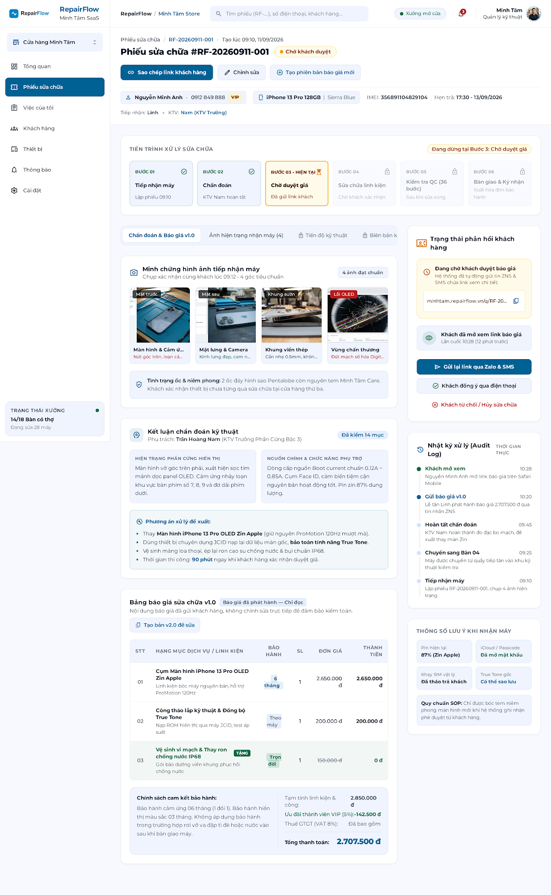
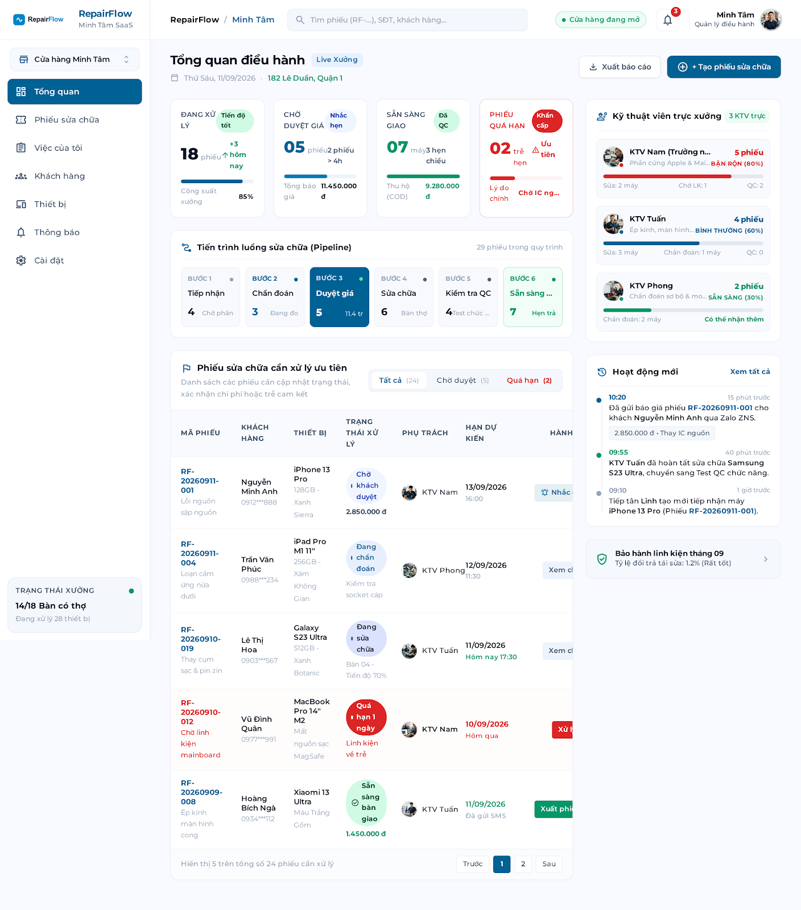

# RepairFlow

RepairFlow is a workflow management system for personal device repair shops and independent technicians. This README is the review entry point: it explains the product first, then records what has actually been implemented and how it was verified.

## Part 1 — Product overview

### Product goal

RepairFlow manages a repair order from device intake through diagnosis, quotation, customer approval, repair, quality control, handover, and warranty.

The product creates a clear evidence trail for four questions:

1. What condition was the device in when it was received?
2. What did the technician diagnose and propose?
3. Which quotation version did the customer approve?
4. What work, quality checks, handover details, and warranty were recorded?

RepairFlow does not diagnose faults automatically or decide prices automatically. The technician remains responsible for the diagnosis, repair plan, parts, labor, and estimated completion time. The system records, explains, approves, and preserves those decisions.

### Problem being solved

Small repair businesses often rely on paper notes, chat messages, phone calls, or memory. This creates several risks:

- Disagreement about the device condition before repair.
- Unclear status and next action for customers and staff.
- Quotations that do not clearly explain parts, labor, or replacement reasons.
- Missing repair history by customer or device.
- Lost handover details and warranty information.

### Main product flow

```text
Intake
  → Record condition and photos
  → Diagnose
  → Create quotation
  → Customer approves or rejects through a customer link
  → Perform repair
  → Quality check
  → Handover
  → Activate warranty
```

### Main users

| User | Main purpose |
| --- | --- |
| Receptionist / Front Desk | Create orders, record customer/device details, intake condition, accessories, photos, and handover. |
| Technician | Diagnose, create quotations, record repair work, complete checklists, and perform quality checks. |
| Manager / Owner | Monitor the dashboard, assign staff, handle overdue orders, and review history/audit data. |
| Customer | Open a link without an account, review the diagnosis and quotation, and approve or reject the proposal. |

### MVP scope

The MVP focuses on one workspace or repair shop and one complete repair scenario:

- Customer, device, and repair order management.
- Intake checklist, accessories, and before-repair evidence.
- Diagnosis and versioned quotations.
- Time-limited customer links and customer approval/rejection.
- Repair checklist, quality check, handover, and warranty.
- Timeline, audit trail, and customer/device history.

The MVP does not include inventory, payment/accounting, AI diagnosis, automatic price recommendations, multi-branch management, or long-lived customer accounts.

---

## Part 2 — Current implementation status

The database foundation and FastAPI health-check foundation have been implemented and verified:

| Area | Current result |
| --- | --- |
| PostgreSQL image | `postgres:18-alpine` |
| PostgreSQL volume | `/var/lib/postgresql` |
| Database migrations | 6 versioned SQL files |
| Database schema | 20 tables created successfully |
| Migration rerun | Idempotent; the second run does not create duplicate tables or migration records |
| API framework | FastAPI + Uvicorn |
| Health endpoint | HTTP 200 |
| Automated tests | `pytest`: 4 tests passed |

The business API is not complete yet. Authentication, customer/device endpoints, repair-order endpoints, quotations, customer approval, repair execution, quality control, handover, and warranty APIs remain to be implemented.

## 3. Implemented changes

### 3.1. PostgreSQL 18

Docker Compose uses:

    image: postgres:18-alpine

The PostgreSQL 18 volume is mounted at:

    /var/lib/postgresql

Configuration file: [docker-compose.yml](docker-compose.yml)

### 3.2. SQL migrations

The current schema source of truth is the following directory:

[src/db/migrations/versions](src/db/migrations/versions)

| Version | Responsibility |
| --- | --- |
| `0001_identity.sql` | Workspaces, users, and memberships |
| `0002_customers_devices_orders.sql` | Customers, devices, and repair orders |
| `0003_evidence_diagnosis_quotes.sql` | Evidence, diagnosis, quotations, and quotation items |
| `0004_public_links_decisions.sql` | Customer links and customer decisions |
| `0005_execution_handover.sql` | Work logs, checklists, handover, and warranty |
| `0006_status_audit_indexes.sql` | Status history, audit logs, constraints, and indexes |

The Python migration runner only discovers and executes these SQL files. It records applied versions in `schema_migrations`, uses an advisory lock, and skips versions that have already been applied.

Migration runner: [src/db/migrate.py](src/db/migrate.py)

### 3.3. FastAPI health endpoint

The current API source is in [src/app](src/app).

Current endpoint:

    GET /health

Expected success envelope:

    {
      "data": {
        "status": "ok",
        "service": "repairflow-api",
        "apiVersion": "v1"
      },
      "meta": {
        "requestId": "req_<uuid>"
      }
    }

## 4. Run and verification instructions

### 4.1. Install Python dependencies

    python -m venv .venv

    # PowerShell
    .venv\\Scripts\\Activate.ps1

    pip install -r requirements-dev.txt

Do not commit `.env` or real passwords. Use [.env.example](.env.example) for local configuration.

### 4.2. Start PostgreSQL

    docker compose up -d db
    docker compose ps

The database is ready when the container reports `healthy`.

### 4.3. Run migrations

    python -m src.db.migrate

The first run applies the six SQL migrations. A later run must report that the database is already up to date and must not create duplicate migration records.

### 4.4. Start the API

    python -m src.app

The API runs at `http://127.0.0.1:8000` by default.

Verify the health endpoint at:

    GET http://127.0.0.1:8000/health

### 4.5. Run tests

    pytest

Verified result:

    4 passed

Current test coverage:

- [tests/test_health.py](tests/test_health.py): health response, request ID, and error envelope.
- [tests/test_migrations.py](tests/test_migrations.py): migration ordering and PostgreSQL DDL checks.

## 5. Review documentation

| Order | Document | Review purpose |
| ---: | --- | --- |
| 1 | [docs/usecase.md](docs/usecase.md) | User stories, actors, main flows, alternative flows, and acceptance criteria. |
| 2 | [docs/architecture-and-requirements.md](docs/architecture-and-requirements.md) | Architecture, roles, state machine, security, and audit rules. |
| 3 | [docs/database-requirements.md](docs/database-requirements.md) | ERD, tables, constraints, indexes, and transaction rules. |
| 4 | [docs/api-contract.md](docs/api-contract.md) | Frozen API Contract v1. |
| 5 | [docs/api-handoff.md](docs/api-handoff.md) | API/UI readiness, known gaps, and integration checklist. |
| 6 | [docs/ui-requirements.md](docs/ui-requirements.md) | UI flows and acceptance criteria. |
| 7 | [plans/001-repairflow-dual-track.md](plans/001-repairflow-dual-track.md) | Implementation phases G0–G9 and workstream ownership. |

## 6. Repository structure

```text
.
├── README.md
├── docker-compose.yml
├── requirements.txt
├── requirements-dev.txt
├── src/
│   ├── app/                         # FastAPI application
│   └── db/
│       ├── database.py              # SQLAlchemy engine and session
│       ├── migrate.py               # SQL migration runner
│       └── migrations/versions/     # Six versioned SQL migrations
├── tests/                           # pytest tests
├── docs/                            # Business, database, UI, and API documentation
├── plans/                           # Implementation plans
├── server/                          # Previous scaffold; not the current FastAPI entrypoint
├── src/ui/                          # UI prototype and mock data
└── assets/                          # Product and prototype assets
```

The current FastAPI entrypoint is [src/app/__main__.py](src/app/__main__.py). The `server/` directory is not the active FastAPI entrypoint.

## 7. Evidence images

These images are embedded directly for product and UI review:

### Product scope


### Internal UI screen 1



### Internal UI screen 2



### Customer approval screen


The images represent the UI prototype. PostgreSQL, migration, test, and FastAPI results are verified by the commands and test output described in Section 4.

## 8. Not completed yet

The following areas are not production-ready:

- Authentication and session management.
- Workspace isolation and API-enforced RBAC.
- Customer, device, and repair-order endpoints.
- Diagnosis, quotation versioning, and customer approval APIs.
- Repair work logs, quality checks, handover, and warranty APIs.
- UI integration with the real API instead of mock data.
- CI/CD, staging, production secrets, backups, and monitoring.

## 9. Current review checklist

- [x] PostgreSQL `18-alpine` starts healthy.
- [x] Volume mount uses `/var/lib/postgresql`.
- [x] Six versioned SQL migrations are present.
- [x] Twenty tables are created successfully.
- [x] Rerunning the migration runner does not create duplicates.
- [x] `pytest` passes four tests.
- [x] FastAPI `/health` returns HTTP 200.
- [ ] Business API and authentication are complete.
- [ ] UI is connected to the real API.
- [ ] Staging and production deployment are complete.
