# RepairFlow

> Evidence-first repair operations for personal device repair shops.

RepairFlow manages a repair order from device intake through diagnosis,
quotation, customer approval, repair, quality control, and handover or return.
The product keeps the evidence behind each operational decision visible and
reviewable. Warranty is intentionally deferred to a later module.

[Product overview](#repairflow-at-a-glance) · [Use cases](#use-case-overview) · [C4 architecture](#architecture-at-a-glance) · [Database ERD](#database-erd-and-evidence-model) · [Run locally](#run-repairflow-locally) · [v0 documentation](docs/v0/README.md)

> **README boundary:** This is the product dashboard and repository entry point.
> Detailed requirements, business rules, database constraints, and full-size
> diagrams remain canonical in [`docs/v0/`](docs/v0/README.md). The Mermaid
> diagrams below are reader-oriented summaries and must stay aligned with those
> source documents.

## RepairFlow at a glance

### Product goal

RepairFlow helps personal device repair shops and independent technicians
manage the full repair lifecycle in one workspace. It preserves an evidence
trail for four questions:

1. What condition was the device in when it was received?
2. What did the technician diagnose and propose?
3. Which quotation version did the customer approve?
4. What work, quality checks, and handover details were recorded?

RepairFlow records and explains operational decisions. It does not diagnose
faults automatically or decide prices automatically.

### The evidence chain

```mermaid
flowchart LR
    Intake["Intake baseline<br/>Condition, accessories, photos"]
    Diagnosis["Diagnosis<br/>Findings and recommendation"]
    Quote["Quote version<br/>Items, reasons, total"]
    Decision["Customer decision<br/>Approve or reject exact version"]
    Work["Repair work<br/>Checklist, logs, after evidence"]
    QC["Quality check<br/>Pass or rework"]
    Closure["Handover / return<br/>Confirmation and signature"]

    Intake --> Diagnosis --> Quote --> Decision --> Work --> QC --> Closure
    QC -->|Fail| Work
    Decision -->|Reject and continue discussion| Quote
```

This is the product's central promise: every important transition has a
recorded actor, timestamp, supporting evidence, and (where relevant) the exact
quote version or checklist that enabled it. See the detailed business rules in
[`03-business-and-domain-requirements.md`](docs/v0/03-business-and-domain-requirements.md).

### Users and access

| User | MVP responsibility | Access boundary |
| --- | --- | --- |
| Owner / Manager | Monitors operations, assigns staff, handles overdue orders, and reviews history and audit data. | Workspace-wide management access. |
| Receptionist / Front Desk | Records intake, performs operational lookup, sends links, and completes handover or return work. | Account is optional; write access is limited to assigned work. |
| Technician | Performs diagnosis, quotation, repair, and quality-check work. | Account is optional; access is limited by role and assignment. |
| Customer | Reviews progress and the current quotation, then approves, rejects, or confirms handover/return. | No account; uses a protected, expiring public link and OTP. |

## Product lifecycle

The repair order state machine is the operational contract. A state transition
is not just a label change: the backend must validate its prerequisites and
record the actor, reason when required, status history, and audit entry.

```mermaid
stateDiagram-v2
    direction LR

    [*] --> received: Create repair order

    received --> diagnosing: "Intake complete; baseline locked"
    received --> cancelled: Cancel before repair

    diagnosing --> waiting_for_approval: Diagnosis + valid quote
    diagnosing --> cancelled: Cancel before repair

    waiting_for_approval --> approved: Customer approves current quote
    waiting_for_approval --> rejected: Customer rejects current quote
    waiting_for_approval --> cancelled: Cancel before repair

    approved --> repairing: Start with approved quote
    approved --> cancelled: Cancel before repair

    repairing --> quality_check: Submit for QC
    repairing --> cancellation_requested: Request cancellation during repair
    repairing --> ready_for_return: Unrepairable or stop confirmed

    cancellation_requested --> repairing: Cancellation rejected
    cancellation_requested --> ready_for_return: Technician / Owner confirms

    quality_check --> ready_for_pickup: QC passed
    quality_check --> repairing: "QC failed; rework required"

    rejected --> waiting_for_approval: Create a new quote version
    rejected --> ready_for_return: Do not continue

    ready_for_return --> returned: Customer confirms and signs return
    ready_for_pickup --> handed_over: Customer confirms and signs handover

    cancelled --> [*]
    handed_over --> [*]
    returned --> [*]
```

Important gates:

- Intake must be complete, including at least one condition photo, before the
  order can move to diagnosis.
- Repair cannot start without an `approved` decision for the current quote
  version.
- A failed quality check always returns the order to `repairing`.
- `cancelled`, `handed_over`, and `returned` are terminal states; cancelled
  orders are never reopened.

The full transition rules and exception handling are in
[`03-business-and-domain-requirements.md`](docs/v0/03-business-and-domain-requirements.md#6-trạng-thái-và-luật-chuyển-trạng-thái).

## Actors and system boundary

The following context view explains who uses RepairFlow and what each actor is
allowed to do at a product level. It intentionally does not replace the
authorization rules in the v0 documents.

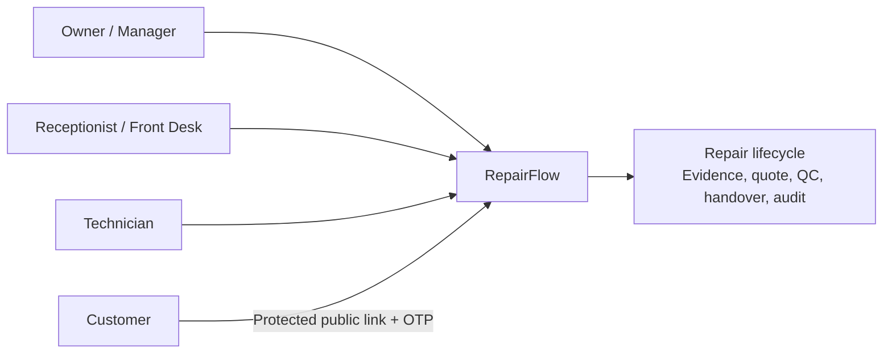

The key distinction is between a **staff profile** and an **access account**:
a Receptionist or Technician can be attributed to work without having a login.
If an account exists, backend authorization still applies workspace, role, and
assignment boundaries. Customers never receive a long-lived account.

See [`07-authentication-and-authorization.md`](docs/v0/07-authentication-and-authorization.md)
for the access principal, workspace, role, assignment, session, and public-link
rules.

### Use Case overview


This view connects the four product personas to the main MVP outcomes. It is a
summary of the detailed actors, permissions, main flows, alternative flows, and
failure flows in [`02-use-cases.md`](docs/v0/02-use-cases.md).

### Role-aware UI entry flow

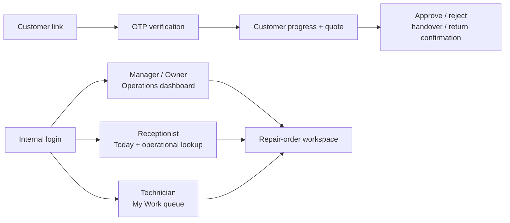

The entry screen follows the persona. Customer never enters the internal shell;
Receptionist lookup is read-only, and Technician work starts from assigned
tasks. See [`06-ui-requirements.md`](docs/v0/06-ui-requirements.md).

## Architecture at a glance

### C4 System Context


This is the highest-level C4 view: people interact with one RepairFlow system;
the customer uses a protected public link while staff use the internal surface.

### C4 Container


The container boundary separates Internal Web UI, Customer Link UI, the .NET
Backend/API, PostgreSQL, and proposed private object storage. The full business
boundary remains the Backend/API.

### Container flow summary

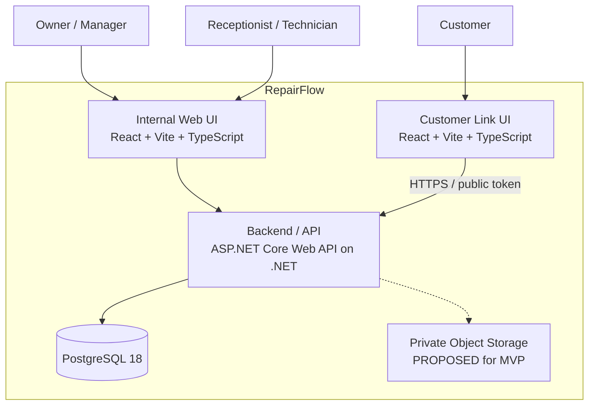

The **Backend/API is the only business boundary**. It owns authentication,
authorization, workflow transitions, quote totals, transactions, response
contracts, and audit writes. React renders screens and calls the API through an
adapter; it must not decide permissions, totals, or state transitions.

The target technology baseline is:

- **Backend:** ASP.NET Core Web API on .NET, structured as a modular monolith.
- **Web UI:** React + Vite + TypeScript for internal and customer surfaces.
- **Database:** PostgreSQL, accessed through EF Core + Npgsql; migrations are
  versioned and SQL-first.
- **Files:** Private object storage for photos/documents is still `PROPOSED`
  until its policy and deployment details are finalized.

The canonical C4 context, container, component, and arc42 views are in
[`04-architecture-c4-arc42.md`](docs/v0/04-architecture-c4-arc42.md).

### C4 Component — Backend/API


This view shows the modular-monolith components that own identity, order
lifecycle, evidence, quote decision, repair/QC, handover, and audit. Component
names are architectural boundaries, not frozen API names.

### Backend module responsibilities

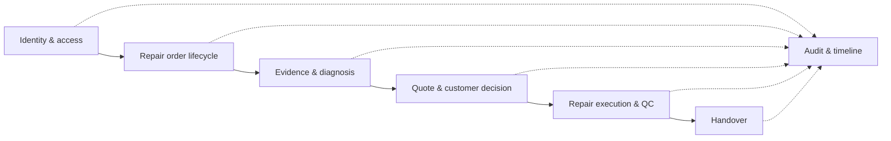

This is a target module view, not a frozen API contract. It shows the
dependency direction that protects the workflow gates: identity provides
context, order provides lifecycle context, quote approval gates execution, QC
gates closure, and every module contributes to the timeline/audit projection.

### Deployment view (local target)

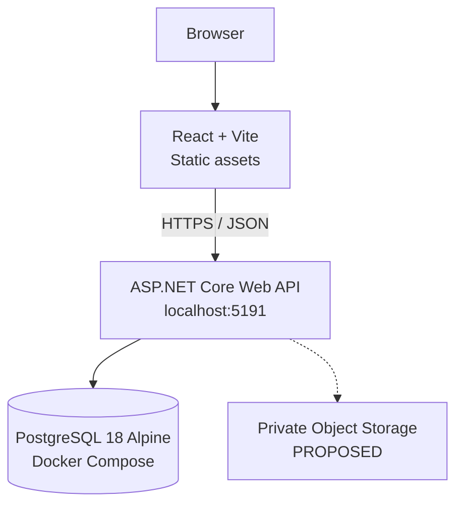

This is the current local topology, not a production deployment or monitoring
runbook. Production topology, observability, and rollback remain deferred.

## Database ERD and evidence model

The ERD below is intentionally reduced to the relationships needed to
understand the product. The complete schema, constraints, indexes, deletion
policy, and migration rules remain in
[`05-database-requirements.md`](docs/v0/05-database-requirements.md).

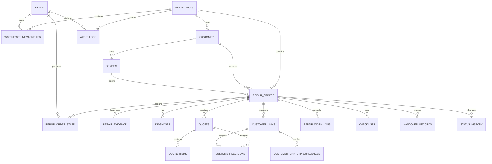

Three design choices make the evidence chain reviewable:

1. A quote is versioned and becomes immutable after it is sent; a later change
   creates a new version instead of overwriting history.
2. A customer decision points to the exact quote version and customer link that
   produced it.
3. `status_history` supports the operational timeline while `audit_logs`
   records security-sensitive and important administrative actions.

### Domain class view

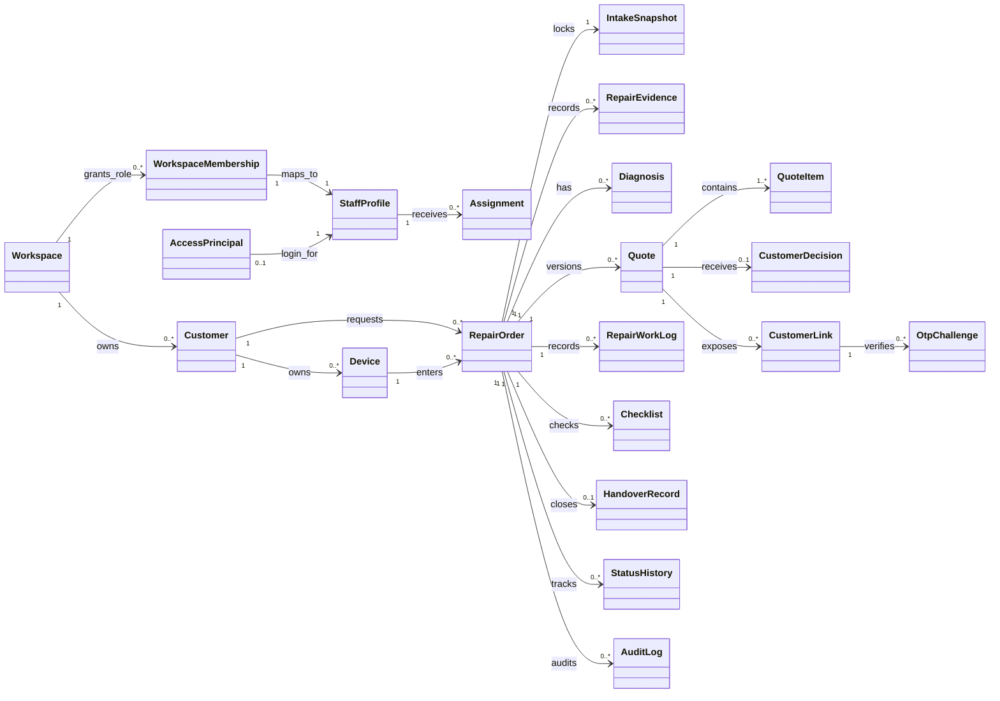

The class view emphasizes the `RepairOrder` aggregate and the immutable quote
version/evidence relationships. It complements the database ERD rather than
replacing the schema in [`05-database-requirements.md`](docs/v0/05-database-requirements.md).

## Customer link, OTP, and quote decision

The public surface is deliberately narrow. A valid token alone cannot expose
order data, and a customer cannot approve a quote version that is no longer the
current version referenced by the link.

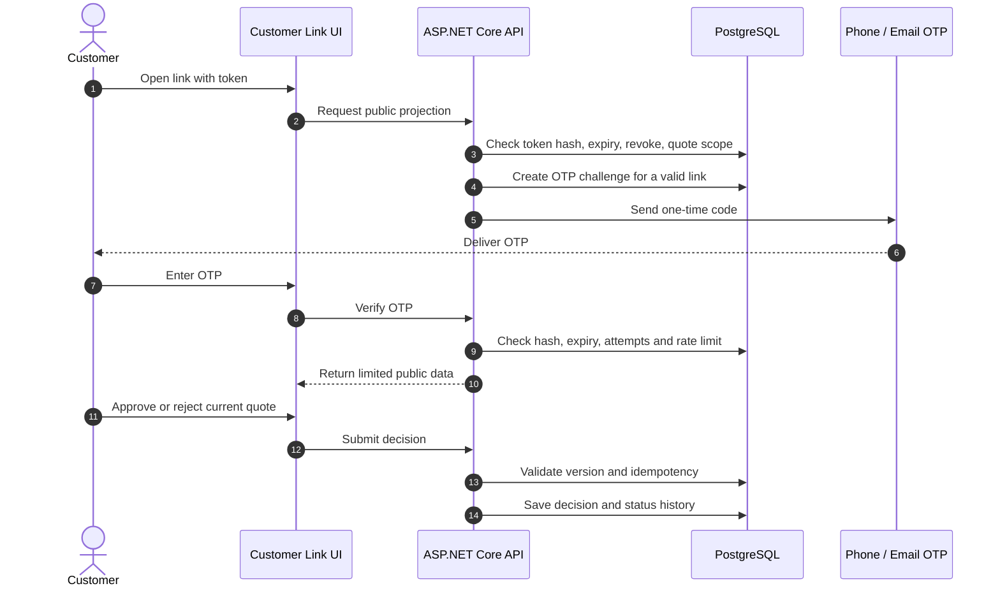

The v0 security baseline is: customer link expiry after 7 days; six-digit OTP
expiry after 5 minutes; five failed attempts; resend after 60 seconds, up to
three resends per 15 minutes; and a 30-minute customer session after successful
verification. Tokens and OTP values are stored as hashes. Full public-link and
session rules are in
[`07-authentication-and-authorization.md`](docs/v0/07-authentication-and-authorization.md)
and the runtime sequences in
[`04-architecture-c4-arc42.md`](docs/v0/04-architecture-c4-arc42.md#143-sequence-customer-decision-và-quote-version).

### Runtime: intake to handover

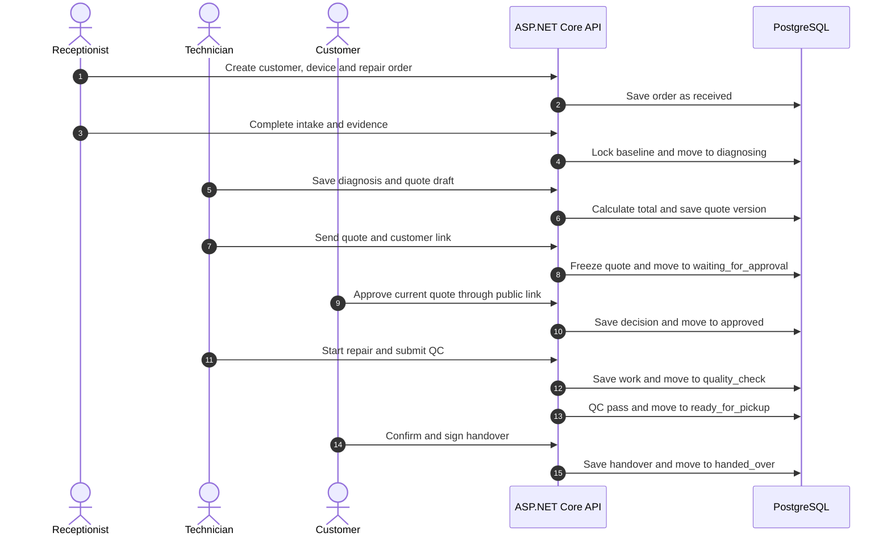

This is the main cross-role runtime path. Each arrow is an API-enforced
transition and produces timeline/audit evidence.

### Runtime: cancellation and return

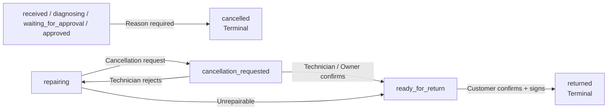

Cancellation is immediate only before repair starts. During repair it requires
an explicit decision; an unrepairable device joins the same controlled return
flow.

### Quote version lifecycle

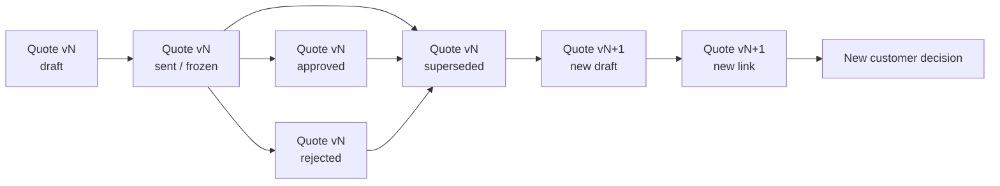

Quote history is append-only after sending. A changed price or item creates a
new version and requires a new decision; old decisions remain reviewable.

### Customer link and OTP lifecycle

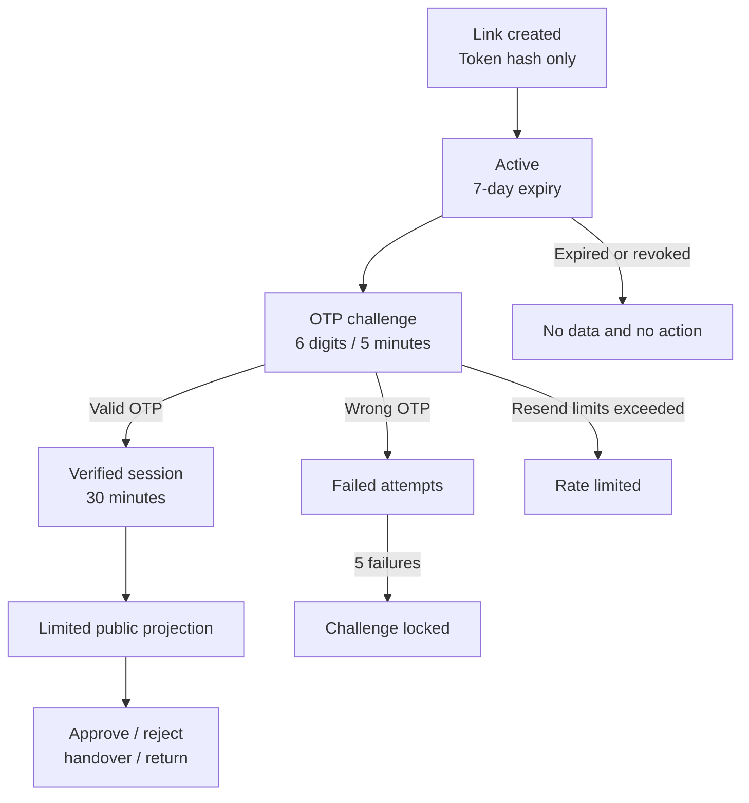

Token validity is not enough to reveal data. OTP verification, expiry,
revocation, rate limits, and public-field projection are enforced by the API.

### Internal authorization boundary

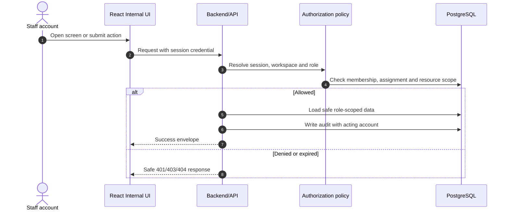

The UI may hide unavailable actions, but only the Backend/API decides whether a
request is allowed and which fields can be returned.

## MVP scope

### In scope

- Customer, device, and repair-order management.
- Intake checklist, accessories, and before-repair evidence.
- Diagnosis and immutable, versioned quotations.
- OTP-protected, time-limited customer links for viewing, decisions, handover,
  and return confirmation.
- Repair checklist, quality check, rework, and handover/return.
- Role, workspace, and assignment-based staff access.
- Cancellation with reason, controlled stop during repair, and unrepairable
  device flow.
- Timeline, audit trail, and customer/device/order history.

### Out of scope for v0

Inventory, payment and accounting, AI diagnosis, automatic price
recommendations, multi-branch management, long-lived customer accounts,
automated email/SMS, and warranty/claims. Warranty is deferred to a later
module.

## Decisions that must stay consistent

These are the most important v0 constraints for anyone changing the product:

- The backend/API is the authority for permission, workflow, totals,
  transactions, and response contracts.
- Every business query is scoped by `workspace_id`.
- Sent or approved quotations are immutable; changes create a new quote version
  and require a new customer decision.
- Repair requires approval of the correct current quote version.
- QC must pass before handover; a failed QC returns to `repairing`.
- Cancellation requires a reason. `cancelled` is terminal and cannot be
  reopened.
- No automatic hard deletion of repair, evidence, decision, signature, status,
  or audit records in the MVP.
- Staff sessions use a 30-minute idle timeout and an 8-hour absolute expiry;
  MFA is deferred from MVP.
- Deployment and monitoring are deferred from the current MVP implementation
  scope.

For the complete decision set and any `OPEN` or `PROPOSED` items, start at
[`01-requirements-closure.md`](docs/v0/01-requirements-closure.md).

## Current project status

**Last reviewed:** 2026-09-17<br>
**Current phase:** `v0 — Implementation`<br>
**Overall status:** `READY — Gate D0 is closed`<br>
**Current implementation gate:** `C1 — IN PROGRESS; c1-001 DONE; c1-002 DONE; c1-003 DONE; c1-004 DONE; c1-005 DONE; c1-006 READY`

### Delivery status

| Area | Status | Evidence / next action |
| --- | --- | --- |
| Requirements baseline | `READY — D0 CLOSED` | [`docs/v0/`](docs/v0/README.md); implement from the closed baseline. |
| Architecture diagrams | `DECIDED — BASELINE CLOSED` | [`04-architecture-c4-arc42.md`](docs/v0/04-architecture-c4-arc42.md); keep diagrams aligned with implementation. |
| Runtime foundation | `DONE — C0 ACCEPTED` | [`C0 acceptance evidence`](plans/v0/c0-runtime-stack-migration/c0-003-acceptance-evidence.md). |
| Business API | `IN PROGRESS — C1 access/authorization` | Continue with c1-006 role-aware navigation, then shared integration acceptance. |
| UI integration | `FOUNDATION VERIFIED — LIVE HEALTH ADAPTER` | [`src/ui/`](src/ui/) and [`src/ui/README.md`](src/ui/README.md). |
| English standardization | `IN PROGRESS` | Continue the language pass and run the language audit. |
| Deployment and monitoring | `DEFERRED` | Define in a later phase. |

### Verified baseline

- The previous Python/FastAPI backend, Python tests, and prototype migration
  files were intentionally removed to restart implementation on the target
  stack.
- PostgreSQL `18-alpine` remains available through Docker Compose.
- The existing vanilla UI and bundle are retained as functional/visual
  reference artifacts; the target React/Vite foundation is active in `src/ui`.
- The React foundation has a typed API adapter, internal/customer shell
  boundary, explicit preview mode, and reusable shared primitives. The adapter
  has been smoke-tested against the target ASP.NET Core `/health` endpoint.

### Remaining implementation gaps after C0

1. Each future business migration still requires its own apply/re-run
   verification in the capability plan.
2. The dashboard, order detail, and customer link still depend on mock data
   until the business API is implemented.
3. Business endpoints, role-aware navigation, and shared C1 integration
   acceptance still need to be implemented in the remaining C1 slices.

These are implementation tasks after D0 closure, not requirements-gate
blockers. The closure record is maintained in
[`01-requirements-closure.md`](docs/v0/01-requirements-closure.md).

### Cluster view

| Cluster | Business capability | Status |
| --- | --- | --- |
| C0 | Target runtime, migration runner, adapter boundary, and test harness | `DONE — ACCEPTED` |
| C1 | Owner/Manager access and application shell | `IN PROGRESS — c1-005 DONE; c1-006 READY` |
| C2 | Customer, device, and order creation | `OPEN FOR IMPLEMENTATION` |
| C3 | Intake checklist and evidence | `OPEN FOR IMPLEMENTATION` |
| C4 | Diagnosis and quotation draft | `OPEN FOR IMPLEMENTATION` |
| C5 | Quotation publishing and customer decision | `OPEN FOR IMPLEMENTATION` |
| C6 | Repair execution | `OPEN FOR IMPLEMENTATION` |
| C7 | Quality control and rework | `OPEN FOR IMPLEMENTATION` |
| C8 | Handover and history | `OPEN FOR IMPLEMENTATION` |
| C9 | Dashboard, filtering, and operational views | `OPEN FOR IMPLEMENTATION` |
| C10 | Local hardening and final verification | `OPEN FOR IMPLEMENTATION` |

## Run RepairFlow locally

### Prerequisites

- .NET SDK required by the target project.
- Node.js and a package manager for the React/Vite project.
- Docker Desktop with Docker Compose.

### Current implementation state

The backend target is in `src/server` after C0 acceptance. The UI foundation
from [`c0-002`](plans/v0/c0-runtime-stack-migration/c0-002-antigravity-react-vite-foundation.md)
has been checked against the real API health endpoint.

Use [`.env.example`](.env.example) for local configuration. Never commit
`.env`, real passwords, tokens, or customer data.

### Start PostgreSQL

```powershell
docker compose up -d db
docker compose ps
```

The database is ready when the container reports `healthy`.

### Run the target API

```powershell
dotnet run --project src/server/RepairFlow.Api/RepairFlow.Api.csproj --urls http://localhost:5191
```

### Apply target database migrations

```powershell
dotnet run --project src/server/RepairFlow.Api/RepairFlow.Api.csproj -- --migrate
```

Migrations are SQL-first and must follow the naming and baseline rules in
[`05-database-requirements.md`](docs/v0/05-database-requirements.md#120-quyết-định-và-quy-ước-file-migration).

### Seed development access accounts

After the migrations are applied, create or reset the three local test
accounts with:

```powershell
$env:ASPNETCORE_ENVIRONMENT = "Development"
dotnet run --project src/server/RepairFlow.Api/RepairFlow.Api.csproj -- --seed-development-access
```

The command is Development-only and idempotent. It provisions Manager
(`manager@repairflow.vn`), Receptionist (`receptionist@repairflow.vn`) and
Technician (`technician@repairflow.vn`) in `Minh Tâm Store`, with initial
password `dat123456`. The database stores a password hash; no Owner account is
created by this development seed.

### Run the target UI

```powershell
cd src/ui
npm install
npm run dev
```

Open `http://localhost:5173/` for live mode. Use
`http://localhost:5173/?preview=1` to view the shell with sample data while the
backend is unavailable. The vanilla files and `app.bundle.js` in `src/ui` are
functional/visual reference artifacts only.

### Checks

UI checks are documented in [`src/ui/README.md`](src/ui/README.md). Backend
build/test and API integration evidence are recorded in the
[`C0 acceptance record`](plans/v0/c0-runtime-stack-migration/c0-003-acceptance-evidence.md).

## Project structure

```text
.
├── README.md                         # Product dashboard, diagrams, status, quickstart
├── AGENTS.md                         # Repository development rules
├── docker-compose.yml                # Local PostgreSQL runtime
├── src/
│   ├── server/                       # Target ASP.NET Core/.NET API
│   └── ui/                           # Target React/Vite UI and reference artifacts
├── tests/                             # Target server/test projects
├── docs/
│   ├── README.md                     # Documentation governance
│   └── v0/                           # Active product requirements for phase v0
│       ├── README.md                 # v0 reading order and document status
│       ├── 01-requirements-closure.md
│       ├── 02-use-cases.md
│       ├── 03-business-and-domain-requirements.md
│       ├── 04-architecture-c4-arc42.md
│       ├── 05-database-requirements.md
│       ├── 06-ui-requirements.md
│       ├── 07-authentication-and-authorization.md
│       ├── 08-ui-design-blueprint-and-stitch-handoff.md
│       ├── 09-ui-standards-and-design-system.md
│       └── architecture/             # C4 PlantUML sources and rendered PNGs
├── plans/                            # LLM implementation plans and evidence
├── scripts/                          # Build and development scripts
└── assets/                           # Product and prototype assets
```

The existing `src/ui/app.bundle.js` is a legacy reference artifact. The target
frontend uses Vite; do not treat the legacy bundle as the active UI runtime.

## Documentation map

Read the active v0 documents in order. The status below describes the closed
v0 baseline; implementation work is tracked separately in `plans/`.

| # | Document | What it answers |
| --- | --- | --- |
| 01 | [Requirements closure](docs/v0/01-requirements-closure.md) | Closure decision, open questions, and implementation entry criteria. |
| 02 | [Use cases](docs/v0/02-use-cases.md) | Actors, user stories, main flows, alternative flows, and failure flows. |
| 03 | [Business and domain requirements](docs/v0/03-business-and-domain-requirements.md) | Roles, permissions, states, business rules, security, and domain data. |
| 04 | [Architecture — C4 + arc42](docs/v0/04-architecture-c4-arc42.md) | Canonical architecture narrative, C4 views, runtime sequences, and decisions. |
| 05 | [Database requirements](docs/v0/05-database-requirements.md) | Entities, ERD, constraints, indexes, OTP, backup, and transaction guidance. |
| 06 | [UI requirements](docs/v0/06-ui-requirements.md) | Screens, UX flows, UI states, and acceptance criteria. |
| 07 | [Authentication and authorization](docs/v0/07-authentication-and-authorization.md) | Account scope, role permissions, data visibility, sessions, and public links. |
| 08 | [UI design blueprint and Stitch handoff](docs/v0/08-ui-design-blueprint-and-stitch-handoff.md) | Visual screen inventory, viewport targets, and design handoff. |
| 09 | [UI standards and design system](docs/v0/09-ui-standards-and-design-system.md) | UI standards, palette, shared layout components, and design rules. |

The [documentation guide](docs/README.md) defines source-of-truth boundaries,
decision labels, and the required workflow for documentation changes.

## Verification checklist

- [x] Gate D0 requirements closure is complete.
- [x] Target ASP.NET Core/.NET + React/Vite technology baseline is documented.
- [x] Legacy backend/test prototype is removed for a clean implementation reset.
- [x] Existing UI is retained as a reference.
- [x] ASP.NET Core/.NET runtime and `/health` contract are implemented.
- [x] Target versioned migration runner is implemented and verified.
- [x] React/Vite/TypeScript app and API adapter foundation are implemented.
- [x] Target backend and UI test/build baseline passes.
- [x] Core workflow, access, OTP, retention, backup, and cancellation decisions are recorded in v0 documentation.
- [x] Core architecture, state, data, and customer-link diagrams are summarized in this README and maintained in canonical v0 documents.
- [x] UI is connected to the real API health boundary.
- [ ] Business API, full permission enforcement, and role-aware auth UI are complete.
- [ ] English standardization audit is complete.
- [ ] Deployment and monitoring are defined for a later phase.

## How to maintain the diagrams

When a product decision changes, update the relevant canonical document under
`docs/v0/` first. Then update the corresponding summary diagram or explanation
in this README. Do not add a new state, permission, API contract, or schema
relationship here unless it is already decided in the source document.
