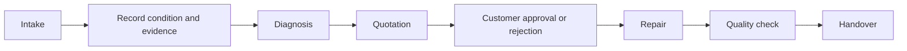

# RepairFlow

> Evidence-first repair operations for personal device repair shops.

RepairFlow manages a repair order from device intake through diagnosis, quotation, customer approval, repair, quality control, and handover. It keeps the evidence trail behind each operational decision visible and reviewable. Warranty is intentionally deferred to a later module.

[Product workflow](#product-workflow) · [Run RepairFlow yourself](#run-repairflow-yourself) · [v0 documentation](docs/v0/README.md)

## Overview

### Product goal

RepairFlow helps personal device repair shops and independent technicians manage the complete repair lifecycle in one place.

The product preserves an evidence trail for four questions:

1. What condition was the device in when it was received?
2. What did the technician diagnose and propose?
3. Which quotation version did the customer approve?
4. What work, quality checks, and handover details were recorded?

RepairFlow records and explains operational decisions. It does not diagnose faults automatically or decide prices automatically.

### Users and access

| User | Responsibility in the MVP |
| --- | --- |
| Owner / Manager | Monitors operations, assigns staff, handles overdue orders, and reviews history and audit data. |
| Receptionist / Front Desk | Can receive an optional account with read-only operational lookup across workspace orders and write access to assigned intake/handover work; without an account, remains a staff profile. |
| Technician | Can receive an optional account with fixed access to assigned diagnosis, repair, and quality-check work; without an account, remains a staff profile. |
| Customer | Opens a 7-day, expiring or revocable public link. OTP is required before viewing, approving, or rejecting a quotation. No account. The same protected link is used for handover or return confirmation. |

## Product workflow




## Key features

### **Evidence-first intake**

Record the device condition, accessories, photos, and other evidence before repair begins.

### **Versioned quotations**

Keep quotation history and identify exactly which quotation version the customer approved.

### **Public customer approval**

Let customers review, approve, or reject a quotation through a 7-day, revocable public link protected by OTP.

### **Repair and quality control**

Track repair work, checklists, rework, quality checks, and handover information.

### **Controlled cancellation and return**

Allow cancellation with a required reason before repair starts. A cancellation
request during repair requires confirmation from the responsible Technician or
an Owner exception. An unrepairable device follows the return flow. Cancelled
orders are terminal and are never reopened.

### **Timeline and audit history**

Keep the customer, device, repair order, and operational history connected through a traceable timeline.

## MVP scope

### In scope

- Customer, device, and repair order management.
- Intake checklist, accessories, and before-repair evidence.
- Diagnosis and versioned quotations.
- Versioned quotations with immutable history and customer approval or rejection.
- OTP-protected, time-limited customer links for viewing, decisions, handover,
  and return confirmation.
- Repair checklist, quality check, and handover.
- Role, workspace, and assignment-based staff access.
- Cancellation with reason, controlled return, and unrepairable-device flow.
- Timeline, audit trail, and customer or device history.

### Out of scope for v0

Inventory, payment and accounting, AI diagnosis, automatic price recommendations, multi-branch management, long-lived customer accounts, and warranty/claims. Warranty is deferred to a later module.

## v0 decisions recorded

The following baseline decisions are recorded in the active v0 documentation:

- Customer links expire after 7 days and require OTP before any data or action
  is available. OTP uses 6 digits, expires after 5 minutes, allows 5 failed
  attempts, and can be resent after 60 seconds up to 3 times per 15 minutes.
- Staff sessions use a 30-minute idle timeout and an 8-hour absolute expiry.
  MFA is deferred from MVP.
- Quote changes create a new immutable version on the same repair order; old
  versions and decisions remain in history.
- No automatic hard deletion of repair, evidence, signature, or audit data in
  MVP. Database backup is daily with 14 retained copies and restore testing is
  required before real use.
- Deployment and monitoring are temporarily deferred and are not part of the
  current MVP implementation scope.

Detailed rules and diagrams remain in the [v0 documentation](docs/v0/README.md),
especially the [business requirements](docs/v0/03-business-and-domain-requirements.md),
[architecture](docs/v0/04-architecture-c4-arc42.md), and
[authentication and authorization](docs/v0/07-authentication-and-authorization.md).

## Current project status

**Last reviewed:** 2026-09-15<br>
**Current phase:** `v0 — Requirements closure`<br>
**Overall status:** `BLOCKED — Gate D0 is open`<br>
**Current implementation gate:** `C0 — Foundation, shared fixtures, UI adapter boundary, and test harness`

### Delivery status

| Area | Status | Evidence | Next action | Owner |
| --- | --- | --- | --- | --- |
| Requirements baseline | `PARTIAL — CORE DECISIONS RECORDED` | [v0 requirements](docs/v0/README.md) | Reconcile remaining open items and complete Gate D0. | Product / Engineering |
| Architecture diagrams | `READY FOR REVIEW` | [C4 + Mermaid architecture](docs/v0/04-architecture-c4-arc42.md) | Review the inline Mermaid class and sequence views. | Product / Engineering |
| Runtime foundation | `PARTIAL` | [FastAPI](src/app), [database](src/db), [tests](tests) | Finish the remaining C0 fixture and harness work. | Engineering |
| Business API | `NOT STARTED` | [v0 documentation](docs/v0/README.md) | Open C1 only after Gate D0. | Engineering |
| UI integration | `MOCK BASELINE` | [UI source](src/ui) | Finish the adapter boundary, then replace mock runtime paths by cluster. | UI |
| English standardization | `IN PROGRESS` | Repository documentation and UI source | Complete the language pass and run the language audit. | Engineering |
| Deployment and monitoring | `DEFERRED` | v0 scope | Define in a later phase. | Product / Engineering |

### Verified baseline

- FastAPI runs from `src/app/` and exposes `GET /health`.
- PostgreSQL `18-alpine` runs through Docker Compose.
- Six versioned SQL migrations create the current 20-table schema.
- The migration runner is idempotent.
- The current test baseline is four passing tests when run with the repository `PYTHONPATH`.
- The UI is a prototype backed by mock data; it is not connected to the business API.

### Current blockers

1. Gate D0 is not complete; remaining open decisions still need to be reconciled in the requirements closure.
2. The API contract is not frozen. Current fixtures and response shapes are implementation aids, not a Product-approved contract.
3. Business endpoints and management/staff authentication are not implemented.
4. The dashboard, order detail, and customer link still depend on mock data.

Do not start C1–C10 business implementation until Product closes the required P0 decisions. The detailed gate is maintained in [01-requirements-closure.md](docs/v0/01-requirements-closure.md).

### Cluster view

| Cluster | Business capability | Status |
| --- | --- | --- |
| C0 | Runtime foundation, shared fixtures, adapter boundary, and test harness | `IN PROGRESS` |
| C1 | Owner/Manager access and application shell | `BLOCKED BY D0` |
| C2 | Customer, device, and order creation | `BLOCKED BY D0` |
| C3 | Intake checklist and evidence | `BLOCKED BY D0` |
| C4 | Diagnosis and quotation draft | `BLOCKED BY D0` |
| C5 | Quotation publishing and customer decision | `BLOCKED BY D0` |
| C6 | Repair execution | `BLOCKED BY D0` |
| C7 | Quality control and rework | `BLOCKED BY D0` |
| C8 | Handover and history | `BLOCKED BY D0` |
| C9 | Dashboard, filtering, and operational views | `BLOCKED BY D0` |
| C10 | Local hardening and final verification | `BLOCKED BY D0` |

## Project documentation

Read the active v0 documents in order. The status below describes the current document state; unresolved product decisions remain explicitly marked inside the documents.

| # | Document | Current status | What it answers |
| --- | --- | --- | --- |
| 02 | [Use cases](docs/v0/02-use-cases.md) | `ACTIVE — open policies remain` | Who does what, through which main, alternative, and failure flows. |
| 03 | [Business and domain requirements](docs/v0/03-business-and-domain-requirements.md) | `ACTIVE — baseline updated` | Roles, permissions, states, business rules, security, and domain data. |
| 04 | [Architecture — C4 + arc42](docs/v0/04-architecture-c4-arc42.md) | `ACTIVE — C4 + Mermaid views` | How the system is shaped and how its parts interact. |
| 05 | [Database requirements](docs/v0/05-database-requirements.md) | `ACTIVE — baseline updated` | Entities, schema, constraints, indexes, OTP, backup, and transaction guidance. |
| 06 | [UI requirements](docs/v0/06-ui-requirements.md) | `ACTIVE — prototype baseline` | Screens, UX flows, UI states, and acceptance criteria. |
| 07 | [Authentication and authorization](docs/v0/07-authentication-and-authorization.md) | `DECIDED — scope + technical defaults` | Account scope, role permissions, data visibility, OTP, sessions, and auth boundaries. |
| 08 | [UI design blueprint and Stitch handoff](docs/v0/08-ui-design-blueprint-and-stitch-handoff.md) | `DECIDED — UI direction and handoff baseline` | Visual screen inventory, Stitch prompt workflow, viewport targets, and Antigravity handoff. |

The [documentation guide](docs/README.md) defines the authority of each document and the required decision labels.

## Run RepairFlow yourself

### Prerequisites

- Python with the project dependencies available.
- Docker Desktop with Docker Compose.

### Install Python dependencies

```powershell
python -m venv .venv
.venv\Scripts\Activate.ps1
pip install -r requirements-dev.txt
```

Use [.env.example](.env.example) for local configuration. Never commit `.env`, real passwords, tokens, or customer data.

### Start PostgreSQL

```powershell
docker compose up -d db
docker compose ps
```

The database is ready when the container reports `healthy`.

### Run migrations

```powershell
python -m src.db.migrate
```

The first run applies the six SQL migrations. Later runs must report that the database is up to date without creating duplicate migration records.

### Start the API

```powershell
python -m src.app
```

The API runs at `http://127.0.0.1:8000` by default. Verify `GET http://127.0.0.1:8000/health`.

### Open the UI prototype

Open [`src/ui/index.html`](src/ui/index.html) in a browser. The current UI bundle is a prototype backed by mock data and is not connected to the business API yet.

### Run tests

```powershell
$env:PYTHONPATH = (Get-Location).Path
pytest
```

## Project structure

```text
.
├── README.md                         # Product overview, status, and local quickstart
├── AGENTS.md                         # Repository development rules
├── docker-compose.yml                # Local PostgreSQL runtime
├── requirements*.txt                 # Python dependencies
├── src/
│   ├── app/                          # FastAPI application and business features
│   ├── db/                           # Database connection, migrations, and seeds
│   └── ui/                           # UI prototype and mock boundary
├── tests/                             # Backend and integration tests
├── docs/
│   ├── README.md                     # Documentation governance
│   └── v0/                           # Active product requirements for phase v0
│       ├── README.md                 # v0 reading order and document status
│       ├── 01-requirements-closure.md
│       ├── 02-use-cases.md
│       ├── 03-business-and-domain-requirements.md
│       ├── 04-architecture-c4-arc42.md
│       ├── 05-database-requirements.md
│       ├── 06-ui-requirements.md
│       ├── 07-authentication-and-authorization.md
│       ├── 08-ui-design-blueprint-and-stitch-handoff.md
│       └── architecture/             # C4/PlantUML assets; Mermaid is inline in 04
├── plans/                            # LLM implementation plans
├── scripts/                          # Build and development scripts
└── assets/                           # Product and prototype assets
```

The generated UI bundle is produced by `scripts/build-bundle.cjs`; edit UI source files, not `src/ui/app.bundle.js` directly.

## Verification checklist

- [x] PostgreSQL `18-alpine` starts healthy.
- [x] Six versioned SQL migrations are present.
- [x] The migration runner is idempotent.
- [x] The FastAPI `/health` endpoint returns HTTP 200.
- [x] The baseline test suite passes four tests.
- [x] The active runtime is `src/app`; no `server/` directory is used.
- [ ] Gate D0 requirements closure is complete.
- [x] Core workflow, access, OTP, retention, backup, and cancellation decisions are recorded in v0 documentation.
- [x] Core class and sequence diagrams are embedded as Mermaid blocks in the architecture Markdown.
- [ ] Business API and Owner/Manager authentication are complete.
- [ ] UI is connected to the real API.
- [ ] English standardization audit is complete.
- [ ] Deployment and monitoring are defined for a later phase.
