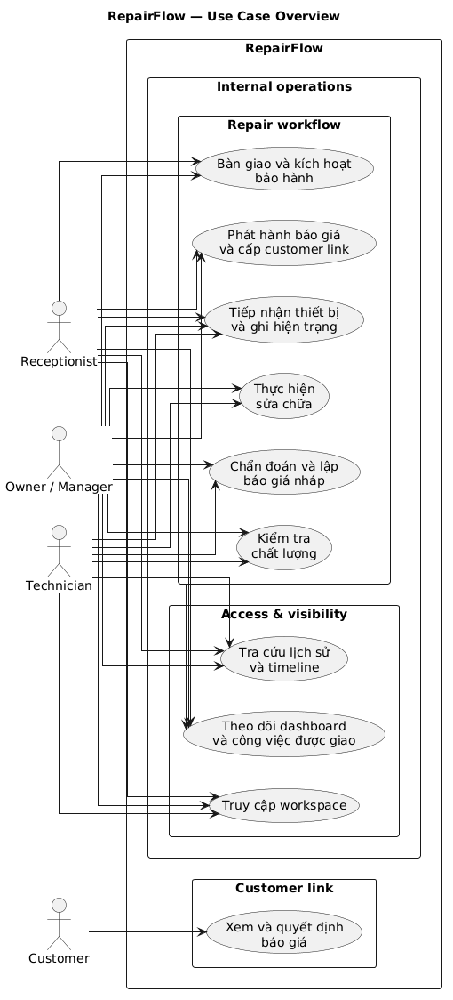

# RepairFlow — Đặc tả Use Case và luồng người dùng

## 1. Mục đích và phạm vi

Tài liệu này mô tả các use case quan trọng nhất của RepairFlow ở mức nghiệp vụ và mức tương tác người dùng. Mục tiêu là làm rõ:

- Ai thực hiện từng hành động và được phép làm đến đâu.
- Dữ liệu nào phải có trước khi chuyển bước.
- Luồng chính, luồng thay thế, lỗi và ngoại lệ.
- Kết quả nghiệp vụ và điều kiện để hoàn tất từng use case.
- Bằng chứng, quyết định của khách và lịch sử audit nào phải được lưu.
- Tiêu chí nghiệm thu để QA, Product và Developer có thể dùng chung.

Phạm vi bao gồm hai bề mặt sử dụng:

1. **Giao diện nội bộ** do Owner/Manager hoặc Receptionist/Technician có active account truy cập; staff profile chưa có account vẫn được chọn để ghi nhận trách nhiệm.
2. **Giao diện public qua customer link** cho Customer, không yêu cầu tài khoản trong MVP.

Tài liệu này không mở rộng phạm vi MVP sang thanh toán, tồn kho, AI chẩn đoán, định giá tự động, tài khoản khách hàng dài hạn hoặc tích hợp SMS/Zalo/email tự động.

### 1.1. Trạng thái đặc tả và các điểm cần chốt thêm

Các use case dưới đây là baseline nghiệp vụ và đã mô tả happy path, alternative flow cùng acceptance test. Trước khi triển khai business API, các policy chưa được quyết định hoàn toàn như cancellation/reopen, correction intake, quote/payment boundary, unclaimed device, warranty claim, retention, concurrency và deployment phải được chốt theo [requirements closure](./01-requirements-closure.md). Không tự suy ra policy mới từ UI mock hoặc từ một endpoint riêng lẻ.

## 2. Nguồn yêu cầu và cách đọc tài liệu

| Nguồn | Vai trò trong đặc tả này |
| --- | --- |
| [`README.md`](../../README.md) | Mục tiêu sản phẩm, giá trị cốt lõi, demo scenario và phạm vi MVP. |
| [`03-business-and-domain-requirements.md`](./03-business-and-domain-requirements.md) | Vai trò, phân quyền, trạng thái, transaction, audit, bảo mật và dữ liệu nghiệp vụ. |
| [`06-ui-requirements.md`](./06-ui-requirements.md) | Màn hình, hành vi UI, luồng nội bộ/public và tiêu chí nghiệm thu UX/UI. |
| [`05-database-requirements.md`](./05-database-requirements.md) | Enum, quan hệ dữ liệu, constraint và các điều kiện toàn vẹn API/database. |
| [`07-authentication-and-authorization.md`](./07-authentication-and-authorization.md) | Phạm vi account, role, visibility và authorization tối thiểu. |
| `src/ui/features/**` | Đối chiếu phạm vi prototype hiện tại, không thay thế cho business rule phía backend. |

### 2.1. Quy ước quan trọng

- `repair order`/`phiếu sửa chữa` là đối tượng trung tâm của toàn bộ quy trình.
- `overdue` trong UI hiện tại là **cờ vận hành quá hạn**, không nên coi là trạng thái nghiệp vụ terminal nếu backend vẫn dùng `repair_order_status` theo database requirements.
- Báo giá đã `sent`, `approved` hoặc `rejected` là snapshot bất biến. Mọi thay đổi phải tạo version mới.
- Customer link trong prototype đang dùng route dạng `#/customer/:id`; triển khai thật phải dùng token ngẫu nhiên, chỉ lưu hash, có hạn dùng và có thể thu hồi.
- Quyền truy cập và điều kiện nghiệp vụ phải được kiểm tra ở lớp thực thi của hệ thống; UI chỉ hỗ trợ hiển thị và gọi hành động. State machine canonical nằm ở tài liệu business/domain.
- Actor trong use case là người có mục tiêu nghiệp vụ; không đưa Backend/API, Object Storage hoặc notification worker vào danh sách actor. Các thành phần đó chỉ được nhắc trong đặc tả luồng khi cần mô tả hành vi hệ thống.
- Actor nội bộ là Owner, Manager hoặc staff account có session hợp lệ. Owner/Manager có thể thao tác thay staff profile; account Receptionist/Technician chỉ được truy cập theo role và assignment.

## 3. Actors và persona

### 3.1. Bảng actor

| Actor | Mục tiêu | Quyền và trách nhiệm chính | Không được tự ý |
| --- | --- | --- | --- |
| **Owner** | Kiểm soát toàn bộ vận hành và access của workspace. | Quản lý cửa hàng, nhân viên, account, quyền, toàn bộ phiếu, link public, báo cáo và ngoại lệ. | Xóa audit log hoặc xóa cứng bằng chứng/quyết định/lịch sử. |
| **Manager** | Điều phối công việc và xử lý phiếu trễ. | Phân công nhân viên, theo dõi dashboard, báo cáo, xử lý ngoại lệ theo chính sách. | Quản lý tài khoản Owner nếu chưa được cấp quyền riêng. |
| **Receptionist/Front Desk** | Tiếp nhận thiết bị và điều phối giao tiếp với khách. | Tạo phiếu, nhập khách/thiết bị, ghi hiện trạng, ảnh/phụ kiện, gửi link, bàn giao. | Sửa chẩn đoán hoặc báo giá đã duyệt nếu không có quyền. |
| **Technician** | Chẩn đoán và thực hiện sửa chữa đúng phạm vi được phân công. | Chẩn đoán, lập báo giá, ghi work log, checklist sửa, QC. | Xem/sửa phiếu ngoài workspace hoặc ngoài phạm vi phân công. |
| **Customer** | Hiểu thiết bị, chẩn đoán, chi phí và quyết định sửa. | Mở link hợp lệ, xem thông tin được phép, duyệt hoặc từ chối đúng quote version. | Truy cập phiếu khác, sửa nội dung báo giá hoặc duyệt quote cũ. |

**Quy ước access:** Access principal có thể là Owner, Manager, Receptionist hoặc Technician nếu đã được cấp account và membership hợp lệ. Receptionist/Technician chưa có account chỉ là staff profile, không có session. `userId` trong staff assignment là ID hồ sơ nhân sự và được tách khỏi người đang đăng nhập. Chi tiết visibility và permission tối thiểu được ghi ở tài liệu access/authorization của v0.

### 3.2. Ma trận quyền theo nhóm use case

Ký hiệu: `P` = thực hiện chính, `S` = hỗ trợ/xem, `A` = chỉ được thực hiện khi có quyền ngoại lệ, `-` = không thuộc luồng. Dấu `*` nghĩa là chỉ áp dụng khi staff đã được cấp account và quyền tương ứng.

`P/S/A` trong bảng mô tả **trách nhiệm nghiệp vụ**, không phải toàn bộ quyền đăng nhập. Mọi thao tác nội bộ phải đi qua access principal hợp lệ; Owner/Manager có thể thao tác thay staff và phải ghi rõ staff profile được attribution. Receptionist/Technician có account chỉ được truy cập theo role và assignment.

| Use case | Owner | Manager | Receptionist | Technician | Customer |
| --- | ---: | ---: | ---: | ---: | ---: |
| Đăng nhập và chọn workspace | P | P | P* | P* | - |
| Xem dashboard/danh sách | P | P | S theo assignment | S theo assignment | - |
| Tạo phiếu và tiếp nhận | P | P | P theo quyền | A | - |
| Ghi hiện trạng/bằng chứng | P | P | P theo assignment | P theo assignment | S theo public scope |
| Chẩn đoán | P | P | S tối thiểu | P theo assignment | S theo public scope |
| Lập/sửa nháp báo giá | P | P/review | S | P theo assignment khi còn draft | - |
| Gửi/revoke customer link | P | P | P theo quyền | - | - |
| Duyệt/từ chối báo giá | S | S | - | - | P |
| Xác nhận thay khách qua điện thoại | P | A | A | - | - |
| Ghi nhận sửa chữa | P | P/review | - | P theo assignment | - |
| QC và kết luận đạt/không đạt | P | P/review | S | P khi có responsibility QC | S theo public scope |
| Bàn giao và kích hoạt bảo hành | P | P | P theo assignment | S | S theo public scope |
| Xem lịch sử/timeline | P | P | S theo assignment | S theo assignment | S theo link |
| Phân công nhân viên | P | P | - | - | - |

### 3.3. Sơ đồ Use Case tổng quan

Sơ đồ chỉ giữ các actor chính và các mục tiêu nghiệp vụ lớn; không biểu diễn
Backend/API, Object Storage hoặc các chi tiết kỹ thuật. Account của Receptionist
và Technician là tùy chọn, còn staff profile không có account vẫn có thể được
chọn để attribution khi Owner/Manager thao tác thay. Các đường nối trong
overview là liên kết đại diện để giữ bố cục dễ đọc; ma trận quyền ở mục 3.2
mới là nơi quy định đầy đủ phạm vi của từng actor.



Source PlantUML: [repairflow-usecase-overview.puml](./architecture/repairflow-usecase-overview.puml).

## 4. Business rules dùng chung

| Mã | Quy tắc | Hệ quả khi vi phạm |
| --- | --- | --- |
| BR-01 | Mọi thao tác nội bộ phải thuộc một access principal active, membership hợp lệ và đúng phạm vi `workspace_id`, role và assignment. | Từ chối truy cập; không được để UI tự che dữ liệu khác tenant hoặc order ngoài phạm vi. |
| BR-02 | Một phiếu phải gắn đúng customer và device trong cùng workspace. | Không cho tạo liên kết chéo workspace hoặc chéo chủ thiết bị. |
| BR-03 | Hiện trạng tối thiểu phải được ghi trước khi bắt đầu chẩn đoán/sửa. | Không cho chuyển `received` → `diagnosing` nếu checklist/bằng chứng chưa đủ. |
| BR-04 | Diagnosis phải nêu kết quả, nguyên nhân, đề xuất và thời gian dự kiến trước khi gửi quote. | Không cho chuyển sang `waiting_for_approval`. |
| BR-05 | Quote phải có ít nhất một item hợp lệ; subtotal/total tính lại ở backend. | Không cho `draft` → `sent`; không tin tổng tiền do client gửi. |
| BR-06 | Quote đã gửi hoặc đã quyết định không được sửa trực tiếp. | Tạo quote version mới, quote cũ giữ nguyên lịch sử. |
| BR-07 | Decision luôn tham chiếu đúng `quote_id` và `source_link_id`. | Không chấp nhận approve quote cũ hoặc link của phiếu khác. |
| BR-08 | Chỉ quote hiện hành ở trạng thái `approved` mới mở khóa sửa chữa. | Không cho chuyển sang `repairing`. |
| BR-09 | Một request approve/reject phải idempotent. | Click lặp không tạo quyết định thứ hai hoặc đổi quyết định đã ghi. |
| BR-10 | Nếu QC không đạt, phiếu phải quay lại `repairing`, không được nhảy thẳng đến bàn giao. | Khóa `ready_for_pickup`. |
| BR-11 | Chỉ được bàn giao khi QC đã `passed` và có biên bản bàn giao. | Từ chối transaction bàn giao. |
| BR-12 | Bảo hành mặc định bắt đầu từ ngày/giờ bàn giao thực tế. | Không được kích hoạt trước bàn giao, trừ ngoại lệ của Owner/Manager có lý do. |
| BR-13 | Không lưu mật khẩu/mã mở khóa thiết bị trong MVP. | Từ chối trường nhạy cảm hoặc lưu theo chính sách mã hóa riêng ở giai đoạn sau. |
| BR-14 | File ảnh/tài liệu private; chỉ hiển thị qua signed URL. | Không đưa object storage URL public trực tiếp vào response. |
| BR-15 | Audit log, bằng chứng, customer decision và status history không bị xóa cứng trong luồng thường. | Chỉ cho phép archive/retention theo chính sách được phê duyệt. |
| BR-16 | `overdue` là điều kiện tính từ `expected_completed_at` và status hiện tại. | Dashboard phải cảnh báo và ghi nhận xử lý, không tự ý làm mất trạng thái nghiệp vụ. |
| BR-17 | Owner, Manager, Receptionist và Technician có thể được cấp account; staff profile chưa có account không có session riêng. | Không tạo session hoặc cho gọi use case nội bộ khi chưa có access principal hợp lệ. |
| BR-18 | Receptionist và Technician chỉ được xem dữ liệu trực tiếp cần cho trách nhiệm và repair order được phân công. | Từ chối truy cập order, customer, device hoặc tài liệu ngoài role/assignment. |
| BR-19 | Account đăng nhập và staff profile được attribution là hai thông tin độc lập. | Audit phải giữ cả acting account và staff profile; không cho giả mạo hoặc ghi đè người thực hiện. |
| BR-20 | Customer chỉ được xem và quyết định đúng order/quote mà public link hợp lệ tham chiếu. | Không lộ dữ liệu nội bộ, order khác hoặc quote version cũ không còn hiệu lực. |

## 5. Danh mục use case ưu tiên

| ID | Use case | Actor chính | Mức độ | Kết quả nghiệp vụ chính | Màn hình/feature liên quan |
| --- | --- | --- | --- | --- | --- |
| UC-01 | Access principal đăng nhập và vào workspace | Owner/Manager hoặc staff account | Must | Tạo session hợp lệ và giới hạn dữ liệu theo workspace, role và assignment. | Login, app shell |
| UC-02 | Xem dashboard và danh sách việc | Manager/Owner | Must | Biết phiếu đang ở đâu, chờ ai, phiếu nào trễ/sẵn sàng. | Dashboard |
| UC-03 | Tạo phiếu và tiếp nhận thiết bị | Owner/Manager hoặc Receptionist account | Must | Tạo order code, gắn customer/device, ghi issue và trạng thái `received`. | Create repair order |
| UC-04 | Ghi hiện trạng và bằng chứng | Owner/Manager hoặc account được phân công | Must | Khóa mốc “trước khi sửa”, tạo checklist và ảnh private. | Condition/evidence |
| UC-05 | Chẩn đoán và lập báo giá nháp | Owner/Manager hoặc Technician account | Must | Lưu diagnosis, quote items, tổng tiền và thời gian dự kiến. | Diagnosis/quote |
| UC-06 | Gửi quote và cấp customer link | Owner/Manager hoặc Receptionist account có quyền | Must | Quote `sent`, link có hạn, order `waiting_for_approval`. | Quote detail/customer link |
| UC-07 | Customer mở link và xem thông tin | Customer | Must | Xem đúng phiếu/quote được cấp, không cần account. | Customer link |
| UC-08 | Customer duyệt hoặc từ chối quote | Customer | Must | Lưu decision gắn quote version, đổi trạng thái order. | Customer link |
| UC-09 | Bắt đầu và thực hiện sửa chữa | Owner/Manager hoặc Technician account | Must | Chỉ thực hiện work đã duyệt, lưu log/checklist và ảnh sau sửa. | Repair execution |
| UC-10 | Kiểm tra chất lượng và xử lý rework | Owner/Manager hoặc Technician account có responsibility QC | Must | QC đạt thì sẵn sàng bàn giao; không đạt thì quay lại sửa. | Quality check |
| UC-11 | Bàn giao và kích hoạt bảo hành | Owner/Manager hoặc Receptionist account có quyền | Must | Tạo handover, khóa dữ liệu chính, tạo warranty từ ngày bàn giao. | Handover/warranty |
| UC-12 | Tra cứu lịch sử và timeline | Access principal theo quyền | Must | Truy ngược customer/device/order và người thực hiện từng bước. | History/timeline/audit |
| UC-13 | Phân công và thay đổi người phụ trách | Manager/Owner | Should | Tách rõ intake/diagnosis/repair/QC/handover; giữ lịch sử người cũ. | Assignment/settings |
| UC-14 | Xử lý link lỗi, quote mới và phiếu trễ | Staff/Manager | Should | Revoke/reissue link, tạo version mới, ghi lý do và thông báo. | Notifications/detail |

Các use case UC-01–UC-12 được đặc tả chi tiết dưới đây. UC-13–UC-14 được đặc tả ở mức nghiệp vụ vì phụ thuộc module quản trị/thông báo mở rộng.

### 5.1. User story theo persona

Mỗi user story dưới đây có thể dùng làm đầu vào cho backlog. Một story chỉ được coi là hoàn tất khi các điều kiện nghiệm thu liên quan trong mục 10 đạt và business rule được kiểm tra ở lớp thực thi của hệ thống.

| ID | Persona | User story | Vì sao cần | Tiêu chí chấp nhận tóm tắt |
| --- | --- | --- | --- | --- |
| US-01 | Owner/Manager hoặc staff được cấp account | Là người dùng nội bộ, tôi muốn đăng nhập vào đúng workspace để chỉ xem và thao tác đúng phạm vi được cấp. | Bảo vệ dữ liệu khi hệ thống được deploy. | Account active và membership hợp lệ mới login được; session scope theo workspace; role/assignment giới hạn dữ liệu; staff profile không có account không có session. |
| US-02 | Manager/Owner | Là người quản lý, tôi muốn xem dashboard theo status, người phụ trách và hạn trả để biết việc nào cần xử lý trước. | Điều phối năng lực và phiếu trễ. | KPI/filter dẫn tới danh sách đúng; overdue là cờ tính từ deadline; có loading/empty/error. |
| US-03 | Owner/Manager thao tác cho Receptionist | Là người quản lý, tôi muốn chọn hoặc tạo customer/device và ghi nhận người tiếp nhận để không nhập trùng và không bỏ sót thông tin nhận máy. | Tạo dữ liệu đầu vào sạch và truy được lịch sử. | Có duplicate check theo phone/device; order code unique; trạng thái ban đầu là `received`; staff profile tiếp nhận được lưu. |
| US-04 | Owner/Manager thao tác cho Receptionist/Technician | Là người quản lý, tôi muốn ghi checklist, phụ kiện, ảnh hiện trạng và chọn staff profile thực hiện để hai bên có cùng bằng chứng baseline. | Giảm tranh chấp về tình trạng và tài sản đi kèm. | Không qua diagnosis nếu intake chưa đủ; ảnh private có stage/staff profile/thời gian. |
| US-05 | Owner/Manager thao tác cho Technician | Là người quản lý, tôi muốn ghi findings, cause, recommendation và chọn kỹ thuật viên thực hiện để giải thích chẩn đoán trước khi báo giá. | Bảo đảm quyết định kỹ thuật có trách nhiệm rõ ràng. | Diagnosis có staff profile/time; không tự động chẩn đoán; có thể đính kèm note/evidence. |
| US-06 | Owner/Manager thao tác cho Technician | Là người quản lý, tôi muốn lập quote theo từng linh kiện/công/dịch vụ và nêu lý do kỹ thuật để khách hiểu mình đang duyệt gì. | Minh bạch giá và phạm vi công việc. | Item có loại/mô tả/số lượng/đơn giá/lý do; total do backend tính; staff profile chẩn đoán được lưu. |
| US-07 | Owner/Manager thao tác cho cửa hàng | Là người quản lý, tôi muốn gửi một customer link có hạn dùng để khách xem đúng phiếu và quote hiện hành. | Trao quyền xem/duyệt có giới hạn. | Quote `sent`, order `waiting_for_approval`, token lưu hash, link có expiry/revoke. |
| US-08 | Customer | Là khách hàng, tôi muốn mở link không cần tài khoản để xem hiện trạng, diagnosis, quote và thời gian dự kiến. | Ra quyết định mà không phải cài app/đăng ký. | Link chỉ đọc đúng public DTO; link lỗi/hết hạn/revoke có thông báo rõ. |
| US-09 | Customer | Là khách hàng, tôi muốn duyệt hoặc từ chối chính xác quote version đang xem để cửa hàng biết quyết định của tôi. | Tránh sửa chữa khi chưa được đồng ý và tránh tranh chấp version. | Decision gắn `quote_id`/`source_link_id`; approve/reject idempotent; nút bị khóa sau quyết định. |
| US-10 | Owner/Manager thao tác cho Technician | Là người quản lý, tôi muốn chỉ cho phép bắt đầu sửa sau khi quote đúng version được duyệt và ghi work log/checklist theo staff profile. | Bảo đảm work thực tế khớp work được đồng ý. | Chưa approved thì API chặn; có started/ended, work items, actual parts và after evidence. |
| US-11 | Owner/Manager thao tác cho Quality checker | Là người quản lý, tôi muốn chọn quality-checker profile và đối chiếu lỗi ban đầu, chức năng, tình trạng sau sửa để kết luận đạt hoặc yêu cầu sửa lại. | Không giao thiết bị khi chưa đạt. | QC pass mới được `ready_for_pickup`; fail luôn quay về `repairing` với lý do. |
| US-12 | Owner/Manager thao tác cho Receptionist/Customer | Là người quản lý, tôi muốn ghi staff profile bàn giao, người nhận, phụ kiện và tình trạng cuối để khách nhận đúng thiết bị. | Hoàn tất evidence chain trước khi đóng phiếu. | Không handover nếu QC chưa pass; có handover record và xác nhận. |
| US-13 | Customer/Owner | Là khách hàng, tôi muốn biết điều khoản và thời điểm bắt đầu bảo hành để có thể tra cứu khi quay lại. | Bảo đảm cam kết sau sửa không bị thất lạc. | Warranty bắt đầu từ handover theo mặc định; terms/end date hiển thị và truy được từ device history. |
| US-14 | Manager/Owner | Là người quản lý, tôi muốn phân công riêng staff profile tiếp nhận, chẩn đoán, sửa, QC và bàn giao để biết ai chịu trách nhiệm ở từng giai đoạn. | Một `assigned_technician_id` duy nhất không đủ cho audit. | Assignment không ghi đè lịch sử; staff profile inactive không nhận phiếu mới; account của staff là tùy chọn. |
| US-15 | Manager/Owner | Là người quản lý, tôi muốn tạo quote version mới hoặc thu hồi link khi thông tin thay đổi/lộ link để giữ an toàn và yêu cầu khách duyệt lại. | Bảo vệ tính bất biến của quote và quyền public. | Quote cũ `superseded`; link cũ revoke; version mới có decision mới và audit reason. |
| US-16 | Owner/Manager | Là người quản lý, tôi muốn xem lịch sử theo customer/device/order để trả lời khách và xử lý tranh chấp bằng dữ liệu thật. | Giảm phụ thuộc vào giấy/chat cá nhân. | Timeline nối được status, decision, evidence, work, QC, handover, warranty; audit không sửa/xóa thường. |

## 6. Luồng người dùng theo persona

### 6.1. Receptionist/Front Desk

Receptionist có thể được cấp account với quyền giới hạn; nếu chưa có account, Owner/Manager thao tác trên giao diện và chọn hồ sơ Receptionist cho các mốc cần truy vết.

| Bước | Hành động | Kết quả mong đợi |
| ---: | --- | --- |
| 1 | Owner/Manager mở phiên nội bộ và chọn hồ sơ Receptionist đang thực hiện. | Chỉ thấy dữ liệu đúng cửa hàng; mốc tiếp nhận gắn đúng staff profile. |
| 2 | Tìm customer bằng phone hoặc tạo customer mới. | Tránh tạo hồ sơ trùng. |
| 3 | Chọn/tạo device, nhập serial/IMEI và issue khách mô tả. | Có phiếu với mã dễ đọc, status `received`. |
| 4 | Ghi phụ kiện, nguồn/bật máy, ghi chú và ảnh hiện trạng. | Có bằng chứng trước sửa; không bỏ sót phụ kiện. |
| 5 | Gửi customer link sau khi Technician tạo quote. | Quote chuyển `sent`, order chờ khách duyệt. |
| 6 | Theo dõi dashboard, xử lý khách từ chối hoặc phiếu trễ. | Có lý do, timeline và link/version đúng. |
| 7 | Khi QC đạt, kiểm tra người nhận/phụ kiện/tình trạng cuối. | Tạo handover record và chuyển `handed_over`. |
| 8 | Gửi/xuất thông tin bảo hành theo chính sách cửa hàng. | Warranty active từ ngày bàn giao; order vào lịch sử. |

### 6.2. Technician

Technician có thể được cấp account với quyền giới hạn; nếu chưa có account, Owner/Manager ghi nhận thao tác và chọn hồ sơ Technician được phân công.

| Bước | Hành động | Kết quả mong đợi |
| ---: | --- | --- |
| 1 | Owner/Manager mở bộ lọc “Việc của Technician” hoặc order được phân công. | Chỉ thấy phiếu đúng workspace/phân công. |
| 2 | Kiểm tra intake evidence trước khi thao tác. | Xác nhận baseline condition. |
| 3 | Ghi findings, cause, recommendation, estimated duration và chọn Technician profile. | Diagnosis có staff profile thực hiện và timestamp. |
| 4 | Tạo quote gồm part/labor/service, quantity, price, reason. | Tổng tiền backend tính đúng; quote nháp có version. |
| 5 | Phát hành quote sau khi kiểm tra nội dung. | Order `waiting_for_approval`; không sửa trực tiếp quote cũ. |
| 6 | Chỉ bắt đầu khi decision đúng version là `approved`. | Order `repairing`; các hạng mục được duyệt là checklist đầu vào. |
| 7 | Ghi work log, checklist thực hiện, linh kiện thực tế, ảnh sau sửa và staff profile. | Phân biệt proposed/approved/performed/verified. |
| 8 | Chạy QC và kết luận đạt/không đạt. | Đạt → `ready_for_pickup`; không đạt → `repairing`. |

### 6.3. Manager/Owner (Admin mở rộng)

Owner/Manager là người dùng có access session trong MVP; Receptionist/Technician có thể có access session tối thiểu nếu được cấp account. Admin chỉ là role mở rộng, chưa cần credential riêng.

| Bước | Hành động | Kết quả mong đợi |
| ---: | --- | --- |
| 1 | Xem KPI, pipeline và danh sách cảnh báo. | Biết việc đang chờ khách, quá hạn, sẵn sàng giao. |
| 2 | Lọc theo status, technician, ngày nhận, quá hạn. | Danh sách phản ánh dữ liệu thật trong workspace. |
| 3 | Phân công hoặc thay đổi người chịu trách nhiệm. | Không ghi đè người đã hoàn thành bước trước; audit đầy đủ. |
| 4 | Xử lý link lộ/hết hạn, quote cần sửa, phiếu bị khách từ chối. | Revoke/version/cancel theo policy và ghi reason. |
| 5 | Kiểm tra timeline/audit khi có tranh chấp. | Truy được quote version, decision, ảnh, người và thời gian. |

### 6.4. Customer

| Bước | Hành động | Kết quả mong đợi |
| ---: | --- | --- |
| 1 | Mở link được cửa hàng gửi. | Hệ thống xác thực token, hiển thị đúng order/quote. |
| 2 | Kiểm tra thông tin thiết bị, hiện trạng, ảnh và diagnosis. | Hiểu thiết bị nhận vào và phương án đề xuất. |
| 3 | Xem từng quote item, lý do, bảo hành và estimated completion. | Biết chính xác nội dung mình sắp duyệt. |
| 4 | Chọn duyệt hoặc từ chối. | Có bước xác nhận, lưu tên/liên hệ snapshot và timestamp. |
| 5 | Nếu cần trao đổi, dùng kênh hỗ trợ của cửa hàng. | Không tạo decision giả hoặc duyệt nhầm version. |
| 6 | Mở lại link để theo dõi status. | Chỉ xem phần public được phép; link hết hạn/revoke hiển thị rõ. |

## 7. Đặc tả use case chi tiết

### UC-01 — Access principal đăng nhập và truy cập workspace

| Trường | Đặc tả |
| --- | --- |
| Mục tiêu | Cho access principal truy cập đúng workspace và thực hiện thao tác nội bộ trong phạm vi role/assignment an toàn. |
| Actor chính | Owner/Manager hoặc staff account được cấp. |
| Actor nghiệp vụ phụ | Receptionist/Technician/Quality checker là staff profile được chọn trong từng nghiệp vụ; có thể có account nếu được cấp quyền truy cập. |
| Trigger | Access principal mở ứng dụng hoặc gửi thông tin đăng nhập. |
| Tiền điều kiện | Access principal tồn tại; thuộc workspace; đang active; role và assignment phù hợp nếu là staff account. Staff profile chưa có account vẫn có thể được attribution bởi Manager. |
| Dữ liệu vào | Email/phone/username theo cơ chế auth, password/PIN và workspace context theo access policy. |
| Hậu điều kiện thành công | Tạo session có thời hạn; tải workspace, role và assignment; redirect đến màn hình phù hợp. |
| Hậu điều kiện thất bại | Không tạo session; không tiết lộ access principal/workspace nào tồn tại. |
| Quy tắc liên quan | BR-01, BR-15; xác thực phải ở backend, không chỉ ẩn menu. |

#### Luồng chính

| Bước | Actor | Hành động | Kiểm tra và dữ liệu lưu |
| ---: | --- | --- | --- |
| 1 | Access principal | Mở màn hình login. | Hiển thị form và trạng thái loading/error rõ ràng theo account được cấp. |
| 2 | Access principal | Nhập thông tin và submit. | Client kiểm tra rỗng; backend nhận request qua HTTPS. |
| 3 | System | Xác thực credential. | Kiểm tra user active/locked và membership active. |
| 4 | System | Tạo session/access token. | Không trả password; session có expiry và cơ chế logout. |
| 5 | System | Nạp workspace và role management. | Mọi query tiếp theo gắn `workspace_id`; staff account bị giới hạn bởi role/assignment, còn attributed staff được ghi riêng. |
| 6 | System | Ghi audit login thành công nếu policy yêu cầu. | Lưu actor, thời gian, user agent/IP hash theo chính sách. |
| 7 | System | Điều hướng về màn hình phù hợp. | Hiển thị menu theo role/assignment; không dùng menu làm cơ chế bảo mật. |

#### Luồng thay thế và ngoại lệ

| Mã | Điều kiện | Xử lý |
| --- | --- | --- |
| A1 | Sai credential | Hiển thị lỗi chung; không nói rõ email hay password sai; áp dụng rate limit. |
| A2 | Access principal `inactive`/`locked` hoặc membership `suspended` | Từ chối đăng nhập, không tạo session. Staff profile inactive cũng không được chọn cho assignment mới. |
| A3 | Một access principal thuộc nhiều workspace | Hiển thị bước chọn workspace; mọi request sau đó phải mang workspace context hợp lệ. |
| A4 | Session hết hạn | Xóa context cục bộ, yêu cầu login lại; không tự giữ quyền bằng cache UI. |
| A5 | Backend/API lỗi | Hiển thị lỗi có thể thử lại; không chuyển người dùng vào màn hình dữ liệu cũ như thể đã đăng nhập. |

#### Tiêu chí nghiệm thu

- Access principal bị khóa không thể truy cập API bằng cách gọi trực tiếp.
- Staff account chỉ được gọi API trong phạm vi role, workspace và assignment; profile không có account không tạo được session.
- Refresh trang không làm mất session hợp lệ nhưng session hết hạn phải buộc đăng nhập lại.

### UC-02 — Xem Dashboard và danh sách việc

| Trường | Đặc tả |
| --- | --- |
| Mục tiêu | Giúp người vận hành biết phiếu đang ở đâu, đang chờ ai, phiếu nào quá hạn và phiếu nào sẵn sàng bàn giao. |
| Actor chính | Owner/Manager hoặc staff account trong session hợp lệ. |
| Trigger | Mở Dashboard, bấm KPI/pipeline, dùng filter hoặc tìm kiếm. |
| Tiền điều kiện | Đã đăng nhập; có workspace context; quyền đọc order. |
| Dữ liệu vào | Filter status, người phụ trách, ngày nhận, overdue, waiting customer, query order/customer/device. |
| Hậu điều kiện | Hiển thị KPI và danh sách nhất quán với dữ liệu hiện tại; mỗi dòng mở được order đúng quyền. |
| Quy tắc liên quan | BR-01, BR-16. |

#### Luồng chính

| Bước | Actor/System | Hành động | Kết quả cần có |
| ---: | --- | --- | --- |
| 1 | User | Mở Dashboard. | Hiển thị loading, sau đó KPI theo workspace. |
| 2 | System | Tính nhóm phiếu theo status nghiệp vụ. | Processing, waiting approval, repairing/QC, ready pickup và overdue. |
| 3 | System | Tải danh sách order. | Mỗi dòng có mã, khách, thiết bị, status, technician, ngày nhận, hạn trả. |
| 4 | User | Chọn KPI hoặc pipeline step. | Filter danh sách tương ứng, không tạo dữ liệu mới. |
| 5 | User | Lọc theo status/technician/date/overdue. | Kết quả giữ đúng filter; hiển thị empty state nếu không có dữ liệu. |
| 6 | User | Mở một dòng order. | Điều hướng đến detail và giữ order id chính xác. |
| 7 | System | Ghi audit nếu filter/export là hành động cần truy vết theo policy. | Không ghi audit cho mọi lần render nếu không cần. |

#### Luồng thay thế và ngoại lệ

| Mã | Điều kiện | Xử lý |
| --- | --- | --- |
| A1 | Không có order | Hiển thị empty state và CTA tạo phiếu nếu role được phép. |
| A2 | API dashboard lỗi | Giữ layout lỗi rõ ràng; cho retry; không hiển thị KPI cũ như dữ liệu live. |
| A3 | Phiếu quá hạn | Hiển thị cờ overdue, gợi ý hành động liên hệ khách/điều phối; không tự đổi status thành `overdue`. |
| A4 | User không có quyền xem một order | API trả 403/404 phù hợp; UI không tiết lộ order tồn tại. |
| A5 | Export được bấm trong prototype | MVP chỉ được coi là placeholder; không tuyên bố file Excel/PDF đã là nguồn báo cáo chính nếu chưa có backend export. |

#### Tiêu chí nghiệm thu

- KPI bấm được và dẫn đến danh sách lọc đúng.
- Dashboard không trộn dữ liệu workspace khác.
- Overdue được tính từ hạn trả và status hiện tại, không dựa vào một field mock tĩnh.

### UC-03 — Tạo phiếu và tiếp nhận thiết bị

| Trường | Đặc tả |
| --- | --- |
| Mục tiêu | Tạo một repair order đầy đủ để cửa hàng có thể theo dõi thiết bị từ lúc nhận. |
| Actor chính | Owner/Manager hoặc Receptionist account có quyền intake. |
| Actor phụ | Staff profile Receptionist được attribution khi cần. |
| Trigger | Bấm “Tạo phiếu sửa chữa”. |
| Tiền điều kiện | Access principal có session hợp lệ và quyền tạo order; workspace active. |
| Dữ liệu vào bắt buộc | Customer name, phone; device type/brand/model; serial/IMEI hoặc device identifier; issue customer mô tả. |
| Dữ liệu vào tùy chọn | Email, note, issue start time, power state, accessories, expected completed time, intake note. |
| Hậu điều kiện thành công | Tạo customer/device nếu cần, tạo `repair_order` với order code unique và status `received`, ghi creator/intake staff/status history/audit. |
| Quy tắc liên quan | BR-01, BR-02, BR-13. |

#### Luồng chính

| Bước | Actor | Hành động | Kiểm tra và dữ liệu lưu |
| ---: | --- | --- | --- |
| 1 | Owner/Manager | Mở form tạo phiếu và chọn staff profile Receptionist nếu cần. | Form chia rõ Customer → Device → Issue/Intake; có save/cancel. |
| 2 | Owner/Manager | Nhập số điện thoại/tìm customer. | System đề xuất customer cùng workspace; không tạo trùng nếu hồ sơ đã tồn tại. |
| 3 | Owner/Manager | Chọn customer cũ hoặc tạo customer mới. | Validate tên/phone; lưu workspace_id. |
| 4 | Owner/Manager | Tra cứu serial/IMEI/device identifier. | Hiển thị lịch sử thiết bị và cảnh báo order đang mở nếu có. |
| 5 | Owner/Manager | Chọn device cũ hoặc tạo device mới. | Device phải thuộc đúng customer/workspace; không lưu passcode/mật khẩu. |
| 6 | Owner/Manager | Nhập issue khách mô tả và thông tin nhận máy. | Giữ nguyên lời mô tả, không biến thành diagnosis. |
| 7 | Owner/Manager | Chọn người tiếp nhận/phụ trách nếu có. | Tạo `repair_order_staff` responsibility `intake`; staff profile inactive không được nhận mới. |
| 8 | System | Submit transaction. | Tạo customer/device/order, order code unique, status history đầu tiên và audit create. |
| 9 | System | Trả order detail. | Hiển thị mã phiếu, trạng thái `received`, CTA ghi hiện trạng. |

#### Luồng thay thế và ngoại lệ

| Mã | Điều kiện | Xử lý |
| --- | --- | --- |
| A1 | Customer phone đã tồn tại | Hiển thị hồ sơ cũ; user xác nhận dùng hồ sơ đó hoặc sửa theo quyền, không tự nhân bản. |
| A2 | Device đã có order đang mở | Cảnh báo mã phiếu và status; chỉ tạo phiếu mới khi user có quyền xác nhận lý do. |
| A3 | Thiếu serial/IMEI | Cho dùng device identifier/note theo chính sách; không tạo giá trị giả. |
| A4 | Trùng order code do concurrent request | Backend retry/regen code trong transaction; không trả thành công cho hai order cùng mã. |
| A5 | Submit lỗi giữa transaction | Rollback toàn bộ; không để customer/device tồn tại rời rạc nếu transaction được thiết kế atomic. |
| A6 | User bỏ form | Không tạo order; giữ cảnh báo unsaved nếu UI hỗ trợ. |
| A7 | Thiết bị có dữ liệu nhạy cảm | Không đưa passcode/mật khẩu vào field tự do; hiển thị cảnh báo thao tác đúng policy. |

#### Tiêu chí nghiệm thu

- Tạo phiếu xong có thể tra cứu bằng mã phiếu trong workspace.
- Không thể tạo order nếu thiếu customer/device/issue tối thiểu.
- Lịch sử device cũ được hiển thị trước khi người dùng xác nhận tạo phiếu mới.

### UC-04 — Ghi hiện trạng và bằng chứng trước sửa

| Trường | Đặc tả |
| --- | --- |
| Mục tiêu | Tạo baseline có thể đối chiếu để bảo vệ khách và cửa hàng trước khi chẩn đoán/sửa. |
| Actor chính | Owner/Manager hoặc Receptionist/Technician account được phân công. |
| Trigger | Mở tab hiện trạng sau khi tạo phiếu hoặc bấm “Hoàn tất hiện trạng”. |
| Tiền điều kiện | Order ở `received`; có customer/device; user có quyền sửa intake. |
| Dữ liệu vào | Checklist ngoại hình/chức năng, accessories, power state, note, ảnh mặt trước/sau/cạnh/vùng hỏng, caption/important flag. |
| Hậu điều kiện thành công | Tạo checklist `intake`, evidence `before_repair`, gắn captured_by/captured_at; order đủ điều kiện sang `diagnosing`. |
| Quy tắc liên quan | BR-03, BR-14, BR-15. |

#### Luồng chính

| Bước | Actor/System | Hành động | Kiểm tra và dữ liệu lưu |
| ---: | --- | --- | --- |
| 1 | User | Mở màn hình hiện trạng. | Hiển thị checklist theo nhóm: ngoại hình, màn hình, camera, loa/mic, nút, cổng, kết nối, nguồn, phụ kiện. |
| 2 | User | Chọn kết quả từng mục. | Mỗi mục có giá trị rõ ràng: tốt, lỗi, không kiểm tra hoặc ghi chú; không dùng giá trị mơ hồ. |
| 3 | User | Ghi scratches/dents/cracks/missing accessories. | Note gắn với order; giữ nguyên những gì có trước sửa. |
| 4 | User | Chụp/upload ảnh. | Kiểm tra MIME, extension, size, checksum; lưu object storage private và metadata DB. |
| 5 | User | Ghi chú từng ảnh/đánh dấu ảnh quan trọng. | Evidence stage `before_repair`, captured_by và captured_at. |
| 6 | User | Xác nhận đã kiểm đủ và lưu checklist. | Validate các mục tối thiểu và số ảnh theo policy cửa hàng. |
| 7 | System | Hoàn tất transaction intake. | Ghi checklist completed, status history/audit; mở CTA “Bắt đầu chẩn đoán”. |

#### Luồng thay thế và ngoại lệ

| Mã | Điều kiện | Xử lý |
| --- | --- | --- |
| A1 | Thiếu checklist bắt buộc | Không hoàn tất; hiển thị rõ mục còn thiếu và thông báo “Chưa hoàn tất hiện trạng”. |
| A2 | Thiếu ảnh tối thiểu hoặc ảnh upload lỗi | Cho retry từng file; không coi ảnh URL ngoài là evidence đã lưu. |
| A3 | File sai loại/quá lớn/checksum không hợp lệ | Từ chối file, không tạo record rác; audit nếu policy yêu cầu. |
| A4 | Thiết bị không bật được | Ghi “không thể kiểm tra” kèm lý do, không đánh dấu là “tốt”. |
| A5 | User không còn quyền hoặc order đã đổi trạng thái | Từ chối update; reload trạng thái hiện tại, không overwrite dữ liệu mới. |
| A6 | Phát hiện order đang mở trùng device sau khi tạo | Dừng/đưa cảnh báo cho Manager; không xóa evidence đã capture. |

#### Tiêu chí nghiệm thu

- Không có đường dẫn UI/API nào cho phép `received` → `diagnosing` khi intake checklist chưa hoàn tất.
- Mỗi ảnh có stage, người chụp, thời gian và metadata file.
- Customer chỉ được xem ảnh baseline qua public link nếu ảnh đó thuộc phạm vi public của quote/order.

### UC-05 — Chẩn đoán và lập báo giá nháp

| Trường | Đặc tả |
| --- | --- |
| Mục tiêu | Biến hiện trạng thành kết luận kỹ thuật và đề xuất có thể giải thích cho khách. |
| Actor chính | Owner/Manager hoặc Technician account được phân công. |
| Actor phụ | Manager/Owner theo quyền review. |
| Trigger | Owner/Manager mở thao tác chẩn đoán cho Technician profile trên order đã đủ intake. |
| Tiền điều kiện | Order ở `diagnosing`; intake evidence/checklist đã hoàn tất; Technician được phân công. |
| Dữ liệu vào diagnosis | Findings, cause, recommendation, estimated duration, technical note/evidence. |
| Dữ liệu vào quote | Item type `part`/`labor`/`service`, description, quantity, unit price, replacement reason, estimated duration, warranty note. |
| Hậu điều kiện | Có diagnosis và quote `draft`; subtotal/total lưu kiểu tiền chính xác; chưa gửi cho khách. |
| Quy tắc liên quan | BR-04, BR-05, BR-06. |

#### Luồng chính

| Bước | Actor | Hành động | Kiểm tra và dữ liệu lưu |
| ---: | --- | --- | --- |
| 1 | Owner/Manager | Mở order được phân công và chọn Technician profile. | API kiểm tra workspace, staff profile và responsibility. |
| 2 | Owner/Manager | Đọc issue và baseline evidence. | Không được thay thế lời mô tả gốc bằng diagnosis. |
| 3 | Owner/Manager | Ghi findings/cause/recommendation cho Technician profile. | Lưu `diagnosed_by`, `created_at`; diagnosis là quyết định chuyên môn được quy cho staff profile. |
| 4 | Owner/Manager | Nhập estimated duration. | Dùng để giải thích cho khách và tính expected completion nếu policy cho phép. |
| 5 | Owner/Manager | Thêm quote items. | Mỗi item có loại, mô tả, quantity, price, reason; không dùng giá âm nếu policy không cho phép. |
| 6 | System | Tính từng line total, subtotal và total. | Tính lại từ DB/backend; không dùng floating point. |
| 7 | Owner/Manager | Lưu nháp. | Quote version đầu tiên `v1`, status `draft`; có thể sửa trước khi gửi. |
| 8 | Owner/Manager | Review nội dung. | Kiểm tra item đã phản ánh đúng diagnosis, reason, warranty và thời gian. |

#### Luồng thay thế và ngoại lệ

| Mã | Điều kiện | Xử lý |
| --- | --- | --- |
| A1 | Chưa đủ bằng chứng để kết luận | Giữ order `diagnosing`; lưu note cần kiểm tra thêm, không tạo quote gửi khách. |
| A2 | Quote chưa có item hoặc item thiếu giá/mô tả/lý do | Chỉ cho save draft nếu policy cho phép; không cho phát hành. |
| A3 | Khách yêu cầu phương án khác | Tạo item/quote mới theo yêu cầu; không sửa mất diagnosis/quote history cũ. |
| A4 | Cần thay đổi quote đã sent/approved | Dùng UC-14 tạo version mới; quote cũ thành `superseded` sau khi version mới được tạo. |
| A5 | User không có quyền đổi giá | Cho xem hoặc gửi request review; backend từ chối write trực tiếp. |
| A6 | Tính tổng backend khác tổng client | Backend là nguồn đúng; trả chi tiết chênh lệch để UI refresh, không ghi theo tổng client. |

#### Tiêu chí nghiệm thu

- Customer có thể hiểu mỗi item cần làm gì và vì sao.
- Quote draft có thể sửa, nhưng quote đã gửi/duyệt chỉ đọc.
- Diagnosis không phải kết quả tự động của hệ thống; người chẩn đoán và thời điểm được lưu.

### UC-06 — Gửi báo giá và cấp customer link

| Trường | Đặc tả |
| --- | --- |
| Mục tiêu | Phát hành một quote snapshot và cung cấp quyền xem/quyết định có giới hạn cho Customer. |
| Actor chính | Owner/Manager hoặc Receptionist account có quyền phát hành. |
| Actor phụ | Staff profile được attribution; Customer chỉ nhận và sử dụng public link. |
| Trigger | Owner/Manager bấm “Gửi link khách hàng”. |
| Tiền điều kiện | Diagnosis hợp lệ; quote hiện hành `draft` có item; customer có phương thức liên hệ; order chưa bị cancel. |
| Hậu điều kiện thành công | Quote `sent`; customer link có token hash/expiry; order `waiting_for_approval`; status history/audit được ghi trong transaction. |
| Quy tắc liên quan | BR-05, BR-06, BR-07, BR-14. |

#### Luồng chính

| Bước | Actor/System | Hành động | Kiểm tra và dữ liệu lưu |
| ---: | --- | --- | --- |
| 1 | Owner/Manager | Mở quote draft và chọn phát hành. | Hiển thị version, items, subtotal, total, warranty và thời gian dự kiến để review lần cuối. |
| 2 | System | Khóa quote hiện hành. | Dùng transaction/row lock để tránh hai lần phát hành đồng thời. |
| 3 | System | Tính lại line total/subtotal/total. | Quote snapshot không phụ thuộc tổng tiền từ browser. |
| 4 | System | Chuyển quote `draft` → `sent`. | Ghi `sent_at` nếu schema có; quote từ đây chỉ đọc. |
| 5 | System | Tạo token public ngẫu nhiên và lưu hash. | Link gắn đúng `repair_order_id`, `quote_id`, purpose `quote_review`, expires_at. |
| 6 | System | Chuyển order → `waiting_for_approval`. | Ghi status history và audit `send_quote/create_link`. |
| 7 | Owner/Manager | Copy link hoặc gửi qua kênh thủ công. | Không đặt phone/email/total/token trong URL; UI có thể copy link. |
| 8 | System | Ghi last access khi Customer mở. | Không coi mở link là đã duyệt. |

#### Luồng thay thế và ngoại lệ

| Mã | Điều kiện | Xử lý |
| --- | --- | --- |
| A1 | Quote không có item hợp lệ | Từ chối phát hành; chỉ rõ field cần sửa. |
| A2 | Quote đã sent/approved | Không tạo link mới cho cùng snapshot nếu không có policy; dùng resend link hoặc version mới. |
| A3 | Link cũ còn active nhưng quote đã superseded | Revoke link cũ hoặc đánh dấu không còn quyết định; tạo link mới cho version hiện hành. |
| A4 | Gửi thông báo ngoài hệ thống thất bại | Quote/link vẫn được tạo nếu MVP dùng copy thủ công; hiển thị cảnh báo “chưa gửi tin”, không rollback nếu policy đã quy định. |
| A5 | Concurrent send | Chỉ một transaction thành công; request còn lại nhận trạng thái hiện hành và không tạo duplicate decision scope. |
| A6 | Link bị lộ/nghi ngờ lộ | Owner/Manager revoke link, tạo link mới và ghi audit reason. |

#### Tiêu chí nghiệm thu

- Một link không thể xem order/quote khác.
- Quote phát hành hiển thị đúng version và tổng tiền snapshot.
- Gửi lại link không biến thành một quote version mới nếu nội dung không đổi.

### UC-07 — Customer mở link và xem báo giá/trạng thái

| Trường | Đặc tả |
| --- | --- |
| Mục tiêu | Cho Customer xem thông tin đủ để hiểu và quyết định, không cần tạo tài khoản. |
| Actor chính | Customer. |
| Trigger | Customer mở customer link. |
| Tiền điều kiện | Token tồn tại sau khi hash; chưa hết hạn; chưa bị revoke; order/quote trong phạm vi public. |
| Dữ liệu hiển thị | Tên shop, mã phiếu, thiết bị, trạng thái, intake condition/evidence được phép, diagnosis, quote items, total, warranty, expected completion, kênh hỗ trợ. |
| Hậu điều kiện thành công | Ghi `last_accessed_at`; không thay đổi decision/status chỉ vì xem. |
| Quy tắc liên quan | BR-01, BR-07, BR-14. |

#### Luồng chính

| Bước | Actor/System | Hành động | Kết quả |
| ---: | --- | --- | --- |
| 1 | Customer | Nhấp link. | Trình duyệt gửi token qua HTTPS. |
| 2 | System | Hash token và tìm link. | Kiểm tra expiry, revoke, purpose, quote/order scope. |
| 3 | System | Nạp public DTO. | Không trả internal note, token hash, dữ liệu workspace hoặc thông tin không cần thiết. |
| 4 | System | Ghi access event. | Lưu thời điểm, user agent/IP hash theo policy; không lưu token plaintext. |
| 5 | Customer | Xem overview/status/condition/diagnosis. | Thuật ngữ dễ hiểu, status current và next step rõ. |
| 6 | Customer | Mở chi tiết quote. | Thấy version, item, quantity, price, reason, warranty, estimated completion và total. |
| 7 | Customer | Chọn approve/reject hoặc gọi hỗ trợ. | Điều hướng sang UC-08 hoặc kênh tư vấn; chưa ghi decision nếu chỉ gọi. |

#### Luồng thay thế và ngoại lệ

| Mã | Điều kiện | Xử lý |
| --- | --- | --- |
| A1 | Token không tồn tại/sai | Hiển thị “Không tìm thấy liên kết hoặc liên kết không còn hợp lệ”; không tiết lộ order id. |
| A2 | Link hết hạn | Hiển thị hướng dẫn liên hệ cửa hàng; không cho approve/reject. |
| A3 | Link bị revoke | Hiển thị link đã thu hồi; nhân viên có thể cấp link mới. |
| A4 | Quote đã superseded | Hiển thị version mới nếu link mới hợp lệ; quote cũ chỉ đọc/không còn quyết định. |
| A5 | Order đã handed over/warranty active | Cho xem lịch sử/status theo policy; ẩn nút approve/reject. |
| A6 | Ảnh/file không tải được | Hiển thị placeholder và retry; không lộ object key/private URL. |

#### Tiêu chí nghiệm thu

- Customer không cần login nhưng không thể dùng link để đọc phiếu khác.
- Mở link không đổi status thành approved.
- Customer thấy rõ quote version đang xem và trạng thái link.

### UC-08 — Customer duyệt hoặc từ chối quote

| Trường | Đặc tả |
| --- | --- |
| Mục tiêu | Ghi nhận quyết định có thể truy vết của Customer đối với đúng báo giá mà họ đã xem. |
| Actor chính | Customer. |
| Actor phụ | Owner/Manager hoặc Receptionist xử lý follow-up sau khi có decision. |
| Trigger | Customer chọn “Đồng ý sửa chữa” hoặc “Từ chối/trao đổi”. |
| Tiền điều kiện | Link hợp lệ; quote `sent`; chưa có decision hợp lệ; quote là version hiện hành của order. |
| Dữ liệu vào | Decision, customer name, contact snapshot nếu yêu cầu, rejection note nếu từ chối, confirmation action. |
| Hậu điều kiện approve | Tạo `customer_decision=approved`, quote `approved`, order `approved`, audit actor `customer`. |
| Hậu điều kiện reject | Tạo `customer_decision=rejected`, quote `rejected`, order `rejected` hoặc chờ xử lý theo policy; ghi lý do nếu có. |
| Quy tắc liên quan | BR-07, BR-08, BR-09. |

#### Luồng chính: approve

| Bước | Actor/System | Hành động | Kiểm tra và dữ liệu lưu |
| ---: | --- | --- | --- |
| 1 | Customer | Bấm nút duyệt. | UI mở màn hình xác nhận; hiển thị lại version, total và estimated completion. |
| 2 | Customer | Xác nhận tên/liên hệ và nội dung đồng ý. | Không coi click lần đầu là quyết định cuối nếu còn bước confirmation. |
| 3 | System | Hash token và khóa quote. | Kiểm tra link chưa hết hạn/revoke, quote `sent`, chưa decision. |
| 4 | System | Tạo customer decision. | Gắn `quote_id`, `source_link_id`, customer snapshot, `decided_at`. |
| 5 | System | Cập nhật quote/order. | Quote `approved`; order `approved`; transaction atomic. |
| 6 | System | Ghi status history/audit. | Actor type `customer`, action approve, quote version, source link. |
| 7 | Customer | Nhận màn hình thành công. | Nút approve bị khóa; hiển thị “Đã duyệt” và bước tiếp theo. |

#### Luồng chính: reject

| Bước | Actor/System | Hành động | Kiểm tra và dữ liệu lưu |
| ---: | --- | --- | --- |
| 1 | Customer | Chọn từ chối/trao đổi. | Hiển thị form reason tùy chọn hoặc bắt buộc theo policy. |
| 2 | Customer | Xác nhận từ chối. | Hiển thị version/total đang bị từ chối. |
| 3 | System | Validate token/quote như approve. | Không cho từ chối quote cũ bằng link đã superseded. |
| 4 | System | Tạo decision rejected. | Gắn quote/link/time/name/reason. |
| 5 | System | Cập nhật quote/order. | Quote `rejected`; order `rejected` hoặc flow follow-up theo policy. |
| 6 | System | Ghi audit/timeline. | Nhân viên có thể thấy reason nhưng không sửa decision gốc. |

#### Luồng thay thế và ngoại lệ

| Mã | Điều kiện | Xử lý |
| --- | --- | --- |
| A1 | Customer double-click/refresh sau khi approve | Request thứ hai trả kết quả idempotent; không tạo decision thứ hai. |
| A2 | Link hết hạn giữa lúc mở form và submit | Từ chối; yêu cầu nhận link mới; không đổi order. |
| A3 | Quote đã có decision | Khóa nút; hiển thị quyết định đã ghi và version; không cho đổi trực tiếp. |
| A4 | Quote bị superseded trong lúc Customer đang xem | Submit bị từ chối với lý do version cũ; hiển thị link/version mới nếu có. |
| A5 | Transaction lỗi | Không được có trạng thái order approved nhưng thiếu customer decision; rollback toàn bộ và cho retry. |
| A6 | Customer muốn đổi ý sau reject/approve | Không update decision cũ; nhân viên tạo quote version mới hoặc quy trình exception có audit. |
| A7 | Không thu thập được contact snapshot | Cho phép theo policy nếu token đã xác thực; lưu tối thiểu name/actor và nêu rõ mức tin cậy. |

#### Ngoại lệ: nhân viên xác nhận khách duyệt qua điện thoại

Prototype hiện có nút “Khách đồng ý qua điện thoại”. Đây không phải đường chính của MVP public link, nhưng nếu cửa hàng giữ chức năng này thì phải áp dụng các điều kiện sau:

- Chỉ Owner/Manager hoặc role được policy cấp mới được thực hiện.
- Có modal xác nhận, người xác nhận, thời điểm, quote version, lý do và tham chiếu cuộc gọi/ghi âm nếu policy cho phép.
- Ghi `actor_type=employee`, không giả mạo thành Customer.
- Vẫn tạo quyết định gắn đúng `quote_id`; không approve quote cũ.
- Nếu không có bằng chứng liên hệ hoặc quyền phù hợp, backend phải từ chối dù nút vẫn hiển thị ở UI.

### UC-09 — Bắt đầu và thực hiện sửa chữa

| Trường | Đặc tả |
| --- | --- |
| Mục tiêu | Thực hiện đúng phần khách đã duyệt và để lại bằng chứng công việc thực tế. |
| Actor chính | Owner/Manager hoặc Technician account có assignment phù hợp. |
| Actor phụ | Staff profile Technician được attribution khi Owner/Manager thao tác thay. |
| Trigger | Owner/Manager mở thao tác “Bắt đầu sửa” cho Technician profile trên order `approved`. |
| Tiền điều kiện | Có quote hiện hành `approved` và customer decision approved đúng version; order chưa cancel/handed over. |
| Dữ liệu vào | Start/end, checklist repair, summary, note, actual parts, before/after photos, exception note. |
| Hậu điều kiện | Order `repairing` rồi `quality_check`; work log/checklist/evidence sau sửa được lưu; proposed/approved/performed phân biệt rõ. |
| Quy tắc liên quan | BR-08, BR-14, BR-15. |

#### Luồng chính

| Bước | Actor/System | Hành động | Kiểm tra và dữ liệu lưu |
| ---: | --- | --- | --- |
| 1 | Owner/Manager | Mở order đã approved và chọn Technician profile. | UI hiển thị quote version được duyệt và các hạng mục approved. |
| 2 | Owner/Manager | Bấm bắt đầu sửa cho Technician profile. | Backend kiểm tra decision/quote/version trong transaction; order → `repairing`. |
| 3 | Owner/Manager | Bắt đầu work log cho Technician profile. | Ghi technician_id, started_at, responsibility `repairer`. |
| 4 | Owner/Manager | Thực hiện checklist repair. | Mỗi mục có pending/done/blocked và note khi cần. |
| 5 | Owner/Manager | Ghi linh kiện thực tế/công việc thực tế. | Nếu khác approved phải dừng và đi qua quote version/exception; không âm thầm thay đổi. |
| 6 | Owner/Manager | Upload ảnh sau sửa và note. | Evidence stage `after_repair`, file private, metadata/checksum hợp lệ. |
| 7 | Owner/Manager | Kết thúc work log. | Có ended_at, summary, note, checklist repair completed. |
| 8 | System | Chuyển sang QC. | Chỉ khi required work/checklist đủ; ghi status history/audit. |

#### Luồng thay thế và ngoại lệ

| Mã | Điều kiện | Xử lý |
| --- | --- | --- |
| A1 | Chưa có approve đúng version | Khóa CTA; trả lỗi nghiệp vụ; không đổi status. |
| A2 | Cần thêm hạng mục ngoài quote | Dừng hạng mục phát sinh, tạo quote version mới và yêu cầu customer decision lại. |
| A3 | Linh kiện thực tế khác approved | Ghi discrepancy; không đánh dấu performed hoàn tất cho tới khi được duyệt/exception hợp lệ. |
| A4 | Sửa thất bại hoặc phát sinh lỗi mới | Ghi note/evidence; chuyển QC hoặc rework theo policy, không tự bàn giao. |
| A5 | Upload ảnh sau sửa lỗi | Cho retry; không bỏ qua evidence nếu policy yêu cầu ảnh bắt buộc. |
| A6 | Hai kỹ thuật viên thao tác đồng thời | Lock/assignment policy; không ghi đè work log hoặc responsibility của người khác. |
| A7 | Mất mạng sau khi bắt đầu | UI cho biết trạng thái chưa đồng bộ; server là nguồn đúng, không tự đánh dấu hoàn tất cục bộ. |

#### Tiêu chí nghiệm thu

- Không có API hợp lệ để bắt đầu sửa khi chưa có decision approved đúng quote version.
- Work log lưu được ai, bắt đầu/kết thúc khi nào và đã làm gì.
- UI/API phân biệt đề xuất, đã duyệt, đã thực hiện và đã kiểm tra.

### UC-10 — Kiểm tra chất lượng và xử lý sửa lại

| Trường | Đặc tả |
| --- | --- |
| Mục tiêu | Xác nhận thiết bị đạt yêu cầu trước khi cho phép bàn giao. |
| Actor chính | Owner/Manager hoặc Technician account có responsibility QC. |
| Trigger | Work log/checklist repair hoàn tất, order ở `quality_check`. |
| Tiền điều kiện | Có repair evidence/work log tối thiểu; Owner/Manager có quyền QC. |
| Dữ liệu vào | Checklist lỗi ban đầu, power boot, chức năng liên quan, lỗi mới, ngoại hình sau sửa, ảnh, limitation note, kết luận pass/fail. |
| Hậu điều kiện đạt | Checklist `quality_check` completed/pass; order `ready_for_pickup`. |
| Hậu điều kiện không đạt | Checklist completed/fail; order `repairing`; có reason và hướng rework. |
| Quy tắc liên quan | BR-10, BR-11, BR-14. |

#### Luồng chính

| Bước | Actor | Hành động | Kiểm tra và dữ liệu lưu |
| ---: | --- | --- | --- |
| 1 | Owner/Manager | Mở QC checklist và chọn Quality checker profile. | Hiển thị issue ban đầu, work đã làm và baseline để so sánh. |
| 2 | Owner/Manager | Kiểm tra khởi động/chức năng liên quan. | Ghi pass/fail từng mục, không chỉ ghi kết luận chung. |
| 3 | Owner/Manager | Kiểm tra lỗi mới và ngoại hình. | So với before evidence; ghi limitation còn lại nếu có. |
| 4 | Owner/Manager | Chụp ảnh sau sửa. | Evidence stage `after_repair`, private object storage. |
| 5 | Owner/Manager | Chọn kết luận `passed` hoặc `failed`. | Nếu failed phải có note/reason; nếu passed phải hoàn tất required items. |
| 6 | System | Lưu checklist và đổi status trong transaction. | Pass → `ready_for_pickup`; fail → `repairing`; ghi actor/time/history/audit. |
| 7 | System | Cập nhật thông báo nội bộ. | Có thể hiện “sẵn sàng bàn giao” hoặc “cần sửa lại”. |

#### Luồng thay thế và ngoại lệ

| Mã | Điều kiện | Xử lý |
| --- | --- | --- |
| A1 | Có mục QC chưa kiểm | Không cho pass; highlight mục thiếu. |
| A2 | Có lỗi mới | Bắt buộc note, ảnh nếu cần và kết luận fail hoặc limitation được Owner duyệt. |
| A3 | Không đạt chức năng liên quan | Chuyển `repairing`, mở rework task; không cho handover. |
| A4 | QC user không phải người được cấp quyền | API trả 403; không tin field role do client gửi. |
| A5 | QC save thất bại | Không đổi status; cho retry; tránh trạng thái “ready” không có checklist. |
| A6 | Order đã bị cancel/handover trong lúc QC | Từ chối update, reload trạng thái và yêu cầu xử lý theo exception. |

#### Tiêu chí nghiệm thu

- Không thể chuyển `quality_check` → `ready_for_pickup` khi checklist chưa pass.
- Không thể chuyển `quality_check` → `handed_over` trực tiếp.
- QC fail luôn để lại lý do và đưa phiếu về `repairing`.

### UC-11 — Bàn giao thiết bị và kích hoạt bảo hành

| Trường | Đặc tả |
| --- | --- |
| Mục tiêu | Trả đúng thiết bị/phụ kiện, ghi nhận tình trạng cuối và khởi tạo bảo hành có thể tra cứu. |
| Actor chính | Owner/Manager hoặc Receptionist account có responsibility `handover`. |
| Actor phụ | Customer tham gia xác nhận; staff profile được attribution khi cần. |
| Trigger | Owner/Manager mở phiếu `ready_for_pickup` và bấm “Tạo biên bản bàn giao”. |
| Tiền điều kiện | QC pass; order ready; chưa có handover record; recipient được xác định. |
| Dữ liệu vào | Recipient name, handover datetime, returned accessories, final condition, confirmation, warranty duration/end date, note. |
| Hậu điều kiện thành công | Handover record được tạo; order `handed_over` rồi `warranty_active`; warranty start bằng ngày bàn giao; timeline/audit cập nhật. |
| Quy tắc liên quan | BR-11, BR-12, BR-15. |

#### Luồng chính

| Bước | Actor/System | Hành động | Kiểm tra và dữ liệu lưu |
| ---: | --- | --- | --- |
| 1 | Owner/Manager | Mở form bàn giao và chọn Receptionist profile nếu cần. | Hiển thị quote/đã làm/QC/baseline và accessories nhận vào. |
| 2 | Owner/Manager | Xác nhận người nhận. | Nhập recipient name; có thể yêu cầu contact/signature theo policy. |
| 3 | Owner/Manager | Đối chiếu và ghi phụ kiện trả. | Cảnh báo thiếu/khác so với intake; không tự xóa dữ liệu nhận vào. |
| 4 | Owner/Manager | Ghi final condition và limitation. | So sánh với before/after evidence; đính kèm ảnh handover nếu có. |
| 5 | Owner/Manager | Chọn thời hạn bảo hành/terms. | Không dùng “doanh thu/đã thanh toán”; lưu warranty policy. |
| 6 | System | Chạy transaction bàn giao. | Kiểm tra status ready + QC pass; tạo handover record, evidence `handover`, status `handed_over`. |
| 7 | System | Tạo warranty. | `start_date` = ngày bàn giao; tính end_date theo policy; status `active`. |
| 8 | System | Hoàn tất timeline/audit. | Khóa thông tin quan trọng của phiếu; đưa vào lịch sử customer/device. |
| 9 | Customer/Receptionist | Xác nhận đã nhận máy. | Hiển thị biên bản/tóm tắt bảo hành theo phạm vi public. |

#### Luồng thay thế và ngoại lệ

| Mã | Điều kiện | Xử lý |
| --- | --- | --- |
| A1 | QC chưa pass hoặc thiếu checklist | Không mở submit bàn giao; hiển thị lý do. |
| A2 | Thiếu phụ kiện so với intake | Bắt buộc note discrepancy và người phê duyệt theo policy; không sửa baseline. |
| A3 | Người nhận khác customer | Cho phép nếu policy; lưu recipient name và quan hệ/ghi chú nếu cần. |
| A4 | Khách không ký/xác nhận trực tiếp | Ghi phương thức xác nhận thay thế; Owner/Manager policy quyết định có cho đóng hay không. |
| A5 | Handover submit bị retry | Transaction idempotent; không tạo hai warranty/handover records. |
| A6 | Cần kích hoạt bảo hành trước bàn giao | Chỉ Owner/Manager được làm exception, phải ghi reason; mặc định backend từ chối. |
| A7 | Phiếu đã handed over | Chỉ cho xem/sửa note theo policy; không tạo handover thứ hai hoặc reset warranty âm thầm. |

#### Tiêu chí nghiệm thu

- Không thể bàn giao nếu QC chưa đạt.
- Warranty start không sớm hơn handover nếu không có exception audit.
- Customer/device history hiển thị được order, handover và warranty sau khi đóng phiếu.

### UC-12 — Tra cứu lịch sử, timeline và audit

| Trường | Đặc tả |
| --- | --- |
| Mục tiêu | Cho nhân viên truy ngược toàn bộ bằng chứng và trách nhiệm khi khách quay lại hoặc có tranh chấp. |
| Actor chính | Owner/Manager; Customer chỉ xem public subset. Receptionist/Technician có thể là staff account giới hạn hoặc staff profile được hiển thị trong lịch sử. |
| Trigger | Mở customer profile, device profile, order detail hoặc timeline. |
| Tiền điều kiện | Có quyền đọc entity; query thuộc workspace; public link hợp lệ nếu là Customer. |
| Dữ liệu hiển thị | Order, status history, work logs, decisions, checklists, evidence, handover, warranty, audit event theo quyền. |
| Hậu điều kiện | Không chỉnh sửa log gốc; có thể lọc/xem chi tiết/đính kèm signed URL theo hạn. |
| Quy tắc liên quan | BR-01, BR-14, BR-15. |

#### Luồng chính

| Bước | Actor | Hành động | Kết quả |
| ---: | --- | --- | --- |
| 1 | User | Tìm bằng order code, phone, serial/IMEI hoặc customer/device. | Search chỉ trong workspace và theo quyền. |
| 2 | System | Trả danh sách entity phù hợp. | Không trả phone/email/ảnh ngoài phạm vi quyền. |
| 3 | User | Mở order detail/timeline. | Timeline chuẩn hóa `occurred_at`, actor, event type, summary, note, attachments. |
| 4 | System | Tổng hợp dữ liệu từ status history, decision, work log, checklist, evidence, handover, audit. | Sắp xếp theo thời gian và giữ nguồn sự kiện. |
| 5 | User | Mở ảnh/tài liệu. | Backend cấp signed URL có hạn; không expose object key. |
| 6 | User | Đối chiếu quote/decision/handover. | Xác định chính xác version khách đã duyệt và người thực hiện. |

#### Luồng thay thế và ngoại lệ

| Mã | Điều kiện | Xử lý |
| --- | --- | --- |
| A1 | Không tìm thấy | Empty state không tiết lộ entity khác workspace. |
| A2 | Nhiều customer trùng tên | Yêu cầu thêm phone/device identifier/order code để chọn đúng. |
| A3 | Không có quyền xem audit | Hiển thị timeline nghiệp vụ tối thiểu; ẩn metadata nhạy cảm. |
| A4 | Signed URL hết hạn | Cấp URL mới nếu user còn quyền; không đổi evidence record. |
| A5 | Dữ liệu timeline thiếu do legacy | Hiển thị nguồn/nhãn dữ liệu chưa đầy đủ; không tự dựng actor/time giả. |

#### Tiêu chí nghiệm thu

- Từ customer/device có thể đi tới các order liên quan.
- Từ decision có thể truy về đúng link, quote version và order.
- Timeline không cho phép sửa/xóa trực tiếp event gốc.

## 8. Use case bổ trợ

### UC-13 — Phân công và thay đổi người phụ trách

1. Manager/Owner mở order và chọn trách nhiệm cần phân công: `intake`, `diagnosis`, `primary_technician`, `repairer`, `quality_checker`, `handover`.
2. System kiểm tra staff profile active, cùng workspace và role vận hành phù hợp.
3. System tạo/cập nhật assignment mới nhưng giữ người đã hoàn thành các bước trước.
4. Ghi `assigned_at`, `completed_at` và audit; không ghi đè `user_id` của diagnosis/work log/QC/handover đã xảy ra.
5. Nếu người đang phụ trách bị inactive, order phải xuất hiện ở dashboard cảnh báo để Manager reassign.

### UC-14 — Xử lý link lỗi, quote version mới và phiếu quá hạn

| Tình huống | Hành động chuẩn | Kết quả bắt buộc |
| --- | --- | --- |
| Link hết hạn | Revoke link cũ nếu cần, phát hành link mới cho quote hiện hành. | Không tạo decision từ link cũ; audit thời hạn và người tạo. |
| Link bị lộ | Revoke ngay, báo cho Manager/Owner, tạo link mới. | Link cũ không còn đọc được; không xóa lịch sử access. |
| Quote cần sửa sau khi gửi/duyệt | Tạo version mới, copy snapshot item rồi chỉnh ở version mới. | Quote cũ immutable/superseded; customer phải quyết định lại. |
| Khách từ chối nhưng muốn phương án khác | Giữ decision rejected; tạo quote version/trao đổi mới theo policy. | Không đổi decision cũ thành approved. |
| Phiếu quá hạn | Dashboard gắn cờ, Manager xem nguyên nhân, cập nhật expected time và thông báo khách theo policy. | Có reason/timeline; không tự đổi thành status mới nếu backend không định nghĩa. |
| Staff profile bị vô hiệu hóa | Không cho chọn vào assignment mới; giữ lịch sử cũ; Manager reassign order mở. | Không mất audit và không ghi đè người cũ. |

## 9. Ma trận chức năng và mức độ hỗ trợ của prototype hiện tại

Bảng này giúp phân biệt nghiệp vụ đích với phần UI demo đang có trong `src/ui`.

| Chức năng | Prototype hiện tại | Nghiệp vụ cần có khi triển khai thật | Khoảng cần lưu ý |
| --- | --- | --- | --- |
| Dashboard/KPI/filter | Có trong `features/dashboard`; dữ liệu từ mock API. | Query backend theo workspace, status, deadline, technician. | Một số KPI/giá trị đang tĩnh; không coi mock count là dữ liệu thật. |
| Danh sách và chi tiết order | Có route detail, header, condition, quote, sidebar/timeline. | API detail đầy đủ, RBAC, field động, trạng thái hợp lệ. | `fetchOrderDetail` mock có fallback order đầu tiên; runtime thật phải trả not found. |
| Tạo phiếu | Nút mở modal hướng dẫn và mở phiếu mẫu. | Form customer/device/issue, duplicate check, transaction tạo order. | Chưa phải create flow thực tế. |
| Ghi hiện trạng/ảnh | Có renderer ảnh mẫu và thông tin hiện trạng. | Checklist intake, upload private, metadata, minimum evidence, khóa trước sửa. | Chưa có form capture/upload hoàn chỉnh. |
| Diagnosis | Có renderer dữ liệu diagnosis mẫu. | Technician tạo/sửa diagnosis, trách nhiệm, timestamp, evidence. | Chưa có form/API write thật. |
| Quote | Có bảng item, tổng tiền, version, trạng thái chỉ đọc. | Draft/sent/approved/rejected/superseded, backend recalc, item reason. | Mock có thể tạo version; cần bổ sung luồng phát hành và immutable contract. |
| Customer link | Có route `#/customer/:id`, customer mobile view. | Token hash, expiry, revoke, rate limit, public DTO. | Route theo order id chỉ phù hợp demo, không đủ an toàn cho runtime thật. |
| Approve/reject | Có action qua public view; có approve qua phone ở detail. | Transaction, idempotency, decision gắn quote/link/version, audit actor. | Mock không thể hiện đầy đủ `quote_id/source_link_id`; cần backend rule. |
| Repair execution | Có status mẫu trong mock, chưa có màn hình thao tác. | Work log, repair checklist, actual parts, after evidence. | Chưa có use case UI hoàn chỉnh. |
| Quality check | Có tab/nhãn mẫu trong detail, chưa có form pass/fail. | Checklist QC, required items, fail → repairing. | Chưa có guard chuyển trạng thái thật. |
| Handover/warranty | Có status/order mẫu và nội dung định hướng trong docs. | Handover transaction, recipient/accessories/final condition, warranty start/end. | Chưa có màn hình và API hoàn chỉnh. |
| Management access/workspace | UI có current user tĩnh trong config. | Access principal login, session, membership, workspace isolation và quyền theo role/assignment ở backend; staff profile không có account không login. | Không được dùng config UI làm cơ chế phân quyền. |
| Timeline/audit | Có timeline mock trong detail. | Tổng hợp event chuẩn hóa, audit immutable, actor/time/entity. | Mock timeline không phải audit log bảo mật. |

## 10. Bảng acceptance test cấp nghiệp vụ

| ID | Điều kiện kiểm thử | Kết quả mong đợi |
| --- | --- | --- |
| AT-01 | Tạo phiếu với customer/device/issue hợp lệ. | Có order code unique, status `received`, intake actor và status history đầu tiên. |
| AT-02 | Tạo phiếu thiếu issue hoặc device. | Không tạo order; lỗi gắn đúng field. |
| AT-03 | Chuyển sang diagnosis khi chưa đủ intake. | API từ chối; UI hiển thị mục hiện trạng còn thiếu. |
| AT-04 | Upload file sai MIME/quá lớn. | File bị từ chối; không tạo evidence giả. |
| AT-05 | Phát hành quote không có item. | Không chuyển `sent`; không tạo customer link. |
| AT-06 | Phát hành quote hợp lệ. | Quote `sent`, link hash/expiry tồn tại, order `waiting_for_approval`, audit có send. |
| AT-07 | Customer mở link hợp lệ. | Xem đúng public DTO; access time được cập nhật; chưa có decision. |
| AT-08 | Customer mở link hết hạn/revoke. | Không xem/approve; thông báo rõ và không lộ dữ liệu. |
| AT-09 | Customer approve hai lần. | Chỉ một decision; request lặp idempotent; order chỉ `approved` một lần. |
| AT-10 | Approve quote version cũ sau khi đã có version mới. | API từ chối; không đổi status order. |
| AT-11 | Owner/Manager thực hiện thao tác bắt đầu sửa cho Technician khi quote chưa approved. | API từ chối; không tạo work log bắt đầu hoặc không đổi status. |
| AT-12 | Owner/Manager ghi nhận Technician cần thêm hạng mục ngoài approved quote. | Không ghi âm thầm; yêu cầu quote version mới và customer approve lại. |
| AT-13 | QC chưa hoàn tất nhưng user muốn ready pickup. | API từ chối. |
| AT-14 | QC fail. | Ghi reason/evidence; order về `repairing`; không được bàn giao. |
| AT-15 | Handover khi QC pass. | Tạo handover, order `handed_over`, warranty start bằng ngày bàn giao, sau đó `warranty_active`. |
| AT-16 | Handover retry/concurrent. | Không tạo trùng handover/warranty; transaction idempotent. |
| AT-17 | Management session truy cập order thuộc workspace khác. | 403/404; không đọc/ghi dữ liệu ngoài tenant. |
| AT-18 | Staff profile bị inactive nhưng còn order cũ. | Không được gán vào assignment mới; account liên quan không tạo session mới; lịch sử thao tác cũ vẫn còn; Manager có thể reassign. |
| AT-19 | Query lịch sử theo serial/device. | Trả đúng các order cùng workspace, sắp xếp theo thời gian, không thiếu handover/warranty hợp lệ. |
| AT-20 | Phiếu quá hạn nhưng đang `repairing`. | Dashboard gắn cờ overdue và cho xử lý, không làm mất status `repairing`. |

## 11. Các điểm cần giữ nhất quán khi triển khai

1. **Một nguồn dữ liệu trung tâm:** toàn bộ màn hình chỉ đọc từ repair order và các entity liên quan; không tạo state nghiệp vụ độc lập trong từng feature.
2. **Backend là nơi bảo vệ nghiệp vụ:** frontend không được là nơi duy nhất khóa nút approve, start repair, QC hoặc handover.
3. **Quote là immutable snapshot:** không update âm thầm quote đã gửi/duyệt; version mới luôn yêu cầu quyết định mới.
4. **Decision phải truy ngược được:** từ customer decision phải đi được đến source link, quote version và order.
5. **Evidence có stage:** ảnh trước sửa, chẩn đoán, sau sửa và bàn giao phải phân biệt; không dùng một mảng ảnh chung không có stage.
6. **Actor không bị ghi đè:** người tiếp nhận, chẩn đoán, sửa, QC và bàn giao phải được lưu riêng theo hành động.
7. **Public link tối thiểu quyền:** Customer chỉ xem phần cần thiết cho phiếu được cấp; token có expiry/revoke/rate limit.
8. **Không dùng khái niệm thanh toán trong MVP:** `total` là giá trị báo giá, không phải doanh thu đã thu hoặc COD.
9. **Cảnh báo quá hạn là dữ liệu dẫn xuất:** dùng để điều phối, không tự thay thế lifecycle status.
10. **Các màn hình chưa có trong prototype vẫn là phần của target MVP:** internal login, tạo phiếu thật, intake checklist, repair checklist, QC, handover/warranty, staff profile và audit phải được thiết kế theo use case trong tài liệu này.

## 12. Tóm tắt luồng end-to-end chuẩn

```text
Access principal đăng nhập (Owner/Manager hoặc staff account được cấp)
  → Tạo/tìm customer và device
  → Tạo repair order (received)
  → Ghi hiện trạng + ảnh + phụ kiện
  → Chẩn đoán (diagnosing)
  → Tạo quote draft
  → Phát hành quote + customer link (waiting_for_approval)
  → Customer xem link
  → Customer approve (approved) hoặc reject (rejected)
  → Nếu approved: bắt đầu sửa (repairing)
  → Work log + repair checklist + ảnh sau sửa
  → QC đạt (ready_for_pickup) hoặc không đạt (quay lại repairing)
  → Bàn giao + biên bản (handed_over)
  → Kích hoạt bảo hành (warranty_active)
  → Customer/device history + timeline/audit
```

Đây là luồng chuẩn để nghiệm thu MVP. Mọi nhánh rút ngắn, duyệt qua điện thoại, thay đổi báo giá sau khi gửi, phiếu trễ hoặc rework phải được coi là luồng thay thế có quyền, lý do và audit tương ứng.
