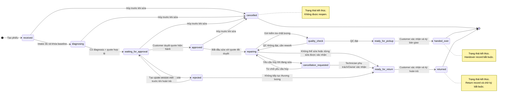

# RepairFlow — Kiến trúc hệ thống và yêu cầu mở rộng

## 1. Mục tiêu

RepairFlow là hệ thống quản lý một chuỗi sửa chữa có thể kiểm chứng:

```text
Tiếp nhận → Ghi nhận hiện trạng → Chẩn đoán → Báo giá → Khách duyệt
→ Phân công sửa → Kiểm tra chất lượng → Bàn giao
```

Mỗi phiếu sửa chữa là nguồn dữ liệu trung tâm. Hệ thống phải trả lời được:

- Thiết bị của ai và được tiếp nhận khi nào?
- Ai chẩn đoán, ai thực hiện sửa, ai kiểm tra và ai bàn giao?
- Trước khi sửa thiết bị có tình trạng gì?
- Khách đã duyệt chính xác báo giá phiên bản nào?
- Công việc nào đã thực hiện và kết quả kiểm tra ra sao?
- Thiết bị được bàn giao khi nào và tình trạng cuối ra sao?

MVP hỗ trợ một cửa hàng hoặc một kỹ thuật viên độc lập, nhưng dữ liệu được thiết kế theo `workspace` để có thể mở rộng nhiều nhân viên sau này.

## 2. Kiến trúc triển khai đề xuất

```text
Admin Web cho nhân viên ─┐
                         ├─ Backend/API ── PostgreSQL
Public Customer Link ───┘                   │
                                            └─ Object Storage
                                               (ảnh và tài liệu)
```

### Thành phần

- **Web application**: giao diện nội bộ cho chủ tiệm, lễ tân, kỹ thuật viên và giao diện công khai cho khách hàng.
- **Backend/API**: xác thực, phân quyền, kiểm tra chuyển trạng thái, nghiệp vụ báo giá, link khách hàng và audit log.
- **PostgreSQL**: nguồn dữ liệu chính cho toàn bộ nghiệp vụ.
- **Object Storage**: lưu ảnh hiện trạng, ảnh sau sửa và các tài liệu đính kèm. Database chỉ lưu metadata và `object_key`.
- **Notification worker**: chưa bắt buộc trong tuần đầu; có thể bắt đầu bằng thông báo trong ứng dụng, sau đó bổ sung email hoặc SMS.

### Quyết định cho MVP

- Dùng **modular monolith**, không dùng microservice.
- Không cần Redis, message broker, Elasticsearch hoặc data warehouse ở giai đoạn đầu.
- Client không truy cập trực tiếp database; mọi thao tác đi qua Backend/API.
- Các thao tác quan trọng như duyệt báo giá, đổi trạng thái và bàn giao phải chạy trong transaction.
- Dùng migration có version để quản lý thay đổi schema.

### Baseline công nghệ triển khai

- **Backend/API bắt buộc**: ASP.NET Core Web API trên .NET, triển khai dạng
  modular monolith. Đây là boundary duy nhất cho authentication, permission,
  workflow, business rule, transaction và response contract.
- **Web UI**: React + Vite + TypeScript cho Internal Web UI và Customer Link
  UI. Vite đảm nhiệm dev/build; React chỉ render UI và không chứa business rule
  hay business API.
- **Database access target**: Entity Framework Core và provider Npgsql cho
  PostgreSQL.
- **Schema migration**: SQL versioned migrations, được thực thi bởi migration
  runner của backend .NET; giữ nguyên contract schema và thứ tự migration đã
  chốt.
- **Local database**: PostgreSQL 18 Alpine chạy bằng Docker Compose; cấu hình qua biến môi trường, không commit secret.

**Implementation note:** Python/FastAPI tại `src/app/`, `src/db/` và test
prototype đã được loại bỏ để reset implementation. C0 target đã dựng lại
health endpoint, migration runner và test baseline bằng ASP.NET Core/.NET tại
`src/server`; đây không phải thay đổi requirements hay business scope.

## 3. Vai trò và phân quyền

### Mô hình truy cập MVP

RepairFlow phục vụ một cửa hàng nhỏ nên hỗ trợ account theo nhu cầu, với tập
role cố định và giới hạn theo workspace/assignment. Một membership có thể được
cấp nhiều role trong cùng workspace; session luôn có một `active_role` để xác
định ngữ cảnh nghiệp vụ hiện tại.

- **Owner**, **Manager**, **Receptionist** và **Technician** có thể được cấp
  account để mở giao diện nội bộ và gọi API trong phạm vi được phép.
- Staff profile chưa được cấp account không có password, credential hoặc
  session riêng; vẫn có thể được dùng để phân công và truy vết.
- Người đang đăng nhập chịu trách nhiệm cho thao tác API; `staff_id`/hồ sơ
  nhân sự ghi nhận người thực hiện nghiệp vụ thực tế.
- Khách hàng không đăng nhập; chỉ dùng public link token có hạn dùng và có thể thu hồi.
- Không mở dashboard/API nội bộ công khai. Môi trường deploy phải yêu cầu
  session của access principal hợp lệ.
- Receptionist được tra cứu operational summary của mọi repair order trong
  cùng workspace ở chế độ read-only để hỗ trợ khách hàng; quyền ghi vẫn theo
  assignment/responsibility.

Chi tiết scope account và permission tối thiểu nằm trong
[07-authentication-and-authorization.md](./07-authentication-and-authorization.md).

### Vai trò

#### Owner/Manager (Admin mở rộng)

- Quản lý thông tin cửa hàng và nhân viên.
- Xem và chỉnh sửa toàn bộ phiếu sửa chữa.
- Xem báo cáo toàn cửa hàng.
- Thu hồi link khách hàng và xử lý các trường hợp ngoại lệ.
- Owner là access principal mặc định của cửa hàng; `Admin` chỉ là vai trò mở rộng khi cần.

#### Manager

- Phân công phiếu cho nhân viên.
- Theo dõi tiến độ và báo cáo vận hành.
- Điều chỉnh quy trình theo chính sách của cửa hàng.
- Không được quản lý tài khoản Owner nếu không được cấp quyền riêng.
- Manager có thể đăng nhập và thao tác trong phạm vi workspace.

#### Receptionist/Front Desk

- Tiếp nhận khách và thiết bị.
- Tạo phiếu, ghi nhận hiện trạng, phụ kiện và hình ảnh.
- Gửi link báo giá và cập nhật bàn giao.
- Tra cứu tiến độ, giai đoạn xử lý, tóm tắt lỗi và thời gian dự kiến của mọi
  phiếu để trả lời khách; phần tra cứu này không có quyền cập nhật.
- Không tự ý sửa chẩn đoán hoặc báo giá đã được duyệt nếu không có quyền.
- Có thể được cấp account với quyền cố định cho order intake/handover được
  giao; nếu chưa có account thì chỉ là staff profile.

#### Technician

- Xem các phiếu được phân công.
- Chẩn đoán, lập báo giá và ghi nhận công việc sửa chữa.
- Hoàn thành checklist sửa chữa và kiểm tra chất lượng.
- Chỉ được sửa dữ liệu trong phạm vi phiếu và quyền được cấp.
- Có thể được cấp account với quyền cố định cho diagnosis/repair/QC của order
  được giao; nếu chưa có account thì được chọn bằng staff profile khi phân công.

#### Customer

- Không cần tài khoản trong MVP.
- Truy cập phiếu thông qua link bảo mật.
- Xem thông tin cần thiết, báo giá và trạng thái.
- Đồng ý hoặc từ chối một phiên bản báo giá.
- Gửi yêu cầu hủy trước khi bắt đầu sửa; Receptionist ghi nhận và thực hiện
  thay đổi trạng thái theo quy định.

### Quy tắc phân quyền

- Quyền phải được kiểm tra ở Backend/API, không chỉ ẩn nút trên giao diện.
- Mọi truy vấn dữ liệu nghiệp vụ phải lọc theo `workspace_id`.
- Hồ sơ nhân sự bị vô hiệu hóa không được nhận phiếu mới; lịch sử thao tác cũ vẫn phải giữ lại.
- Không ghi đè `user_id` của người đã thực hiện một hành động.
- Chỉ access principal active có role-set và membership hợp lệ được gọi API nội
  bộ. `active_role` phải thuộc role-set của membership hiện tại.
- Owner/Manager có thể xem dữ liệu vận hành trong workspace theo quyền;
  Receptionist được xem operational projection toàn workspace nhưng thao tác
  ghi và dữ liệu kỹ thuật chi tiết vẫn bị giới hạn bởi role/assignment.

## 4. Xác định người chịu trách nhiệm

Chỉ có `assigned_technician_id` là chưa đủ, vì một phiếu có thể do nhiều người xử lý ở các giai đoạn khác nhau.

Phiếu cần phân biệt:

- Người tạo phiếu.
- Người tiếp nhận.
- Người chẩn đoán.
- Người chịu trách nhiệm chính.
- Người thực hiện sửa chữa.
- Người kiểm tra chất lượng.
- Người bàn giao.

Dùng bảng `repair_order_staff` để hỗ trợ một hoặc nhiều nhân viên cho một phiếu:

```text
repair_order_staff
    id
    repair_order_id
    user_id
    responsibility
    is_primary
    assigned_at
    completed_at
    note
```

Trong MVP, `responsibility` gồm:

```text
intake
diagnosis
primary_technician
repairer
quality_checker
handover
```

Owner và Manager có quyền phân công, thay đổi người phụ trách và xác định
responsibility/kết quả cần đạt cho từng phiếu. Owner/Manager được phép thay thế
người phụ trách trực tiếp khi nhận thấy người hiện tại chưa đủ kỹ năng hoặc
không phù hợp với task. Việc thay thế phải kết thúc assignment cũ với lý do,
gán người mới và giữ nguyên assignment, thao tác cùng lịch sử audit trước đó;
không xóa hoặc ghi đè dữ liệu đã phát sinh. Account hoặc staff profile bị vô
hiệu hóa không được nhận assignment mới, nhưng mọi assignment và thao tác trong
quá khứ vẫn được giữ.

Ngoài ra, các bảng `diagnoses`, `checklists`, `repair_work_logs`, `handover_records` và `status_history` đều phải có người thực hiện và thời điểm thực hiện. Như vậy hệ thống có thể hiển thị timeline kiểu:

```text
09:10 — Linh tiếp nhận máy
09:45 — Nam chẩn đoán lỗi màn hình
10:20 — Khách duyệt báo giá
11:00 — Nam thực hiện thay màn hình
13:30 — Linh kiểm tra chất lượng
14:00 — Linh bàn giao cho khách
```

## 5. Mô hình dữ liệu chính

### Workspace và nhân viên

```text
workspaces
    id
    name
    phone
    address
    timezone
    created_at

staff_profiles (logical model; current SQL table is `users`)
    id
    name
    phone
    email             # liên hệ tùy chọn, không mặc định là credential
    status
    created_at

workspace_memberships
    id
    workspace_id
    user_id           # ID hồ sơ nhân sự
    role              # default role để tương thích/backfill
    status
    invited_at
    joined_at

workspace_membership_roles
    id
    membership_id
    role
    is_default
    created_at
```

Giữ `workspace_memberships` để xác định hồ sơ nhân sự thuộc workspace và
trạng thái membership. `workspace_memberships.role` là default role dùng cho
backfill/tương thích; quyền được cấp chính thức nằm trong
`workspace_membership_roles`, unique theo `(membership_id, role)` và tối đa một
role mặc định. Access principal/session được quản lý bởi access module riêng;
session lưu `active_role` nhưng không tạo identity mới khi đổi role.

### Khách hàng và thiết bị

```text
customers
    id
    workspace_id
    name
    phone
    email
    note
    created_at
    updated_at

devices
    id
    workspace_id
    customer_id
    device_type
    brand
    model
    serial_number
    device_identifier
    note
    created_at
    updated_at
```

Không lưu mật khẩu hoặc mã mở khóa trong Device master. Nếu nghiệp vụ sửa chữa
thật sự cần giữ credential, chỉ lưu trong repair item bằng encrypted storage của
RepairFlow API/database hiện tại, có consent, giới hạn quyền, expiry và audit;
không plaintext, không đưa vào note/log và không thêm service lưu trữ bên ngoài.

### Phiếu sửa chữa

```text
repair_orders
    id
    workspace_id
    order_code
    customer_id
    device_id
    status
    customer_description
    internal_note
    received_at
    expected_completed_at
    completed_at
    cancelled_at
    cancellation_reason
    created_by
    created_at
    updated_at
```

Mã phiếu `order_code` phải dễ đọc, duy nhất trong workspace và có thể in hoặc đọc qua điện thoại.

### Hiện trạng và bằng chứng

```text
repair_evidence
    id
    workspace_id
    repair_order_item_id
    stage
    object_key
    original_filename
    mime_type
    size
    checksum
    created_by
    created_at
    deleted_at
```

`stage` gồm `before_repair`, `diagnosis`, `after_repair` và `handover`.
Trong C2 chỉ triển khai `before_repair`; evidence gắn với từng
`repair_order_item`, không gắn mơ hồ ở cấp order.

### Quyết định C2 về ảnh ngoại quan

**DECIDED — 2026-09-21**

- Mỗi `repair_order_item` nhận tối đa 5 ảnh `JPG/JPEG` hoặc `PNG`.
- Mỗi ảnh tối đa 1 MB. Không đặt thêm quota tổng độc lập cho order; tổng tối
  đa được tính từ số item và giới hạn của từng item.
- Mỗi item có một mô tả tổng tình trạng ngoại quan bắt buộc. Mô tả là text
  nhiều dòng và dùng lại `handover_condition`; không tạo caption riêng cho ảnh.
- Gợi ý chụp mặt trước, mặt sau, cạnh/cổng và vùng hư hỏng chỉ là hướng dẫn,
  không phải checklist bắt buộc đủ mọi góc.
- Người có quyền xem phiếu được xem evidence. Người có quyền xử lý phiếu được
  upload hoặc xóa ảnh khi item chưa bị khóa.
- Người tạo phiếu tiếp tục được upload/xóa ảnh khi chưa có Technician xác nhận
  nhận bàn giao. Assignment Technician không tự khóa ảnh; thao tác xác nhận
  nhận bàn giao mới là điểm khóa.
- Khi Technician xác nhận nhận bàn giao một item, evidence của item đó bị khóa:
  không upload, xóa hoặc ghi đè thêm. Khóa theo item, không khóa nhầm các item
  khác trong cùng order.
- Xóa ảnh trước khi khóa là xóa khỏi danh sách sử dụng nhưng không hard-delete
  metadata/audit trong MVP. Object vật lý được dọn qua storage cleanup.
- C2 chưa lưu `important flag`, caption, `shot_type`, EXIF/GPS hoặc bản chỉnh
  sửa ảnh. Các nhu cầu này để plan sau.

### Chẩn đoán, báo giá và quyết định của khách

```text
diagnoses
    id
    repair_order_id
    findings
    cause
    recommendation
    estimated_duration
    diagnosed_by
    created_at

quotes
    id
    repair_order_id
    version
    status
    subtotal
    total
    note
    created_by
    created_at

quote_items
    id
    quote_id
    item_type
    description
    quantity
    unit_price
    replacement_reason
    estimated_duration

customer_decisions
    id
    quote_id
    decision
    customer_name
    customer_contact_snapshot
    decided_at
    source_link_id
```

Khi báo giá đã gửi hoặc đã được duyệt, không sửa trực tiếp các dòng cũ. Nếu có thay đổi, tạo báo giá mới với `version` mới và yêu cầu khách xác nhận lại.
Việc thương lượng giảm giá hoặc bỏ bớt hạng mục sửa chữa vẫn thuộc cùng
repair order; chỉ tạo quote version mới, giữ nguyên quote cũ và yêu cầu
Customer quyết định lại version mới.
Customer chỉ duyệt hoặc từ chối toàn bộ quote version hiện hành; không có
approve từng item trong MVP.
Trao đổi thương lượng có thể diễn ra qua điện thoại hoặc Zalo. Customer chỉ
thông báo chưa chấp thuận và yêu cầu thay đổi; Technician điều chỉnh phần kỹ
thuật, hạng mục và giá khi cần, tạo bản nháp version mới và gửi cho Customer
theo quyền được cấp. Nếu quote hiện tại đã `rejected` nhưng thiết bị chưa được hoàn trả,
cùng repair order vẫn được tạo quote version mới và quay lại
`waiting_for_approval`; sau khi order đã `returned` thì không tạo quote mới
trên order cũ. MVP không lưu communication log của phone/Zalo; snapshot item,
giá, version, actor cập nhật và audit là nguồn ghi nhận chính thức.

### Link công khai cho khách

```text
customer_links
    id
    repair_order_id
    quote_id
    purpose
    token_hash
    expires_at
    last_accessed_at
    revoked_at
    created_at
```

Link phải giới hạn đúng phạm vi dữ liệu được xem. Không dùng một link chung có quyền truy cập toàn bộ database hoặc toàn bộ workspace.

### Công việc, checklist và bàn giao

```text
repair_work_logs
    id
    repair_order_id
    technician_id
    summary
    started_at
    ended_at
    note

checklists
    id
    repair_order_id
    checklist_type
    content_json
    completed_by
    completed_at

handover_records
    id
    repair_order_id
    recipient_name
    recipient_contact
    returned_accessories
    final_condition_note
    recipient_signature_ref
    confirmed_at
    handed_over_by

```

Checklist dùng `content_json` trong MVP để triển khai nhanh. Khi cần báo cáo chi tiết theo từng loại lỗi hoặc từng mục kiểm tra, có thể tách thành template và checklist items ở giai đoạn sau.

Warranty được loại khỏi workflow và schema MVP. v0 không có entity, status,
activation, claim, field, notification hoặc permission cho warranty. Khi triển
khai sau, đây sẽ là một module riêng theo chính sách dịch vụ/linh kiện của
từng workspace, không mặc định phụ thuộc vào một mẫu điện thoại hay một loại
thiết bị.

### Theo dõi trạng thái và audit

```text
status_history
    id
    repair_order_id
    from_status
    to_status
    changed_by
    reason
    created_at

audit_logs
    id
    workspace_id
    user_id
    actor_type
    entity_type
    entity_id
    action
    metadata_json
    ip_hash
    user_agent
    created_at
```

`status_history` phục vụ timeline nghiệp vụ. `audit_logs` phục vụ truy vết bảo mật và các hành động quan trọng như sửa báo giá, thu hồi link, thay đổi nhân viên hoặc xóa tài liệu.

## 6. Trạng thái và luật chuyển trạng thái

Trạng thái không chỉ để hiển thị; mỗi chuyển trạng thái phải có điều kiện và người thực hiện.

```text
received
    → diagnosing | cancelled
diagnosing
    → waiting_for_approval | cancelled
waiting_for_approval
    → approved | rejected | cancelled
approved
    → repairing | cancelled
repairing
    → quality_check | cancellation_requested | ready_for_return
quality_check
    → ready_for_pickup | repairing
rejected
    → waiting_for_approval | ready_for_return
ready_for_return
    → returned
cancellation_requested
    → repairing | ready_for_return
ready_for_pickup
    → handed_over
handed_over
```

### 6.0. Canonical state diagram

Sơ đồ dưới đây là biểu diễn trực quan của state machine canonical. Các điều
kiện chuyển trạng thái, quyền thực hiện và dữ liệu audit vẫn lấy từ phần mô tả
nghiệp vụ ngay bên dưới; sơ đồ không tạo thêm trạng thái mới.



Một số luật cần áp dụng:

- Không chuyển sang `diagnosing` nếu chưa có thông tin thiết bị và lỗi khách mô tả.
- Không chuyển sang `waiting_for_approval` nếu chưa có chẩn đoán và báo giá hợp lệ.
- Không chuyển sang `repairing` nếu chưa có quyết định `approved` cho đúng phiên bản báo giá.
- Không chuyển sang `ready_for_pickup` nếu chưa hoàn thành checklist chất lượng.
- Không chuyển sang `handed_over` nếu chưa có biên bản bàn giao.
- Mọi chuyển trạng thái phải ghi `changed_by`, thời gian và lý do khi là ngoại lệ.

### 6.1. Chính sách hủy và hoàn trả

- Customer có thể yêu cầu hủy khi Technician chưa bắt đầu sửa chữa thực tế,
  gồm các trạng thái `received`, `diagnosing`, `waiting_for_approval` và
  `approved`. Receptionist ghi nhận và thực hiện hủy trong phạm vi được giao.
- Lý do hủy là bắt buộc, ví dụ: khách hàng yêu cầu hủy, tạo nhầm phiếu hoặc
  thiết bị chưa được chuyển đến trung tâm sửa chữa.
- Khi order đang `repairing`, yêu cầu hủy không được tự động chấp nhận. Order
  chuyển sang `cancellation_requested` và phải được Technician đang chịu trách
  nhiệm sửa xác nhận; Owner có thể chủ động xác nhận ngoại lệ. Receptionist
  không xác nhận quyết định dừng sửa, nhưng có thể hoàn tất trả máy sau khi
  yêu cầu đã được xác nhận.
- Nếu yêu cầu hủy trong lúc `repairing` được xác nhận, phải ghi nhận tình trạng
  hiện tại và kết thúc bằng luồng `ready_for_return` → `returned`. Receptionist
  hoàn tất việc trả máy; người thực hiện có thể là Receptionist khác nhưng phải
  cùng role và có quyền trên bước hoàn trả. Trường hợp này không kích hoạt bảo
  hành.
- Nếu yêu cầu hủy trong lúc `repairing` bị từ chối, order quay lại hoặc tiếp tục
  ở `repairing`, phải lưu lý do từ chối và tiếp tục luồng sửa chữa bình thường.
- Nếu Technician xác định không thể sửa, Technician ghi lý do và bấm thông báo
  Customer trên customer link; không cần Customer approve lại. Order chuyển vào
  `ready_for_return`, sau đó Customer hoặc người được ủy quyền xác nhận và ký
  trên link, Receptionist hoàn tất biên bản và chuyển sang `returned`.
- Nếu Customer không đồng ý báo giá, order đi theo luồng `rejected` →
  `ready_for_return` → `returned`, không coi là `cancelled`.
- Khi trả máy, phải có xác nhận Customer đã nhận máy và chữ ký; Receptionist
  thực hiện bước này có thể là người khác cùng role với người tiếp nhận ban đầu.
- Mọi yêu cầu hủy, xác nhận, từ chối hoặc hoàn trả phải lưu actor, thời điểm,
  lý do, status history, audit và bằng chứng liên quan nếu có.
- `cancelled` là trạng thái kết thúc; không mở lại (`reopen`) phiếu đã hủy.
- Nếu Customer quay lại sau khi phiếu bị hủy, phải tạo repair order mới và giữ
  nguyên phiếu cùng lịch sử cũ; không trộn timeline, chẩn đoán hoặc báo giá của
  hai phiếu.

### 6.2. Hiệu chỉnh dữ liệu intake

- Ảnh `before_repair` của từng item có một mốc khóa riêng khi Technician xác
  nhận nhận bàn giao. Đây là khóa chỉnh sửa ảnh sớm hơn, không tự chuyển order
  sang `diagnosing`.
- Khi order đã chuyển từ `received` sang `diagnosing`, dữ liệu intake baseline
  được xem là đã khóa để bảo toàn bằng chứng ban đầu.
- Intake baseline gồm Customer, device, lỗi khách mô tả, phụ kiện, tình trạng
  ban đầu và ảnh/bằng chứng trước sửa.
- Chỉ Owner hoặc Manager được hiệu chỉnh dữ liệu intake sau thời điểm khóa,
  với lý do bắt buộc và audit đầy đủ.
- Không xóa hoặc ghi đè giá trị cũ; hệ thống phải giữ được giá trị trước và sau
  hiệu chỉnh. Receptionist/Technician không tự sửa baseline đã khóa.

## 7. Bảo mật và quyền riêng tư

### Quyền truy cập nội bộ

- Mỗi access principal đăng nhập bằng credential riêng; không dùng một credential chung cho cả tiệm nếu hệ thống đã triển khai qua Internet.
- Mật khẩu/PIN phải được hash và không lưu plaintext.
- Session có thời hạn, cookie `HttpOnly`, bật `Secure` khi chạy qua HTTPS và có cơ chế đăng xuất. Mặc định v0 là idle timeout 30 phút và absolute session expiry 8 giờ.
- Receptionist/Technician có thể có credential/session riêng nếu được cấp
  account; staff profile không có account vẫn do quản lý chọn khi nhập dữ liệu
  hoặc phân công.
- Hồ sơ nhân sự bị vô hiệu hóa mất quyền được phân công mới nhưng không làm mất lịch sử cũ.
- Nếu chạy hoàn toàn local/offline, có thể giữ session lâu hơn nhưng vẫn không được mở API nội bộ không bảo vệ.

### Link khách hàng

- Token được tạo bằng bộ sinh số ngẫu nhiên an toàn.
- Database chỉ lưu hash của token.
- Link có thời hạn 7 ngày, có thể thu hồi và có thể tạo lại. Trước khi xem
  thông tin hoặc xác nhận/ký, Customer hoặc người được ủy quyền phải nhập OTP
  gửi qua số điện thoại hoặc email đã được ghi nhận; không coi token/link đơn
  thuần là đủ quyền truy cập. Khi có quote
  version mới, link của version cũ bị thu hồi; khi phiếu đã `handed_over`,
  `returned` hoặc `cancelled`, link không còn quyền quyết định.
- Không đưa thông tin cá nhân hoặc dữ liệu báo giá vào URL.
- OTP gồm 6 chữ số, hết hạn sau 5 phút, tối đa 5 lần nhập sai; chỉ gửi lại sau
  60 giây và tối đa 3 lần trong 15 phút. Rate limit áp dụng theo IP, customer
  link và số điện thoại/email; vượt giới hạn thì khóa tạm 15 phút.
- OTP chỉ lưu dưới dạng hash và chỉ dùng một lần. Sau khi xác thực, customer
  session có hiệu lực 30 phút rồi phải xác thực lại.
- Áp dụng rate limit cho trang public và các thao tác duyệt.
- Link chỉ cho phép xem đúng phiếu được cấp quyền.
- Ghi nhận thời điểm truy cập và quyết định của khách.

### File và dữ liệu

- Bucket ảnh phải ở chế độ private.
- Dùng signed URL có thời hạn khi hiển thị ảnh.
- Kiểm tra MIME type, phần mở rộng, kích thước và tên file khi upload.
- Không cho phép file được upload thực thi trực tiếp trên server.
- Mã hóa dữ liệu khi truyền và khi lưu trữ.
- Chỉ lưu mã mở khóa thiết bị nếu thật sự cần cho thao tác sửa chữa và có consent;
  lưu ciphertext trong backend/database hiện tại, không lưu trong Device master,
  note tự do hoặc log. Nếu không cần giữ lại, chỉ lưu credential status.
- Trong MVP không tự động xóa phiếu, audit, ảnh hoặc chữ ký. Chính sách
  retention và xóa dữ liệu chi tiết sẽ được bổ sung sau khi có yêu cầu pháp lý
  hoặc chính sách chính thức của workspace.

### Audit và khôi phục

- Audit log không được cho phép nhân viên thường sửa hoặc xóa.
- Các hành động nhạy cảm phải lưu actor, thời gian, đối tượng và lý do.
- Backup database mỗi ngày, giữ 14 bản gần nhất.
- Phải kiểm thử khôi phục backup trước khi dùng thật.
- Có quy trình xử lý khi lộ link, sửa nhầm báo giá hoặc gửi nhầm thông tin.

## 8. Theo dõi, dashboard và báo cáo

### Timeline của một phiếu

Timeline phải tổng hợp từ `status_history`, `repair_work_logs`, `customer_decisions`, `checklists`, `repair_evidence` và `handover_records`.

Mỗi sự kiện nên hiển thị:

- Thời điểm.
- Người thực hiện.
- Hành động.
- Ghi chú hoặc lý do.
- Tài liệu/hình ảnh liên quan nếu có.

### Dashboard vận hành

MVP nên có các nhóm chỉ số sau:

- Số phiếu đang xử lý theo trạng thái.
- Phiếu đang chờ khách duyệt.
- Phiếu quá thời gian dự kiến.
- Phiếu sẵn sàng bàn giao.
- Phiếu theo từng kỹ thuật viên.
- Thời gian trung bình từ tiếp nhận đến bàn giao.
- Số phiếu bị trả lại ở bước kiểm tra chất lượng.

### Báo cáo kỹ thuật viên

- Số phiếu được phân công, đang xử lý và đã hoàn tất.
- Thời gian xử lý theo từng phiếu.
- Số lần sửa lại hoặc không đạt kiểm tra chất lượng.
- Các thiết bị hoặc lỗi thường gặp.

### Báo cáo khách hàng

- Lịch sử sửa chữa theo khách hàng.
- Lịch sử theo serial number hoặc thiết bị.

Báo cáo warranty được loại khỏi MVP và sẽ thiết kế cùng module warranty sau.

### Báo cáo giá trị

Vì MVP chưa có thanh toán, chỉ nên gọi là **giá trị báo giá** hoặc **giá trị phiếu hoàn tất**, không gọi là doanh thu đã thu.

Các báo cáo có thể tính trực tiếp bằng query hoặc database view. Chưa cần tạo bảng snapshot hoặc data warehouse.

## 9. Thông báo và nhắc việc

Các sự kiện nên được thiết kế để sau này có thể gửi nhiều kênh:

- Báo giá đang chờ khách duyệt.
- Khách đã duyệt hoặc từ chối báo giá.
- Phiếu bị quá thời gian dự kiến.
- Thiết bị đã sẵn sàng bàn giao.
- Link khách hàng sắp hết hạn.

Nhắc việc thiết bị không đến nhận được thực hiện sau khi luồng chính ổn định:
Receptionist gọi điện, cập nhật follow-up và Manager theo dõi cảnh báo. Không
tự động thanh lý thiết bị trong MVP. Nhắc việc warranty được loại khỏi MVP.

Trong MVP, có thể hiển thị thông báo trong dashboard và cho phép nhân viên sao chép link gửi thủ công. Email/SMS là phần mở rộng sau khi nghiệp vụ ổn định.

## 10. Index và tính toàn vẹn dữ liệu

Nên tạo index cho:

- `repair_orders(workspace_id, status)`.
- `repair_orders(workspace_id, order_code)` với unique constraint.
- `repair_orders(customer_id)` và `repair_orders(device_id)`.
- `customers(workspace_id, phone)`.
- `devices(workspace_id, serial_number)` khi serial number có giá trị.
- `repair_order_staff(user_id, repair_order_id)`.
- `status_history(repair_order_id, created_at)`.
- `customer_links(token_hash)`.
Các index cho warranty chỉ được bổ sung khi module warranty được triển khai.

Các nguyên tắc dữ liệu:

- Dùng UUID hoặc ULID làm khóa chính.
- Dùng `numeric` hoặc số nguyên nhỏ nhất phù hợp để lưu tiền, không dùng floating point.
- Dùng UTC trong database và hiển thị theo timezone của workspace.
- Dùng foreign key cho quan hệ chính.
- Dùng transaction khi tạo quyết định khách, đổi trạng thái hoặc bàn giao.
- Không xóa cứng dữ liệu bằng chứng và audit log.

## 11. Phạm vi MVP được cập nhật

### Nên có ngay

- Đăng nhập access principal và xác định workspace.
- Quản lý hồ sơ nhân sự, role, account status và assignment; cấp account cho
  Receptionist/Technician theo nhu cầu.
- Phân công kỹ thuật viên cho từng phiếu.
- Ghi nhận người tạo, người chẩn đoán, người sửa, người kiểm tra và người bàn giao.
- Phiếu sửa chữa, khách hàng và thiết bị.
- Checklist và ảnh hiện trạng.
- Chẩn đoán, báo giá theo phiên bản và quyết định của khách.
- Link khách hàng có thời hạn và thu hồi được.
- Luồng quote bị từ chối hoặc yêu cầu hủy phải hoàn trả thiết bị.
- Timeline lịch sử thao tác.
- Checklist sửa chữa và kiểm tra chất lượng.
- Bàn giao và lịch sử.
- Hủy phiếu trước khi kỹ thuật viên bắt đầu sửa chữa thực tế, kèm lý do và
  audit; nếu đang sửa thì phải qua xác nhận dừng sửa và hoàn trả.
- Dashboard cơ bản theo trạng thái và kỹ thuật viên.
- Tra cứu read-only tiến độ, giai đoạn, tóm tắt lỗi và thời gian dự kiến cho
  Receptionist khi hỗ trợ khách hàng.
- Quyền theo role/workspace/assignment, audit log, kiểm soát file và backup.

### Có thể để sau MVP

- MFA bắt buộc cho Owner/Manager và các vai trò khác.
- Email/SMS tự động.
- Lịch làm việc và phân ca.
- Quản lý kho và tồn linh kiện.
- Thanh toán và kế toán.
- Nhiều chi nhánh.
- Ứng dụng mobile native.
- Báo cáo nâng cao và data warehouse.
- Tài khoản khách hàng dài hạn.
- Module warranty và warranty claim theo chính sách riêng của từng workspace.
- Xử lý thiết bị khách không đến nhận: dashboard cảnh báo, Receptionist gọi
  điện và quy trình xử lý tiếp theo; không tự động thanh lý trong MVP.

## 12. Tiêu chí nghiệm thu kiến trúc

- Có thể xác định chính xác ai đã thực hiện từng giai đoạn của phiếu.
- Một nhân viên chỉ xem và sửa được dữ liệu đúng workspace và đúng quyền.
- Khách chỉ xem được phiếu thông qua link được cấp, link có thể hết hạn hoặc thu hồi.
- Báo giá đã duyệt không bị thay đổi âm thầm.
- Timeline hiển thị được toàn bộ quá trình từ tiếp nhận đến bàn giao.
- Ảnh và tài liệu không bị public ngoài ý muốn.
- Phiếu trước khi bắt đầu sửa có thể tiếp nhận yêu cầu hủy với lý do bắt buộc;
  khi đang `repairing` phải có xác nhận của người chịu trách nhiệm trước khi
  chuyển sang luồng hoàn trả.
- Quote bị từ chối và không thương lượng thêm phải đi qua
  `ready_for_return` → `returned`; nếu Customer muốn
  thay đổi khi thiết bị chưa hoàn trả thì tạo quote version mới trên cùng order.
- Intake baseline sau khi vào `diagnosing` chỉ được Owner/Manager hiệu chỉnh
  với lý do và audit, không xóa giá trị cũ.
- Dashboard cho biết phiếu đang ở đâu, đang chờ ai và phiếu nào bị trễ.
- Có thể truy vấn lịch sử theo khách hàng, thiết bị, kỹ thuật viên và thời gian.
- Có backup và đã kiểm tra khả năng khôi phục dữ liệu.

## 13. Tài liệu UX/UI liên quan

Chi tiết yêu cầu giao diện, luồng người dùng, danh sách màn hình MVP và tiêu chí nghiệm thu được tách riêng tại [docs/v0/06-ui-requirements.md](./06-ui-requirements.md).

Phạm vi authentication, authorization và visibility tối thiểu được chốt tại
[docs/v0/07-authentication-and-authorization.md](./07-authentication-and-authorization.md).

## 14. Tài liệu Database liên quan

Chi tiết schema, kiểu dữ liệu, khóa chính/khóa ngoại, cardinality, index, transaction, quy tắc toàn vẹn và các sơ đồ ERD được tách riêng tại [docs/v0/05-database-requirements.md](./05-database-requirements.md).
