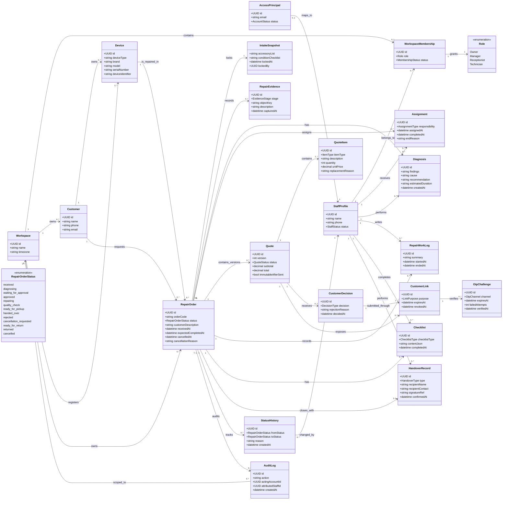
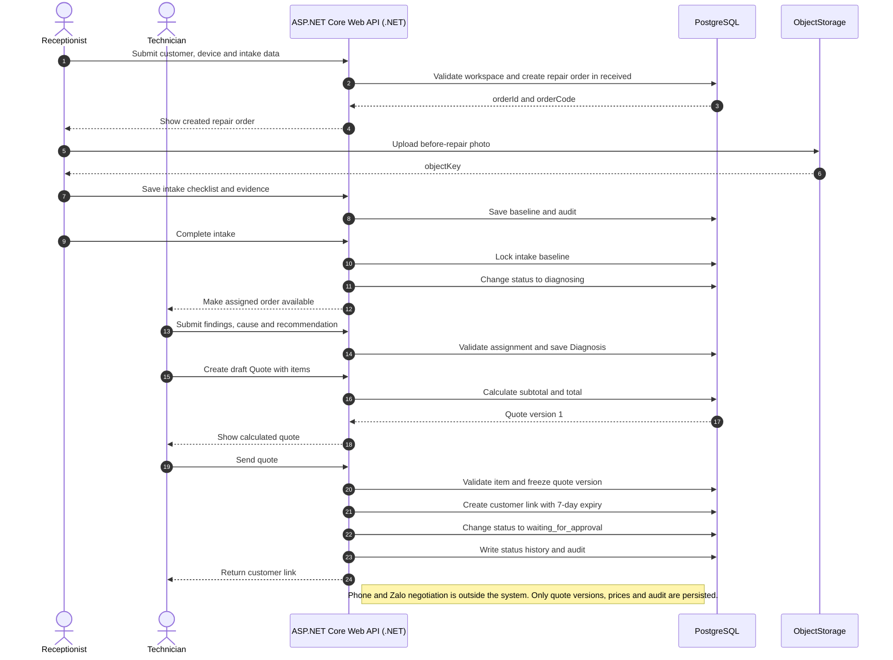
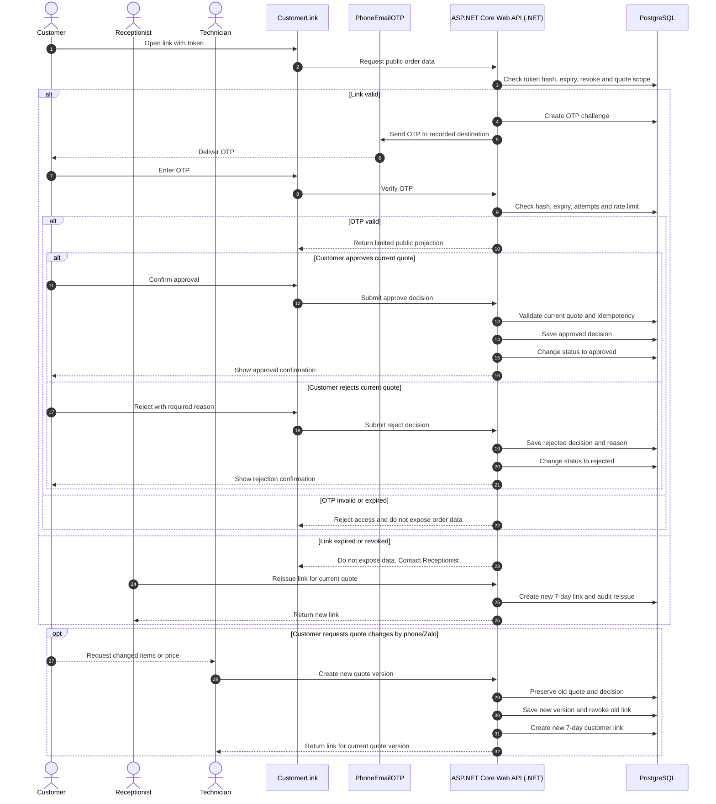
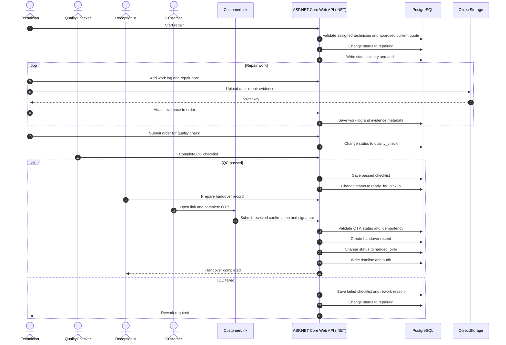
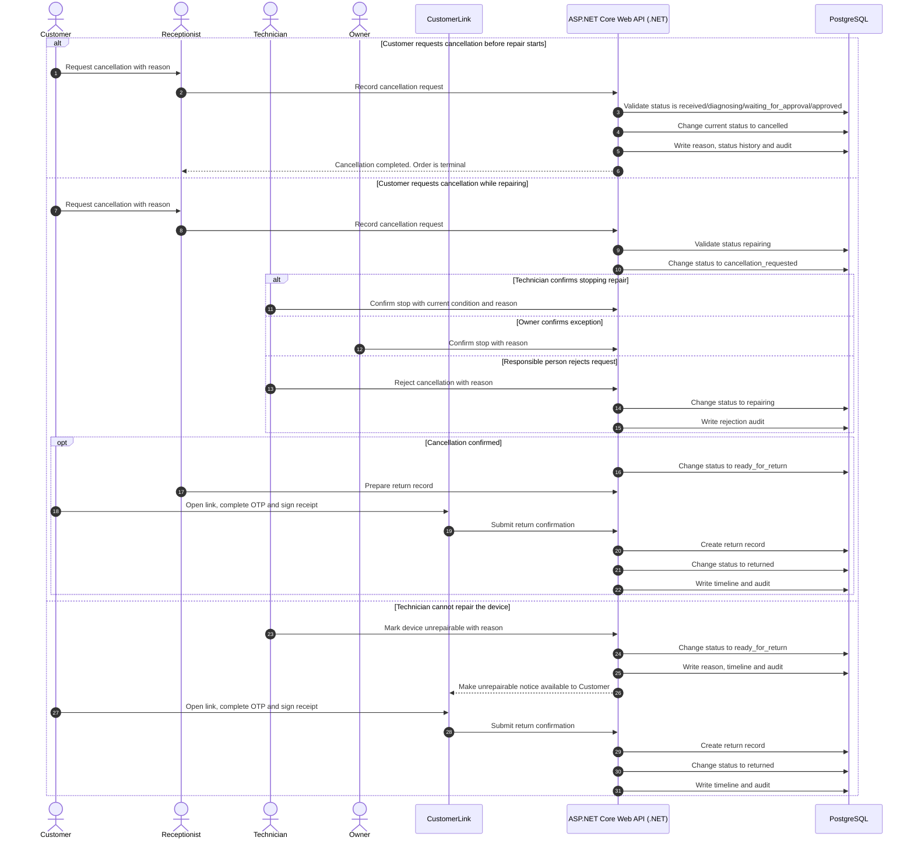
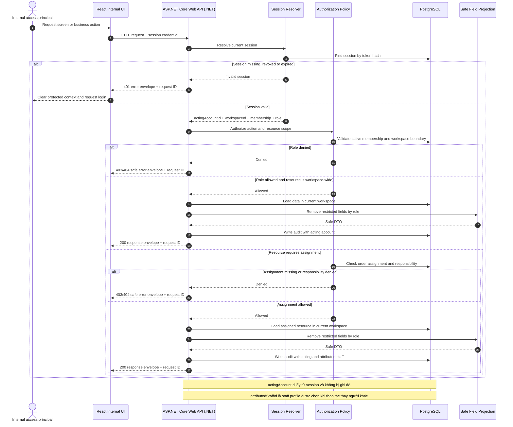
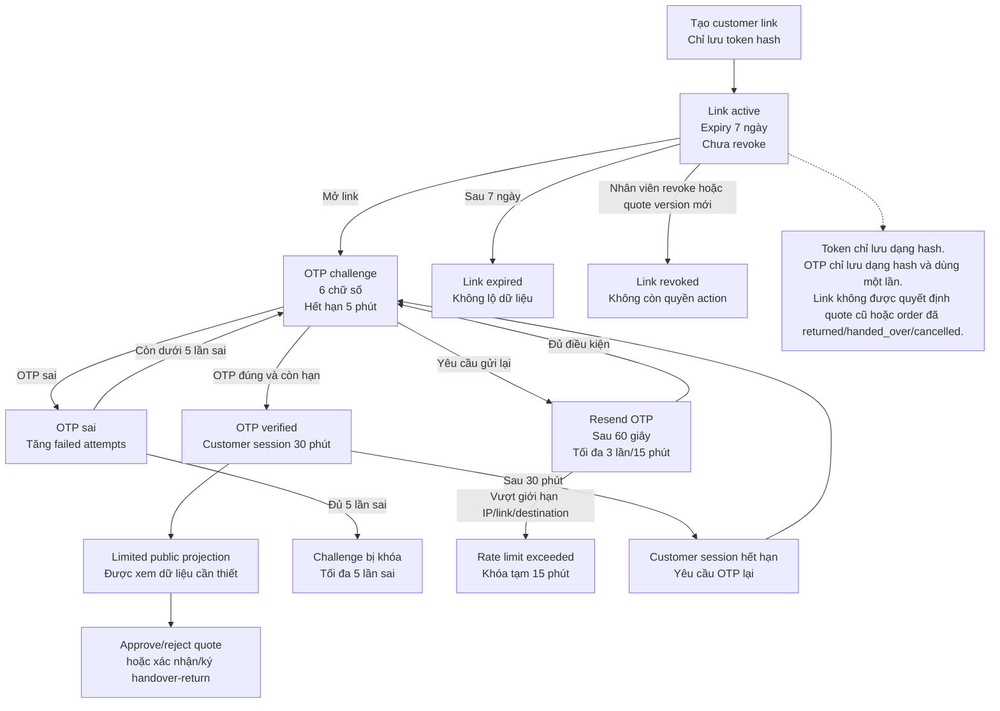

# RepairFlow — Architecture Documentation (C4 + arc42)

> Status: `DECIDED — Gate D0 closed`.
>
> Tài liệu này là view kiến trúc tổng hợp của RepairFlow theo arc42 và C4.
> Các business rule chi tiết vẫn lấy từ
> [03-business-and-domain-requirements.md](./03-business-and-domain-requirements.md),
> [02-use-cases.md](./02-use-cases.md), [05-database-requirements.md](./05-database-requirements.md)
> và [01-requirements-closure.md](./01-requirements-closure.md).

## 0. Mục tiêu của tài liệu

Tài liệu này có ba mục tiêu:

1. Tạo một nơi duy nhất để đọc kiến trúc hệ thống từ góc nhìn tổng thể đến
   module.
2. Làm rõ ranh giới giữa Web UI, Backend/API, PostgreSQL và Object Storage
   trước khi mở các business cluster C1–C10.
3. Làm cơ sở để Product, Developer và QA kiểm tra các quyết định kiến trúc,
   quality requirement và rủi ro mà không tự suy ra business rule mới.

Đây là tài liệu kiến trúc, không phải API contract, implementation plan hay
release handoff.

## 1. Introduction and Goals

RepairFlow quản lý phiếu sửa chữa từ lúc tiếp nhận đến chẩn đoán, báo giá,
khách duyệt, sửa chữa, kiểm tra chất lượng và bàn giao. Giá trị cốt
lõi là tạo evidence trail có thể truy ngược cho toàn bộ vòng đời phiếu.

Các mục tiêu kiến trúc chính:

- Bảo đảm mọi thay đổi quan trọng của phiếu có actor, thời điểm và audit trail.
- Không cho phép UI tự quyết định quyền, tổng tiền hoặc state transition.
- Cô lập dữ liệu theo workspace.
- Giữ kiến trúc đơn giản để MVP có thể triển khai và kiểm thử như một modular
  monolith.
- Cho phép mở rộng Object Storage, notification và nhiều workspace về sau mà
  không phá vỡ core workflow.

Chi tiết product goal và MVP scope nằm trong [README.md](../../README.md).

## 2. Architecture Constraints

Các ràng buộc hiện tại:

- Owner/Manager, Receptionist và Technician có thể có management session khi
  được cấp account và membership hợp lệ.
- Customer dùng public link token có hạn dùng và có thể thu hồi; không có tài
  khoản dài hạn.
- Receptionist và Technician vẫn là staff profile để phân công và truy vết;
  account là tùy chọn theo nhu cầu trực tiếp sử dụng hệ thống.
- Backend/API là nơi kiểm tra permission, business rule, state transition,
  total và transaction.
- Database chính là PostgreSQL; schema được quản lý bằng SQL migration có
  version.
- MVP không bao gồm payment, inventory, AI diagnosis, multi-branch,
  notification worker bắt buộc hoặc data warehouse.

Các policy còn mở phải được giữ trong [01-requirements-closure.md](./01-requirements-closure.md)
và không được biến thành contract bắt buộc khi chưa có Product sign-off.

## 3. Context and Scope

### 3.1. C4 System Context


Source PlantUML: [repairflow-c4-system-context.puml](./architecture/repairflow-c4-system-context.puml).

RepairFlow tương tác với Owner/Manager, Customer và các staff profile trong
quy trình vận hành. Receptionist và Technician có thể được cấp account để
truy cập giới hạn; profile không có account vẫn được dùng để phân công.
Object Storage và notification chưa được coi là actor nghiệp vụ; chúng xuất
hiện ở container/deployment view khi cần.

### 3.2. Use Case Overview

Sơ đồ Use Case tổng quan mô tả các actor, use case MVP và quan hệ chính trong
quy trình sửa chữa. Receptionist và Technician có thể là staff profile có
account tùy nhu cầu hoặc profile không có session riêng. Sơ đồ cố ý gom các use case chi tiết thành
các mục tiêu lớn để dễ đọc; UC-13 và UC-14 vẫn được đặc tả trong tài liệu Use
Case nhưng không đưa vào overview vì chúng là luồng quản trị và ngoại lệ.

Source PlantUML: [repairflow-usecase-overview.puml](./architecture/repairflow-usecase-overview.puml).

### 3.3. In scope / out of scope

In scope: repair order, customer, device, intake evidence, diagnosis, quote
version, customer decision, repair work, quality check, handover, timeline,
audit và dashboard vận hành cơ bản.

Out of scope trong MVP: thanh toán, tồn kho, AI diagnosis, định giá tự động,
nhiều chi nhánh, tài khoản khách hàng dài hạn, email/SMS tự động và warranty.
Warranty được để dành cho một module riêng ở giai đoạn sau.

Chi tiết phạm vi nghiệp vụ nằm trong [02-use-cases.md](./02-use-cases.md).

## 4. Solution Strategy

- Chọn **modular monolith** thay vì microservice.
- Giữ một Backend/API trung tâm để kiểm soát workflow và transaction.
- Tách UI theo feature và để UI gọi API qua adapter boundary.
- PostgreSQL là source of truth cho dữ liệu nghiệp vụ, trạng thái và audit.
- Ảnh/tài liệu được lưu private trong Object Storage; database chỉ lưu metadata
  và object key.
- Dùng migration có version, test acceptance theo scenario và fixture dùng chung
  cho server/UI.

Target technology baseline: **ASP.NET Core Web API trên .NET** cho backend/API,
**React + Vite + TypeScript** cho web UI, **EF Core + Npgsql** cho
database access, PostgreSQL 18 Alpine và versioned SQL migrations. Baseline này
đã được mô tả trong
[03-business-and-domain-requirements.md](./03-business-and-domain-requirements.md).

C0 Python/FastAPI prototype đã được loại bỏ để reset implementation. Health
endpoint, migration runner và test baseline sẽ được dựng lại bằng .NET trong
C0 migration plan; tài liệu target không coi migration là đã hoàn tất.

## 5. Building Block View

### 5.1. C4 Container View


Source PlantUML: [repairflow-c4-container.puml](./architecture/repairflow-c4-container.puml).

Các container cần giữ ranh giới rõ:

- **Internal Web UI**: dashboard và workspace cho Owner/Manager.
- **Customer Link UI**: giao diện public giới hạn theo customer link.
- **ASP.NET Core Web API (.NET)**: session, permission, workflow, quote, decision,
  audit và response envelope.
- **PostgreSQL**: dữ liệu nghiệp vụ, status history và audit log.
- **Object Storage**: ảnh/tài liệu private; trạng thái vẫn là `PROPOSED` cho
  đến khi policy file và deployment được chốt.

### 5.2. C4 Component View — Backend/API


Source PlantUML: [repairflow-c4-component.puml](./architecture/repairflow-c4-component.puml).

Component boundary đề xuất:

- Identity and Access Session.
- Repair Order Lifecycle.
- Evidence and Diagnosis.
- Quote and Customer Decision.
- Repair Execution and Quality Check.
- Handover.
- Audit and Timeline.

Đây là component-level target view để hướng dẫn module hóa; tên module/API cụ
thể chỉ được freeze sau Gate D0 và API contract riêng.

### 5.3. Code-level view

Code-level view chỉ mô tả khi có câu hỏi cần trả lời ở mức module/class. Trong
giai đoạn chuyển đổi, cần phân biệt target layout với C0 compatibility code:

- **Target backend**: solution/project ASP.NET Core Web API trên .NET tại
  `src/server`; layout feature và project boundary đã được tạo trong C0.
- **C0 trước migration**: `src/app/` và `src/db/` là FastAPI/database
  prototype; các file này đã được loại bỏ. `src/ui/` vẫn là UI prototype làm
  functional/visual reference.
- **Target web**: ứng dụng React + Vite + TypeScript dạng static frontend,
  thay thế UI prototype sau khi adapter được nối với ASP.NET Core API.

Không cần vẽ toàn bộ class/module ở giai đoạn v0.

### 5.4. Backend code organization — feature-first

`C2`, `C3` và các mã tương tự là implementation cluster trong roadmap, không
phải business feature. Không tạo thư mục hoặc namespace backend theo cluster,
ví dụ `Features/C2`.

Target backend tổ chức theo business capability:

```text
src/server/RepairFlow.Api/Features/
├── Access/
├── Customer/
├── Device/
└── RepairOrder/
```

Mỗi feature có thể chia tiếp theo trách nhiệm kỹ thuật:

```text
Customer/
├── Api/
├── Application/
├── Domain/
└── Infrastructure/
```

Ranh giới bắt buộc:

- `Api/` chỉ chứa HTTP endpoint, request/response DTO, status mapping và
  OpenAPI metadata; không query database trực tiếp và không chứa business rule.
- `Application/` chứa use case, orchestration, transaction boundary,
  authorization orchestration và repository port/interface; không chứa SQL cụ
  thể.
- `Domain/` chứa entity, value object và business invariant; không phụ thuộc
  ASP.NET Core, EF Core, Npgsql hoặc HTTP.
- `Infrastructure/` chứa repository implementation, SQL/Npgsql/EF mapping và
  external I/O; không tự quyết định business permission hoặc workflow.

Dependency direction:

```text
Api -> Application -> Domain
Infrastructure -> Application ports
Infrastructure -> Domain
```

Không tạo các abstraction chung theo cluster như `C2Models`, `C2Contracts` hoặc
`IC2Repository`. Customer, Device và Repair Order phải có model, contract và
repository boundary riêng. Migration vẫn đặt tại
`Infrastructure/Database/Migrations/` vì đây là persistence boundary dùng chung,
không đặt trong `Features/C2`.

## 6. Runtime View

Các runtime scenario chính cần được giữ nhất quán giữa use case, state machine,
API và database:

1. Tạo phiếu và ghi nhận intake/evidence.
2. Chẩn đoán và tạo quote version.
3. Gửi customer link, customer approve/reject đúng quote version.
4. Thực hiện sửa chữa và quality check.
5. Bàn giao và đóng timeline.

Các transition quan trọng phải atomic: create order, send quote, customer
decision, quality-check transition và handover. Chi tiết state machine
và transaction rule nằm trong [03-business-and-domain-requirements.md](./03-business-and-domain-requirements.md)
và [05-database-requirements.md](./05-database-requirements.md).

## 7. Deployment View

Target runtime topology:

```text
Browser
  └─ React + Vite Web UI (static assets)
       └─ HTTPS / JSON ── ASP.NET Core Web API (.NET)
                              ├─ PostgreSQL 18 Alpine
                              └─ Object Storage (PROPOSED)
```

PostgreSQL local vẫn chạy bằng Docker Compose. Target topology trên đã được
dựng lại ở mức C0; backend runtime active tại `src/server`. Deployment ngoài local, monitoring,
observability và rollback policy được tạm thời để sau; không coi sơ đồ này là
production topology. Backup database hằng ngày, giữ 14 bản gần nhất và kiểm tra
khôi phục là mặc định kỹ thuật v0, nhưng chưa mô tả topology production.

## 8. Cross-cutting Concerns

- Workspace isolation và management permission.
- Session, public link token, expiry, revocation và rate limit.
- State transition và transaction boundary.
- Money calculation bằng numeric/integer, không dùng floating point.
- UTC trong database và timezone của workspace khi hiển thị.
- Private file, MIME/size validation và signed URL.
- Immutable quote snapshot, customer decision, status history và audit log.
- Request ID, error envelope, loading/error/empty state ở UI.

Các concern này là kiến trúc xuyên suốt; không đặt business rule quan trọng chỉ
ở frontend.

## 9. Architecture Decisions

Decision log hiện tại được quản lý trong
[01-requirements-closure.md](./01-requirements-closure.md). Mỗi decision trước khi
đóng cần có owner, ngày chốt, lý do, phương án bị loại, impact lên
server/UI/database/test và scenario success/alternative/failure.

Các quyết định kiến trúc đã có baseline:

- Modular monolith.
- ASP.NET Core Web API trên .NET là backend/API bắt buộc.
- React + Vite + TypeScript là web UI baseline.
- Frontend chỉ là static UI; mọi business operation đi qua ASP.NET Core API.
- Backend là boundary duy nhất để truy cập dữ liệu nghiệp vụ.
- Versioned SQL migrations.
- Transaction cho các thao tác workflow quan trọng.

Các thay đổi mới sau khi đóng baseline phải được ghi nhận như change decision và
cập nhật đồng bộ vào requirements, API, database, UI và test.

## 10. Quality Requirements

Quality requirements cần kiểm chứng:

- **Integrity**: không sửa âm thầm quote đã duyệt; không bàn giao khi QC chưa
  đạt.
- **Security/privacy**: customer link giới hạn đúng phiếu; file không public;
  dữ liệu tách theo workspace.
- **Traceability**: truy ngược được actor, thời điểm, evidence, quote,
  decision, QC và handover.
- **Reliability**: thao tác quan trọng atomic và retry không tạo duplicate.
- **Maintainability**: module theo feature, dependency một chiều, không thêm
  framework chỉ để tổ chức file.
- **Usability/accessibility**: UI luôn hiển thị trạng thái, next action,
  loading, empty, validation, forbidden, conflict và expired state phù hợp.

Target định lượng như latency, availability và RPO/RTO được theo dõi như các
quality target của giai đoạn triển khai; chúng không mở lại Gate D0.
Retention nghiệp vụ đã chốt ở mức không tự động xóa trong MVP; chính sách xóa
chi tiết sẽ bổ sung sau.

## 11. Risks and Technical Debt

- Business API target trên .NET chưa triển khai; UI vẫn dùng mock.
- C0 target runtime và migration runner cần được dựng lại trên .NET.
- Shared fixture và UI adapter boundary còn thiếu.
- Object Storage/deployment/backup production policy chưa hoàn tất; backup
  baseline của MVP đã được chốt.
- Chưa có production topology, monitoring/observability và rollback runbook.

Các khoảng trống còn lại là engineering work sau khi Gate D0 đã đóng, không phải
lý do để khóa requirements baseline.

## 12. Glossary

| Term | Meaning |
| --- | --- |
| Workspace | Phạm vi dữ liệu của một cửa hàng/đơn vị sửa chữa. |
| Repair order | Phiếu sửa chữa, aggregate trung tâm của workflow. |
| Evidence | Ảnh, checklist và ghi chú hiện trạng/sau sửa. |
| Quote version | Snapshot báo giá bất biến được khách quyết định. |
| Customer link | Link public có token, hạn dùng và khả năng thu hồi. |
| Staff profile | Hồ sơ Receptionist/Technician dùng để phân công và audit; có thể được mapping với account nếu cần truy cập trực tiếp. |
| Quality check | Checklist và kết luận đạt/không đạt trước bàn giao. |

## 13. Mục tiêu triển khai sau khi Gate D0 đóng

Tài liệu này sẽ được dùng để:

1. Triển khai C1–C10 theo từng cluster trên nền tảng C0 đã thống nhất.
2. Dẫn đường cho module/backend/UI mà không tự tạo API contract ngoài quyết
   định đã đóng.
3. Gắn mỗi business rule quan trọng với runtime scenario, transaction và test.
4. Kiểm tra mọi thay đổi kiến trúc qua C4 view, decision log và quality
   acceptance.
5. Giữ khả năng mở rộng sau MVP nhưng không triển khai sớm microservice,
   queue, Redis hay analytics platform.

### Definition of Done cho tài liệu kiến trúc

- [x] C4 Context, Container và Component view được Product/Developer review.
- [x] Mọi container/component trong v0 baseline có boundary và quyết định tương ứng.
- [x] Runtime scenario khớp state machine và transaction rule.
- [x] Deployment view phân biệt local baseline với production future state.
- [x] Quality scenarios có acceptance test hoặc issue tương ứng.
- [x] Link từ README, docs README và v0 index được cập nhật.

## 14. Mermaid diagrams cho domain và runtime views

Các biểu đồ class, state, flowchart và sequence chính của workflow v0 được
viết trực tiếp trong file Markdown bằng code fence `mermaid`, để GitHub có thể
render trực tiếp.
Không tạo hoặc commit PNG. Các sequence diagram tập trung vào actor, API,
transaction và state transition; không mô tả từng click UI hoặc chi tiết
deployment.

### 14.1. Domain class diagram

Bao phủ domain core, assignment, quote version, customer link, OTP và audit.



### 14.2. Sequence: intake đến quote

Bao phủ UC-03 → UC-06.



### 14.3. Sequence: customer decision và quote version

Bao phủ UC-07, UC-08 và UC-14.



### 14.4. Sequence: repair, QC và handover

Bao phủ UC-09 → UC-11.



### 14.5. Sequence: cancellation và unrepairable

Bao phủ yêu cầu hủy, dừng sửa và thiết bị không thể sửa.



### 14.6. Sequence: internal access và authorization

Sequence này mô tả boundary chung cho mọi request nội bộ. UI chỉ hỗ trợ điều
hướng và hiển thị; Backend/API mới là nơi quyết định session, workspace, role,
assignment và field projection.



### 14.7. Flowchart: quote version lifecycle

Mỗi quote version là một snapshot bất biến sau khi được gửi. Khi cần thay đổi
trước khi repair order kết thúc, quote cũ và decision cũ vẫn được giữ lại,
link cũ bị thu hồi và version mới phải nhận một quyết định mới.

```mermaid
flowchart LR
    Draft["Quote vN<br/>draft<br/>Có thể chỉnh sửa"]
    Sent["Quote vN<br/>sent<br/>Đã freeze"]
    Approved["Quote vN<br/>approved"]
    Rejected["Quote vN<br/>rejected"]
    Superseded["Quote vN<br/>superseded<br/>Giữ lịch sử"]
    NewDraft["Quote vN+1<br/>draft"]
    NewSent["Quote vN+1<br/>sent"]
    NewDecision["Customer decision mới<br/>cho vN+1"]
    NewApproved["Quote vN+1<br/>approved"]
    NewRejected["Quote vN+1<br/>rejected"]
    OldLink["Customer link vN<br/>revoke"]
    NewLink["Customer link vN+1<br/>7 ngày"]

    Draft -->|Lưu và tính lại ở backend| Draft
    Draft -->|Gửi quote| Sent
    Sent -->|Customer duyệt| Approved
    Sent -->|Customer từ chối| Rejected

    Sent -->|Cần thay đổi trước decision| Superseded
    Approved -->|Cần thay đổi khi order chưa returned| Superseded
    Rejected -->|Thương lượng tiếp khi order chưa returned| Superseded

    Superseded -->|Copy item thành snapshot mới| NewDraft
    NewDraft -->|Gửi quote mới| NewSent
    NewSent -->|Tạo link mới| NewLink
    NewLink -->|Customer quyết định toàn bộ version| NewDecision
    NewDecision -->|approve| NewApproved
    NewDecision -->|reject| NewRejected

    Superseded -.-> OldLink
    OldLink -.->|Không còn quyền quyết định| NewLink
```



### 14.8. Flowchart: customer link và OTP lifecycle

Link hợp lệ nhưng chưa xác thực OTP không được làm lộ public DTO. OTP là one-time
use; sau khi xác thực thành công, customer session chỉ có hiệu lực 30 phút.



## 15. PlantUML sources và cách render

Các source `.puml` và ảnh render `.png` nằm trong
[`docs/v0/architecture/`](./architecture/). Khi môi trường có PlantUML CLI,
có thể render lại bằng:

```powershell
plantuml -tpng docs/v0/architecture/*.puml
```

PNG được commit cùng source để tài liệu xem được ngay cả khi người đọc chưa có
PlantUML.

## Tài liệu liên quan

- [Product README](../../README.md)
- [Requirements closure](./01-requirements-closure.md)
- [Use cases](./02-use-cases.md)
- [Business and domain requirements](./03-business-and-domain-requirements.md)
- [Database requirements](./05-database-requirements.md)
- [UI requirements](./06-ui-requirements.md)
- [Authentication and authorization](./07-authentication-and-authorization.md)
