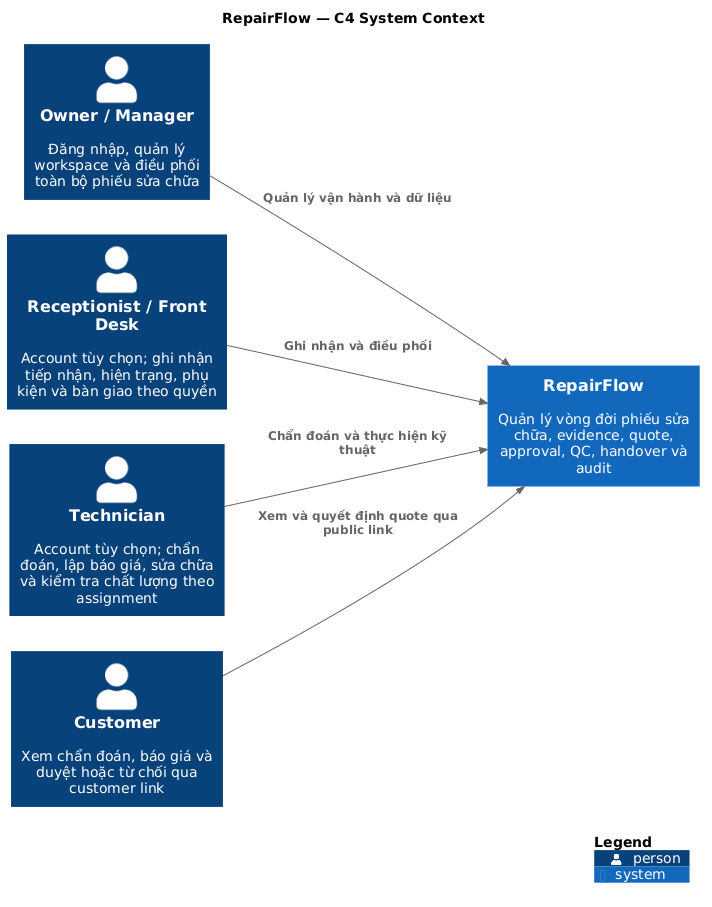
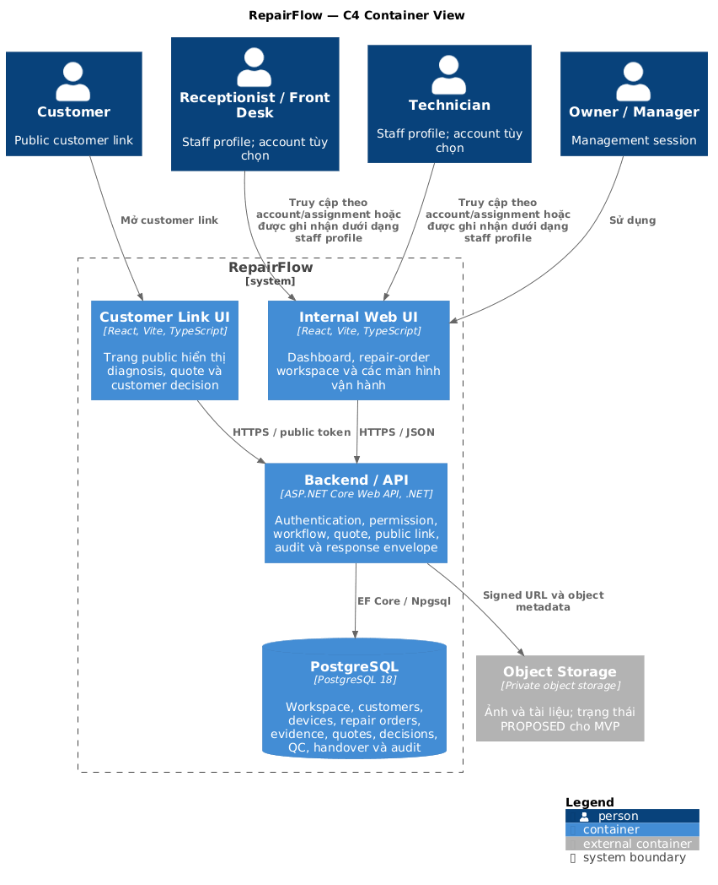
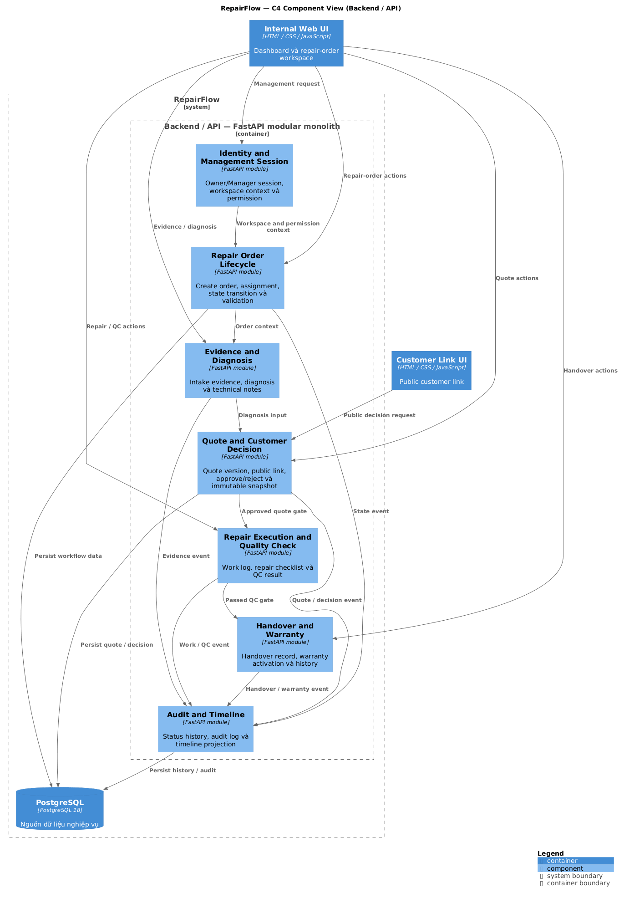

# RepairFlow — Architecture Documentation (C4 + arc42)

> Status: `DRAFT — Gate D0 chưa đạt`.
>
> Tài liệu này là view kiến trúc tổng hợp của RepairFlow theo arc42 và C4.
> Các business rule chi tiết vẫn lấy từ
> [03-business-and-domain-requirements.md](./03-business-and-domain-requirements.md),
> [02-use-cases.md](./02-use-cases.md), [05-database-requirements.md](./05-database-requirements.md)
> và [01-requirements-closure.md](./01-requirements-closure.md).

## 0. Mục tiêu của tài liệu

Tài liệu này có ba mục tiêu:

1. Tạo một nơi duy nhất để đọc kiến trúc hệ thống từ góc nhìn tổng thể đến
   module.
2. Làm rõ ranh giới giữa Web UI, Backend/API, PostgreSQL và Object Storage
   trước khi mở các business cluster C1–C10.
3. Làm cơ sở để Product, Developer và QA kiểm tra các quyết định kiến trúc,
   quality requirement và rủi ro mà không tự suy ra business rule mới.

Đây là tài liệu kiến trúc, không phải API contract, implementation plan hay
release handoff.

## 1. Introduction and Goals

RepairFlow quản lý phiếu sửa chữa từ lúc tiếp nhận đến chẩn đoán, báo giá,
khách duyệt, sửa chữa, kiểm tra chất lượng và bàn giao. Giá trị cốt
lõi là tạo evidence trail có thể truy ngược cho toàn bộ vòng đời phiếu.

Các mục tiêu kiến trúc chính:

- Bảo đảm mọi thay đổi quan trọng của phiếu có actor, thời điểm và audit trail.
- Không cho phép UI tự quyết định quyền, tổng tiền hoặc state transition.
- Cô lập dữ liệu theo workspace.
- Giữ kiến trúc đơn giản để MVP có thể triển khai và kiểm thử như một modular
  monolith.
- Cho phép mở rộng Object Storage, notification và nhiều workspace về sau mà
  không phá vỡ core workflow.

Chi tiết product goal và MVP scope nằm trong [README.md](../../README.md).

## 2. Architecture Constraints

Các ràng buộc hiện tại:

- Owner/Manager, Receptionist và Technician có thể có management session khi
  được cấp account và membership hợp lệ.
- Customer dùng public link token có hạn dùng và có thể thu hồi; không có tài
  khoản dài hạn.
- Receptionist và Technician vẫn là staff profile để phân công và truy vết;
  account là tùy chọn theo nhu cầu trực tiếp sử dụng hệ thống.
- Backend/API là nơi kiểm tra permission, business rule, state transition,
  total và transaction.
- Database chính là PostgreSQL; schema được quản lý bằng SQL migration có
  version.
- MVP không bao gồm payment, inventory, AI diagnosis, multi-branch,
  notification worker bắt buộc hoặc data warehouse.

Các policy còn mở phải được giữ trong [01-requirements-closure.md](./01-requirements-closure.md)
và không được biến thành contract bắt buộc khi chưa có Product sign-off.

## 3. Context and Scope

### 3.1. C4 System Context



Source PlantUML: [repairflow-c4-system-context.puml](./architecture/repairflow-c4-system-context.puml).

RepairFlow tương tác với Owner/Manager, Customer và các staff profile trong
quy trình vận hành. Receptionist và Technician có thể được cấp account để
truy cập giới hạn; profile không có account vẫn được dùng để phân công.
Object Storage và notification chưa được coi là actor nghiệp vụ; chúng xuất
hiện ở container/deployment view khi cần.

### 3.2. Use Case Overview

Sơ đồ Use Case tổng quan mô tả các actor, use case MVP và quan hệ chính trong
quy trình sửa chữa. Receptionist và Technician có thể là staff profile có
account tùy nhu cầu hoặc profile không có session riêng. Sơ đồ cố ý gom các use case chi tiết thành
các mục tiêu lớn để dễ đọc; UC-13 và UC-14 vẫn được đặc tả trong tài liệu Use
Case nhưng không đưa vào overview vì chúng là luồng quản trị và ngoại lệ.

Source PlantUML: [repairflow-usecase-overview.puml](./architecture/repairflow-usecase-overview.puml).

### 3.3. In scope / out of scope

In scope: repair order, customer, device, intake evidence, diagnosis, quote
version, customer decision, repair work, quality check, handover, timeline,
audit và dashboard vận hành cơ bản.

Out of scope trong MVP: thanh toán, tồn kho, AI diagnosis, định giá tự động,
nhiều chi nhánh, tài khoản khách hàng dài hạn, email/SMS tự động và warranty.
Warranty được để dành cho một module riêng ở giai đoạn sau.

Chi tiết phạm vi nghiệp vụ nằm trong [02-use-cases.md](./02-use-cases.md).

## 4. Solution Strategy

- Chọn **modular monolith** thay vì microservice.
- Giữ một Backend/API trung tâm để kiểm soát workflow và transaction.
- Tách UI theo feature và để UI gọi API qua adapter boundary.
- PostgreSQL là source of truth cho dữ liệu nghiệp vụ, trạng thái và audit.
- Ảnh/tài liệu được lưu private trong Object Storage; database chỉ lưu metadata
  và object key.
- Dùng migration có version, test acceptance theo scenario và fixture dùng chung
  cho server/UI.

Quyết định công nghệ hiện tại: FastAPI + Uvicorn, SQLAlchemy + psycopg,
PostgreSQL 18 Alpine và SQL migrations. Baseline này đã được mô tả trong
[03-business-and-domain-requirements.md](./03-business-and-domain-requirements.md).

## 5. Building Block View

### 5.1. C4 Container View



Source PlantUML: [repairflow-c4-container.puml](./architecture/repairflow-c4-container.puml).

Các container cần giữ ranh giới rõ:

- **Internal Web UI**: dashboard và workspace cho Owner/Manager.
- **Customer Link UI**: giao diện public giới hạn theo customer link.
- **FastAPI Backend/API**: session, permission, workflow, quote, decision,
  audit và response envelope.
- **PostgreSQL**: dữ liệu nghiệp vụ, status history và audit log.
- **Object Storage**: ảnh/tài liệu private; trạng thái vẫn là `PROPOSED` cho
  đến khi policy file và deployment được chốt.

### 5.2. C4 Component View — Backend/API



Source PlantUML: [repairflow-c4-component.puml](./architecture/repairflow-c4-component.puml).

Component boundary đề xuất:

- Identity and Access Session.
- Repair Order Lifecycle.
- Evidence and Diagnosis.
- Quote and Customer Decision.
- Repair Execution and Quality Check.
- Handover.
- Audit and Timeline.

Đây là component-level target view để hướng dẫn module hóa; tên module/API cụ
thể chỉ được freeze sau Gate D0 và API contract riêng.

### 5.3. Code-level view

Code-level view chỉ mô tả khi có câu hỏi cần trả lời ở mức module/class. Baseline
hiện tại được tổ chức theo:

- `src/app/`: FastAPI entrypoint, core và feature backend.
- `src/db/`: database access, migration runner và SQL migrations.
- `src/ui/`: app shell, config, shared utilities và feature UI.

Không cần vẽ toàn bộ class/module ở giai đoạn v0.

## 6. Runtime View

Các runtime scenario chính cần được giữ nhất quán giữa use case, state machine,
API và database:

1. Tạo phiếu và ghi nhận intake/evidence.
2. Chẩn đoán và tạo quote version.
3. Gửi customer link, customer approve/reject đúng quote version.
4. Thực hiện sửa chữa và quality check.
5. Bàn giao và đóng timeline.

Các transition quan trọng phải atomic: create order, send quote, customer
decision, quality-check transition và handover. Chi tiết state machine
và transaction rule nằm trong [03-business-and-domain-requirements.md](./03-business-and-domain-requirements.md)
và [05-database-requirements.md](./05-database-requirements.md).

## 7. Deployment View

Baseline local hiện tại:

```text
Browser
  ├─ Internal Web UI / Customer Link UI
  └─ FastAPI + Uvicorn ── PostgreSQL 18 Alpine
                         └─ Object Storage (PROPOSED)
```

PostgreSQL local chạy bằng Docker Compose. Deployment ngoài local, backup/restore,
observability và rollback policy chưa thuộc baseline v0; không coi sơ đồ này là
production topology.

## 8. Cross-cutting Concerns

- Workspace isolation và management permission.
- Session, public link token, expiry, revocation và rate limit.
- State transition và transaction boundary.
- Money calculation bằng numeric/integer, không dùng floating point.
- UTC trong database và timezone của workspace khi hiển thị.
- Private file, MIME/size validation và signed URL.
- Immutable quote snapshot, customer decision, status history và audit log.
- Request ID, error envelope, loading/error/empty state ở UI.

Các concern này là kiến trúc xuyên suốt; không đặt business rule quan trọng chỉ
ở frontend.

## 9. Architecture Decisions

Decision log hiện tại được quản lý trong
[01-requirements-closure.md](./01-requirements-closure.md). Mỗi decision trước khi
đóng cần có owner, ngày chốt, lý do, phương án bị loại, impact lên
server/UI/database/test và scenario success/alternative/failure.

Các quyết định kiến trúc đã có baseline:

- Modular monolith.
- FastAPI + PostgreSQL.
- Backend là boundary duy nhất để truy cập dữ liệu nghiệp vụ.
- Versioned SQL migrations.
- Transaction cho các thao tác workflow quan trọng.

Các quyết định chưa freeze phải giữ nhãn `OPEN` hoặc `PROPOSED`.

## 10. Quality Requirements

Quality requirements cần kiểm chứng:

- **Integrity**: không sửa âm thầm quote đã duyệt; không bàn giao khi QC chưa
  đạt.
- **Security/privacy**: customer link giới hạn đúng phiếu; file không public;
  dữ liệu tách theo workspace.
- **Traceability**: truy ngược được actor, thời điểm, evidence, quote,
  decision, QC và handover.
- **Reliability**: thao tác quan trọng atomic và retry không tạo duplicate.
- **Maintainability**: module theo feature, dependency một chiều, không thêm
  framework chỉ để tổ chức file.
- **Usability/accessibility**: UI luôn hiển thị trạng thái, next action,
  loading, empty, validation, forbidden, conflict và expired state phù hợp.

Target định lượng như latency, availability, RPO/RTO và retention vẫn là OPEN
trong v0.

## 11. Risks and Technical Debt

- Gate D0 chưa đạt; decision backlog còn 44 P0 và 29 P1.
- API contract chưa freeze.
- Business API chưa triển khai; UI vẫn dùng mock.
- Shared fixture và UI adapter boundary còn thiếu.
- Object Storage/deployment/backup policy chưa hoàn tất.
- Chưa có production topology, observability và rollback runbook.

Mục tiêu của tài liệu này không phải che các khoảng trống đó, mà làm chúng hiện
rõ để Product chốt hoặc loại khỏi phạm vi.

## 12. Glossary

| Term | Meaning |
| --- | --- |
| Workspace | Phạm vi dữ liệu của một cửa hàng/đơn vị sửa chữa. |
| Repair order | Phiếu sửa chữa, aggregate trung tâm của workflow. |
| Evidence | Ảnh, checklist và ghi chú hiện trạng/sau sửa. |
| Quote version | Snapshot báo giá bất biến được khách quyết định. |
| Customer link | Link public có token, hạn dùng và khả năng thu hồi. |
| Staff profile | Hồ sơ Receptionist/Technician dùng để phân công và audit; có thể được mapping với account nếu cần truy cập trực tiếp. |
| Quality check | Checklist và kết luận đạt/không đạt trước bàn giao. |

## 13. Mục tiêu triển khai sau khi tài liệu được Product duyệt

Tài liệu này sẽ được dùng để:

1. Chốt boundary C0 foundation trước khi mở C1–C10.
2. Dẫn đường cho module/backend/UI mà không tự tạo API contract ngoài quyết
   định đã đóng.
3. Gắn mỗi business rule quan trọng với runtime scenario, transaction và test.
4. Kiểm tra mọi thay đổi kiến trúc qua C4 view, decision log và quality
   acceptance.
5. Giữ khả năng mở rộng sau MVP nhưng không triển khai sớm microservice,
   queue, Redis hay analytics platform.

### Definition of Done cho tài liệu kiến trúc

- [ ] C4 Context, Container và Component view được Product/Developer review.
- [ ] Mọi container/component `PROPOSED` có owner và decision cần chốt.
- [ ] Runtime scenario khớp state machine và transaction rule.
- [ ] Deployment view phân biệt local baseline với production future state.
- [ ] Quality scenarios có acceptance test hoặc issue tương ứng.
- [ ] Link từ README, docs README và v0 index được cập nhật.

## 14. PlantUML sources và cách render

Các source `.puml` và ảnh render `.png` nằm trong
[`docs/v0/architecture/`](./architecture/). Khi môi trường có PlantUML CLI,
có thể render lại bằng:

```powershell
plantuml -tpng docs/v0/architecture/*.puml
```

PNG được commit cùng source để tài liệu xem được ngay cả khi người đọc chưa có
PlantUML.

## Tài liệu liên quan

- [Product README](../../README.md)
- [Requirements closure](./01-requirements-closure.md)
- [Use cases](./02-use-cases.md)
- [Business and domain requirements](./03-business-and-domain-requirements.md)
- [Database requirements](./05-database-requirements.md)
- [UI requirements](./06-ui-requirements.md)
- [Authentication and authorization](./07-authentication-and-authorization.md)
