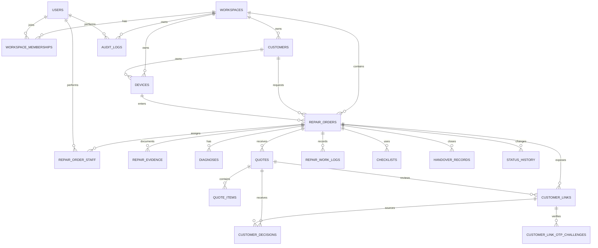
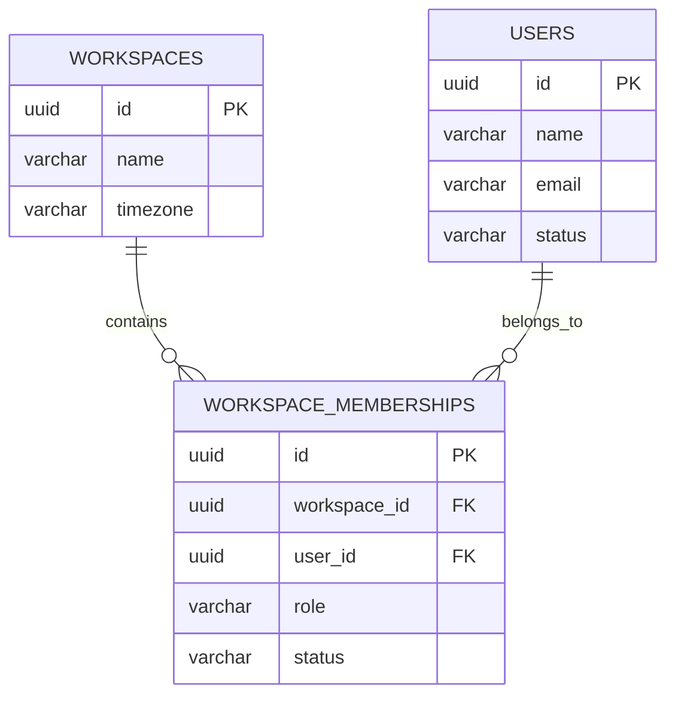
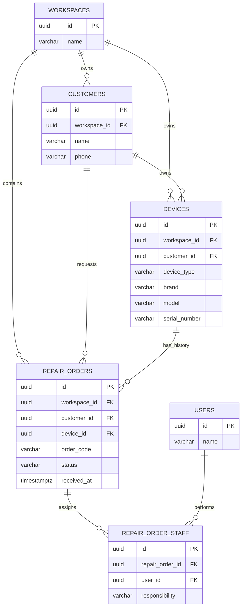
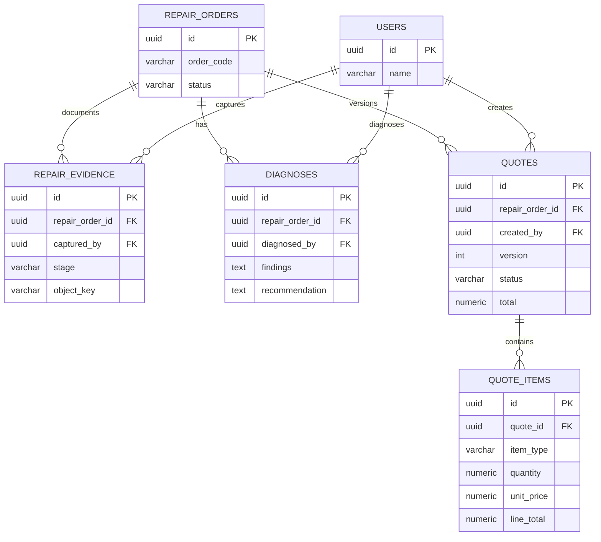
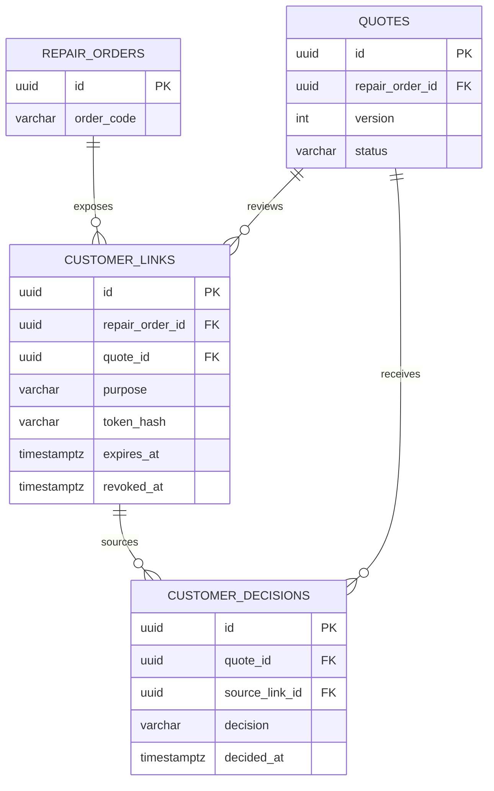
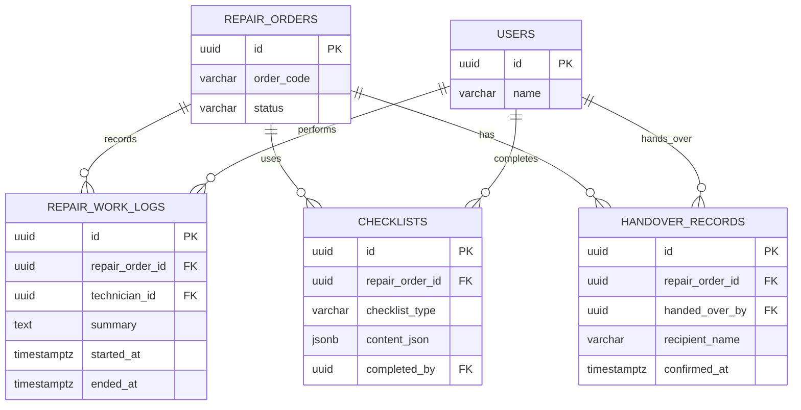

# RepairFlow — Yêu cầu Database và ERD

## 1. Mục tiêu và phạm vi

Tài liệu này là đặc tả dữ liệu chi tiết cho RepairFlow. Đây là nguồn tham chiếu cho thiết kế migration, API, phân quyền, transaction và các truy vấn báo cáo của MVP.

Database phải lưu được toàn bộ chuỗi có thể kiểm chứng:

```text
Workspace → Khách hàng → Thiết bị → Phiếu sửa chữa
    → Hiện trạng → Chẩn đoán → Báo giá → Quyết định khách hàng
    → Sửa chữa → Kiểm tra chất lượng → Bàn giao
```

Phạm vi bao gồm:

- Workspace và thành viên.
- Khách hàng và thiết bị.
- Phiếu sửa chữa và người chịu trách nhiệm theo từng giai đoạn.
- Ảnh/bằng chứng và metadata file.
- Chẩn đoán, báo giá theo phiên bản và quyết định của khách.
- Link public có thời hạn/thu hồi.
- Nhật ký sửa chữa, checklist, kiểm tra chất lượng.
- Bàn giao, lịch sử trạng thái và audit log.
- Index, constraint, transaction và quy tắc cô lập dữ liệu theo workspace.

Không bao gồm trong MVP:

- Kho linh kiện hoặc bảng tồn kho.
- Thanh toán, công nợ, kế toán hoặc hóa đơn điện tử.
- Tích hợp SMS/Zalo/email tự động.
- Lịch làm việc/phân ca.
- Tài khoản khách hàng dài hạn.

## 2. Quyết định cấu hình database

| Hạng mục | Quyết định cho MVP |
| --- | --- |
| Hệ quản trị | PostgreSQL |
| Schema | `public`; phân nhóm bằng tên bảng và module ứng dụng |
| Mô hình triển khai | Một database dùng chung, tách tenant bằng `workspace_id` |
| Khóa chính | UUID v4 tạo ở backend hoặc database |
| Thời gian | `timestamptz`, lưu UTC; hiển thị theo `workspaces.timezone` |
| Tiền tệ | `numeric(14,2)`, đơn vị nhỏ nhất là VND; không dùng floating point |
| Mã phiếu | `order_code` dạng dễ đọc, unique trong workspace |
| JSON | Chỉ dùng cho checklist, phụ kiện và metadata audit; dữ liệu cần lọc/báo cáo phải là cột riêng |
| Xóa dữ liệu | Không xóa cứng bằng chứng, quyết định, lịch sử trạng thái và audit log |
| File | Object Storage private; database lưu metadata và `object_key` |
| Migration | Migration có version, chạy tuần tự và có thể rollback theo chính sách triển khai |
| Tiền tố bảng | Không bắt buộc; dùng tên số nhiều dạng `snake_case` |

### 2.1. Quy ước cột dùng chung

Các bảng nghiệp vụ chính nên có:

```text
id          uuid primary key
created_at  timestamptz not null default now()
updated_at  timestamptz not null default now()  -- nếu bản ghi có thể cập nhật
```

Quy ước khác:

- Tên cột dùng `snake_case`.
- Tên enum nội bộ dùng chữ thường và dấu gạch dưới.
- Cột ghi nhận người thực hiện dùng hậu tố `_by`, ví dụ `created_by`, `diagnosed_by`.
- Cột thời điểm dùng hậu tố `_at`, ngày nghiệp vụ không cần giờ dùng kiểu `date`.
- Không dùng `NULL` để biểu diễn trạng thái; dùng enum/status rõ ràng.
- Cột chứa dữ liệu định danh hoặc liên hệ không ghi vào URL public.

### 2.2. Mô hình truy cập và nhân sự trong MVP

- Một workspace đại diện cho một cửa hàng nhỏ trong MVP.
- Access principal có thể thuộc Owner, Manager, Receptionist hoặc Technician;
  quyền gọi API nội bộ phụ thuộc role, membership và assignment.
- `users` là bảng hồ sơ nhân sự dùng chung cho Owner, Manager, Receptionist và Technician; bảng này không lưu password.
- Receptionist/Technician có thể có credential/session riêng khi được cấp
  account; `user_id` trong assignment, work log, diagnosis, QC và audit vẫn là
  ID hồ sơ nhân sự.
- Khách hàng không có bản ghi đăng nhập; quyền public được cấp bằng token hash trong `customer_links`.
- Nếu dùng auth provider bên ngoài, database chỉ lưu mapping access principal với workspace; không lưu secret plaintext.

## 3. Enum và miền giá trị

Có thể triển khai bằng PostgreSQL `ENUM` hoặc `CHECK constraint`. Với MVP, dùng `CHECK constraint` giúp migration dễ mở rộng hơn.

### 3.1. Nhân sự và workspace

```text
staff_profile_status:
    active | inactive | locked

membership_role:
    owner | admin | manager | receptionist | technician

membership_status:
    invited | active | suspended | removed
```

`owner`, `manager`, `receptionist` và `technician` là các role có thể được cấp
account trong MVP. Account không mặc định tồn tại cho mọi staff profile.

### 3.2. Phiếu sửa chữa

```text
repair_order_status:
    received
    diagnosing
    waiting_for_approval
    approved
    repairing
    cancellation_requested
    quality_check
    ready_for_pickup
    handed_over
    rejected
    ready_for_return
    returned
    cancelled
```

`rejected` dùng khi khách không đồng ý báo giá sau khi đã có kết quả chẩn đoán.
Customer có thể yêu cầu hủy trước khi Technician bắt đầu sửa chữa thực tế;
Receptionist ghi nhận và thực hiện trong phạm vi được giao. Khi order đang
`repairing`, yêu cầu phải qua `cancellation_requested` và được người chịu
trách nhiệm hiện tại xác nhận.
`rejected` đi qua `ready_for_return` → `returned` nếu không sửa chữa.
`cancelled` là trạng thái kết thúc, không có chuyển tiếp `reopen`; nếu khách
quay lại phải tạo repair order mới.

### 3.3. Trách nhiệm nhân viên và bằng chứng

```text
staff_responsibility:
    intake | diagnosis | primary_technician | repairer
    quality_checker | handover

evidence_stage:
    before_repair | diagnosis | after_repair | handover

checklist_type:
    intake | repair | quality_check | handover
```

### 3.4. Báo giá và quyết định

```text
quote_status:
    draft | sent | approved | rejected | superseded | expired | cancelled

quote_item_type:
    part | labor | service

customer_decision:
    approved | rejected
```

Ghi chú trao đổi hoặc lý do từ chối lưu trong cột `note`, không tạo thêm trạng thái nếu chưa có yêu cầu nghiệp vụ riêng.

### 3.5. Link và audit

```text
customer_link_purpose:
    quote_review | status_tracking

actor_type:
    employee | customer | system
```

Warranty không thuộc schema MVP: không có `warranty_status`, bảng warranty,
claim hoặc bước kích hoạt. Module này sẽ được thiết kế riêng ở giai đoạn sau
khi chính sách theo workspace, dịch vụ và linh kiện được chốt.

## 4. ERD tổng thể

Sơ đồ dưới đây mô tả quan hệ chính giữa các nhóm dữ liệu. Các bảng log/audit có quan hệ tham chiếu mềm tới entity vì chúng hỗ trợ nhiều loại đối tượng.



## 5. Đặc tả bảng và cột

### 5.1. `workspaces`

Đại diện cho cửa hàng hoặc không gian làm việc. Đây là tenant gốc của dữ liệu nghiệp vụ.

| Cột | Kiểu | Null | Mặc định | Ràng buộc và ý nghĩa |
| --- | --- | --- | --- | --- |
| `id` | `uuid` | Không | — | PK |
| `name` | `varchar(160)` | Không | — | Tên cửa hàng |
| `phone` | `varchar(32)` | Có | `NULL` | Số liên hệ của cửa hàng |
| `address` | `text` | Có | `NULL` | Địa chỉ hiển thị cho khách |
| `timezone` | `varchar(64)` | Không | `'Asia/Ho_Chi_Minh'` | Tên timezone hợp lệ của IANA |
| `created_at` | `timestamptz` | Không | `now()` | Thời điểm tạo |
| `updated_at` | `timestamptz` | Không | `now()` | Thời điểm cập nhật gần nhất |

### 5.2. `users` — hồ sơ nhân sự

Đại diện cho hồ sơ nhân sự của cửa hàng, không trực tiếp lưu password hoặc
credential. Access principal/session thuộc access module riêng và có thể được
mapping tới staff profile khi nhân sự cần đăng nhập.

| Cột | Kiểu | Null | Mặc định | Ràng buộc và ý nghĩa |
| --- | --- | --- | --- | --- |
| `id` | `uuid` | Không | — | PK |
| `name` | `varchar(160)` | Không | — | Tên hiển thị |
| `email` | `citext` hoặc `varchar(320)` | Có | `NULL` | Email liên hệ; là login identifier của access principal trong MVP khi account được cấp |
| `phone` | `varchar(32)` | Có | `NULL` | Số điện thoại nhân viên |
| `status` | `varchar(16)` | Không | `'active'` | `active`, `inactive`, `locked` |
| `last_login_at` | `timestamptz` | Có | `NULL` | Legacy/optional; profile chưa được cấp account sẽ không có login |
| `created_at` | `timestamptz` | Không | `now()` | Thời điểm tạo |
| `updated_at` | `timestamptz` | Không | `now()` | Thời điểm cập nhật |

### 5.3. `workspace_memberships`

Liên kết hồ sơ nhân sự với workspace và lưu vai trò vận hành.

Membership xác định workspace, role và trạng thái của nhân sự. Membership không
tự động tạo account; account chỉ được cấp khi có nhu cầu truy cập trực tiếp.

| Cột | Kiểu | Null | Mặc định | Ràng buộc và ý nghĩa |
| --- | --- | --- | --- | --- |
| `id` | `uuid` | Không | — | PK |
| `workspace_id` | `uuid` | Không | — | FK → `workspaces.id` |
| `user_id` | `uuid` | Không | — | FK → `users.id` |
| `role` | `varchar(24)` | Không | — | `owner`, `admin`, `manager`, `receptionist`, `technician` |
| `status` | `varchar(16)` | Không | `'invited'` | Trạng thái thành viên |
| `invited_at` | `timestamptz` | Có | `NULL` | Thời điểm gửi lời mời |
| `joined_at` | `timestamptz` | Có | `NULL` | Thời điểm tham gia |
| `created_at` | `timestamptz` | Không | `now()` | Thời điểm tạo |
| `updated_at` | `timestamptz` | Không | `now()` | Thời điểm cập nhật |

Ràng buộc: `unique(workspace_id, user_id)`.

### 5.4. `customers`

Hồ sơ khách hàng thuộc một workspace.

| Cột | Kiểu | Null | Mặc định | Ràng buộc và ý nghĩa |
| --- | --- | --- | --- | --- |
| `id` | `uuid` | Không | — | PK |
| `workspace_id` | `uuid` | Không | — | FK → `workspaces.id` |
| `name` | `varchar(160)` | Không | — | Tên khách hàng |
| `phone` | `varchar(32)` | Không | — | Số điện thoại chính |
| `email` | `varchar(320)` | Có | `NULL` | Email |
| `note` | `text` | Có | `NULL` | Ghi chú nội bộ |
| `created_at` | `timestamptz` | Không | `now()` | Thời điểm tạo |
| `updated_at` | `timestamptz` | Không | `now()` | Thời điểm cập nhật |

Không nên đặt unique tuyệt đối cho số điện thoại toàn database. Nếu cần chống trùng, dùng unique theo `workspace_id` sau khi chuẩn hóa số điện thoại.

### 5.5. `devices`

Thiết bị thuộc khách hàng trong một workspace. Một thiết bị có thể có nhiều phiếu sửa chữa theo thời gian.

| Cột | Kiểu | Null | Mặc định | Ràng buộc và ý nghĩa |
| --- | --- | --- | --- | --- |
| `id` | `uuid` | Không | — | PK |
| `workspace_id` | `uuid` | Không | — | FK → `workspaces.id` |
| `customer_id` | `uuid` | Không | — | FK → `customers.id` |
| `device_type` | `varchar(32)` | Không | — | Điện thoại, laptop, tablet… |
| `brand` | `varchar(80)` | Không | — | Hãng |
| `model` | `varchar(120)` | Không | — | Model |
| `serial_number` | `varchar(160)` | Có | `NULL` | Serial number nếu có |
| `device_identifier` | `varchar(160)` | Có | `NULL` | Mã nhận diện khác |
| `note` | `text` | Có | `NULL` | Ghi chú thiết bị |
| `created_at` | `timestamptz` | Không | `now()` | Thời điểm tạo |
| `updated_at` | `timestamptz` | Không | `now()` | Thời điểm cập nhật |

Có thể dùng unique có điều kiện cho `(workspace_id, serial_number)` khi `serial_number is not null`.

### 5.6. `repair_orders`

Phiếu sửa chữa là entity trung tâm của toàn bộ nghiệp vụ.

| Cột | Kiểu | Null | Mặc định | Ràng buộc và ý nghĩa |
| --- | --- | --- | --- | --- |
| `id` | `uuid` | Không | — | PK |
| `workspace_id` | `uuid` | Không | — | FK → `workspaces.id` |
| `order_code` | `varchar(32)` | Không | — | Unique trong workspace |
| `customer_id` | `uuid` | Không | — | FK → `customers.id` |
| `device_id` | `uuid` | Không | — | FK → `devices.id` |
| `status` | `varchar(32)` | Không | `'received'` | Trạng thái nghiệp vụ |
| `customer_description` | `text` | Không | — | Mô tả lỗi do khách cung cấp |
| `internal_note` | `text` | Có | `NULL` | Ghi chú nội bộ |
| `received_at` | `timestamptz` | Không | `now()` | Thời điểm tiếp nhận |
| `expected_completed_at` | `timestamptz` | Có | `NULL` | Thời gian dự kiến hoàn tất |
| `completed_at` | `timestamptz` | Có | `NULL` | Thời điểm hoàn tất nghiệp vụ |
| `cancelled_at` | `timestamptz` | Có | `NULL` | Thời điểm hủy; bắt buộc có khi `status = 'cancelled'` |
| `cancellation_reason` | `text` | Có | `NULL` | Lý do hủy; bắt buộc có khi `status = 'cancelled'` |
| `created_by` | `uuid` | Không | — | FK → `users.id` |
| `created_at` | `timestamptz` | Không | `now()` | Thời điểm tạo |
| `updated_at` | `timestamptz` | Không | `now()` | Thời điểm cập nhật |

Khi truy vấn phiếu, backend phải kiểm tra cả `workspace_id` của phiếu, khách hàng, thiết bị và người dùng liên quan.

### 5.7. `repair_order_staff`

Lưu người tham gia theo từng trách nhiệm, thay cho việc chỉ có một `assigned_technician_id`.

| Cột | Kiểu | Null | Mặc định | Ràng buộc và ý nghĩa |
| --- | --- | --- | --- | --- |
| `id` | `uuid` | Không | — | PK |
| `repair_order_id` | `uuid` | Không | — | FK → `repair_orders.id` |
| `user_id` | `uuid` | Không | — | FK → `users.id` |
| `responsibility` | `varchar(32)` | Không | — | Vai trò trong phiếu |
| `is_primary` | `boolean` | Không | `false` | Người chính của trách nhiệm đó |
| `assigned_at` | `timestamptz` | Không | `now()` | Thời điểm phân công |
| `completed_at` | `timestamptz` | Có | `NULL` | Thời điểm hoàn tất trách nhiệm |
| `note` | `text` | Có | `NULL` | Ghi chú phân công |

Ràng buộc đề xuất:

- `unique(repair_order_id, user_id, responsibility)`.
- Tối đa một bản ghi `is_primary = true` cho mỗi `(repair_order_id, responsibility)`.

Chỉ Owner/Manager được thêm, thay đổi hoặc kết thúc assignment. Có thể thay
thế trực tiếp người đang xử lý khi không đủ kỹ năng hoặc không phù hợp, nhưng
phải kết thúc assignment cũ với lý do và tạo assignment mới; không xóa bản ghi
cũ hoặc lịch sử audit.

### 5.8. `repair_evidence`

Lưu metadata của ảnh/tài liệu. Nội dung file nằm trong Object Storage.

| Cột | Kiểu | Null | Mặc định | Ràng buộc và ý nghĩa |
| --- | --- | --- | --- | --- |
| `id` | `uuid` | Không | — | PK |
| `repair_order_id` | `uuid` | Không | — | FK → `repair_orders.id` |
| `stage` | `varchar(24)` | Không | — | Giai đoạn của bằng chứng |
| `object_key` | `varchar(512)` | Không | — | Khóa object storage, nguồn tham chiếu chính |
| `file_url` | `text` | Có | `NULL` | URL dẫn xuất hoặc legacy; không lưu signed URL lâu dài |
| `file_name` | `varchar(255)` | Không | — | Tên file gốc hiển thị |
| `mime_type` | `varchar(120)` | Không | — | MIME type đã kiểm tra |
| `file_size` | `bigint` | Không | — | Kích thước byte, phải lớn hơn 0 |
| `checksum` | `varchar(128)` | Không | — | Hash kiểm tra tính toàn vẹn |
| `description` | `text` | Có | `NULL` | Mô tả ảnh/tài liệu |
| `captured_by` | `uuid` | Không | — | FK → `users.id` |
| `captured_at` | `timestamptz` | Không | `now()` | Thời điểm chụp/tải lên |

Không xóa cứng bản ghi này trong luồng nghiệp vụ thông thường. Nếu cần ẩn file, bổ sung trạng thái lưu trữ ở migration riêng.

### 5.9. `diagnoses`

Lưu kết quả chẩn đoán của kỹ thuật viên. Có thể có nhiều bản ghi nếu phiếu được chẩn đoán lại.

| Cột | Kiểu | Null | Mặc định | Ràng buộc và ý nghĩa |
| --- | --- | --- | --- | --- |
| `id` | `uuid` | Không | — | PK |
| `repair_order_id` | `uuid` | Không | — | FK → `repair_orders.id` |
| `findings` | `text` | Không | — | Kết quả kiểm tra |
| `cause` | `text` | Có | `NULL` | Nguyên nhân lỗi |
| `recommendation` | `text` | Không | — | Đề xuất xử lý |
| `estimated_duration` | `integer` | Có | `NULL` | Số phút dự kiến |
| `diagnosed_by` | `uuid` | Không | — | FK → `users.id` |
| `created_at` | `timestamptz` | Không | `now()` | Thời điểm tạo |
| `updated_at` | `timestamptz` | Không | `now()` | Thời điểm cập nhật |

### 5.10. `quotes`

Lưu từng phiên bản báo giá. Không cập nhật nội dung của báo giá đã gửi hoặc đã duyệt.

| Cột | Kiểu | Null | Mặc định | Ràng buộc và ý nghĩa |
| --- | --- | --- | --- | --- |
| `id` | `uuid` | Không | — | PK |
| `repair_order_id` | `uuid` | Không | — | FK → `repair_orders.id` |
| `version` | `integer` | Không | — | Số phiên bản, bắt đầu từ 1 |
| `status` | `varchar(24)` | Không | `'draft'` | Trạng thái báo giá |
| `currency` | `char(3)` | Không | `'VND'` | MVP chỉ hỗ trợ VND |
| `subtotal` | `numeric(14,2)` | Không | `0` | Tổng trước điều chỉnh |
| `total` | `numeric(14,2)` | Không | `0` | Tổng khách cần duyệt |
| `note` | `text` | Có | `NULL` | Ghi chú gửi khách |
| `created_by` | `uuid` | Không | — | FK → `users.id` |
| `sent_at` | `timestamptz` | Có | `NULL` | Thời điểm gửi public link |
| `created_at` | `timestamptz` | Không | `now()` | Thời điểm tạo |
| `updated_at` | `timestamptz` | Không | `now()` | Chỉ cập nhật khi còn draft |

Ràng buộc:

- `unique(repair_order_id, version)`.
- `subtotal >= 0` và `total >= 0`.
- Chỉ một báo giá hiện hành ở trạng thái `draft` hoặc `sent` cho mỗi phiếu.
- Báo giá đã `approved`, `rejected`, `superseded` hoặc `expired` không được sửa nội dung.

### 5.11. `quote_items`

Các dòng linh kiện, công sửa hoặc dịch vụ trong một phiên bản báo giá.

| Cột | Kiểu | Null | Mặc định | Ràng buộc và ý nghĩa |
| --- | --- | --- | --- | --- |
| `id` | `uuid` | Không | — | PK |
| `quote_id` | `uuid` | Không | — | FK → `quotes.id` |
| `item_type` | `varchar(16)` | Không | — | `part`, `labor`, `service` |
| `description` | `varchar(500)` | Không | — | Tên/mô tả dòng báo giá |
| `quantity` | `numeric(12,2)` | Không | `1` | Phải lớn hơn 0 |
| `unit_price` | `numeric(14,2)` | Không | `0` | Không âm |
| `line_total` | `numeric(14,2)` | Không | — | `quantity * unit_price`, tính trong transaction |
| `replacement_reason` | `text` | Có | `NULL` | Lý do thay thế/sửa chữa |
| `estimated_duration` | `integer` | Có | `NULL` | Số phút dự kiến cho dòng |
| `sort_order` | `integer` | Không | `0` | Thứ tự hiển thị |
| `created_at` | `timestamptz` | Không | `now()` | Thời điểm tạo |

`line_total`, `subtotal` và `total` phải được tính lại từ server trong cùng transaction; client không được tự quyết định giá trị cuối.

### 5.12. `customer_decisions`

Lưu quyết định của khách và phiên bản báo giá mà quyết định đó áp dụng.

| Cột | Kiểu | Null | Mặc định | Ràng buộc và ý nghĩa |
| --- | --- | --- | --- | --- |
| `id` | `uuid` | Không | — | PK |
| `quote_id` | `uuid` | Không | — | FK → `quotes.id` |
| `decision` | `varchar(16)` | Không | — | `approved` hoặc `rejected` |
| `customer_name` | `varchar(160)` | Không | — | Snapshot tên tại thời điểm quyết định |
| `customer_contact_snapshot` | `jsonb` | Không | — | Snapshot phone/email cần thiết |
| `note` | `text` | Có | `NULL` | Lý do từ chối hoặc ghi chú |
| `decided_at` | `timestamptz` | Không | `now()` | Thời điểm quyết định |
| `source_link_id` | `uuid` | Không | — | FK → `customer_links.id` |
| `created_at` | `timestamptz` | Không | `now()` | Thời điểm tạo bản ghi |

Chỉ cho phép một quyết định hợp lệ cuối cùng cho mỗi quote. Các lần thử hoặc request lỗi phải nằm trong audit log, không ghi thành nhiều quyết định hợp lệ.

### 5.13. `customer_links`

Link public giới hạn quyền xem đúng phiếu/báo giá.

| Cột | Kiểu | Null | Mặc định | Ràng buộc và ý nghĩa |
| --- | --- | --- | --- | --- |
| `id` | `uuid` | Không | — | PK |
| `repair_order_id` | `uuid` | Không | — | FK → `repair_orders.id` |
| `quote_id` | `uuid` | Có | `NULL` | FK → `quotes.id`; bắt buộc với `quote_review` |
| `purpose` | `varchar(24)` | Không | — | `quote_review` hoặc `status_tracking` |
| `token_hash` | `varchar(128)` | Không | — | Hash token, unique |
| `expires_at` | `timestamptz` | Không | `created_at + 7 days` | Thời điểm hết hạn mặc định sau 7 ngày |
| `last_accessed_at` | `timestamptz` | Có | `NULL` | Lần truy cập gần nhất |
| `revoked_at` | `timestamptz` | Có | `NULL` | Null nghĩa là chưa thu hồi |
| `created_at` | `timestamptz` | Không | `now()` | Thời điểm tạo |

Token thô chỉ xuất hiện khi tạo link và không được lưu trong database. Backend phải kiểm tra `token_hash`, `expires_at`, `revoked_at`, `repair_order_id` và `quote_id` trước mọi thao tác public.

Mọi thao tác public còn yêu cầu OTP. Không lưu OTP dạng plaintext; auth module
phải lưu tối thiểu hash OTP, kênh gửi, destination snapshot, thời điểm hết hạn,
số lần thử và thời điểm xác thực thành công. OTP hợp lệ là điều kiện để xem
public DTO, quyết định quote hoặc xác nhận/ký bàn giao và hoàn trả.

Mặc định kỹ thuật v0 đã chốt: OTP 6 chữ số, hết hạn sau 5 phút, tối đa 5 lần
nhập sai; gửi lại sau 60 giây và tối đa 3 lần trong 15 phút. Rate limit áp dụng
theo IP, customer link và số điện thoại/email, vượt giới hạn thì khóa tạm 15
phút. Customer session sau OTP có hiệu lực 30 phút. OTP phải là one-time use.

### 5.14. `repair_work_logs`

Nhật ký công việc thực tế của kỹ thuật viên.

| Cột | Kiểu | Null | Mặc định | Ràng buộc và ý nghĩa |
| --- | --- | --- | --- | --- |
| `id` | `uuid` | Không | — | PK |
| `repair_order_id` | `uuid` | Không | — | FK → `repair_orders.id` |
| `technician_id` | `uuid` | Không | — | FK → `users.id` |
| `summary` | `text` | Không | — | Tóm tắt công việc đã làm |
| `started_at` | `timestamptz` | Có | `NULL` | Bắt đầu công việc |
| `ended_at` | `timestamptz` | Có | `NULL` | Kết thúc công việc |
| `note` | `text` | Có | `NULL` | Ghi chú |
| `created_at` | `timestamptz` | Không | `now()` | Thời điểm ghi log |

Nếu có cả hai thời điểm, `ended_at >= started_at`.

### 5.15. `checklists`

Lưu checklist intake, repair, quality check hoặc handover dưới dạng JSONB trong MVP.

| Cột | Kiểu | Null | Mặc định | Ràng buộc và ý nghĩa |
| --- | --- | --- | --- | --- |
| `id` | `uuid` | Không | — | PK |
| `repair_order_id` | `uuid` | Không | — | FK → `repair_orders.id` |
| `checklist_type` | `varchar(24)` | Không | — | Loại checklist |
| `content_json` | `jsonb` | Không | `'{}'` | Danh sách item, kết quả, ghi chú |
| `completed_by` | `uuid` | Có | `NULL` | FK → `users.id` |
| `completed_at` | `timestamptz` | Có | `NULL` | Null nếu chưa hoàn tất |
| `created_at` | `timestamptz` | Không | `now()` | Thời điểm tạo |
| `updated_at` | `timestamptz` | Không | `now()` | Thời điểm cập nhật |

Với `quality_check`, `completed_at` chỉ được ghi khi có kết luận rõ ràng `passed` hoặc `failed` trong `content_json`.

### 5.16. `handover_records`

Biên bản bàn giao thiết bị.

| Cột | Kiểu | Null | Mặc định | Ràng buộc và ý nghĩa |
| --- | --- | --- | --- | --- |
| `id` | `uuid` | Không | — | PK |
| `repair_order_id` | `uuid` | Không | — | FK → `repair_orders.id` |
| `recipient_name` | `varchar(160)` | Không | — | Người nhận thiết bị |
| `recipient_contact` | `varchar(64)` | Có | `NULL` | Thông tin liên hệ cơ bản của người nhận |
| `returned_accessories` | `jsonb` | Không | `'[]'` | Danh sách phụ kiện trả lại |
| `final_condition_note` | `text` | Không | — | Tình trạng cuối |
| `recipient_signature_ref` | `varchar(255)` | Không | — | Tham chiếu chữ ký xác nhận đã nhận máy |
| `confirmed_at` | `timestamptz` | Không | `now()` | Thời điểm xác nhận |
| `handed_over_by` | `uuid` | Không | — | FK → `users.id` |
| `created_at` | `timestamptz` | Không | `now()` | Thời điểm tạo |

MVP chỉ cho phép một biên bản bàn giao hợp lệ cuối cùng cho mỗi phiếu; bản sửa đổi phải tạo audit log hoặc version riêng trước khi mở rộng.

### 5.17. Future module — Warranty (không thuộc schema MVP)

Không tạo bảng `warranties` trong schema MVP và không tạo foreign key từ
`repair_orders` sang module này. Khi mở rộng, cần đặc tả riêng policy áp dụng,
thời hạn, điều kiện loại trừ, claim, quyền xem/sửa và ảnh hưởng tới timeline.

### 5.18. `status_history`

Timeline nghiệp vụ của phiếu. Đây là lịch sử chuyển trạng thái, không thay thế audit log bảo mật.

| Cột | Kiểu | Null | Mặc định | Ràng buộc và ý nghĩa |
| --- | --- | --- | --- | --- |
| `id` | `uuid` | Không | — | PK |
| `repair_order_id` | `uuid` | Không | — | FK → `repair_orders.id` |
| `from_status` | `varchar(32)` | Có | `NULL` | Null ở sự kiện tạo phiếu |
| `to_status` | `varchar(32)` | Không | — | Trạng thái mới |
| `changed_by` | `uuid` | Có | `NULL` | FK → `users.id`; null nếu system job |
| `reason` | `text` | Có | `NULL` | Bắt buộc với ngoại lệ hoặc từ chối |
| `created_at` | `timestamptz` | Không | `now()` | Thời điểm chuyển |

Không update hoặc delete bản ghi lịch sử trong hoạt động thông thường.

### 5.19. `audit_logs`

Log bất biến cho hành động nhạy cảm và truy vết bảo mật.

| Cột | Kiểu | Null | Mặc định | Ràng buộc và ý nghĩa |
| --- | --- | --- | --- | --- |
| `id` | `uuid` | Không | — | PK |
| `workspace_id` | `uuid` | Không | — | FK → `workspaces.id` |
| `user_id` | `uuid` | Có | `NULL` | FK → `users.id`; null với customer/system |
| `actor_type` | `varchar(16)` | Không | — | `employee`, `customer`, `system` |
| `entity_type` | `varchar(64)` | Không | — | Tên loại entity |
| `entity_id` | `uuid` | Không | — | ID entity; tham chiếu mềm |
| `action` | `varchar(64)` | Không | — | Ví dụ `quote_sent`, `quote_approved` |
| `metadata_json` | `jsonb` | Không | `'{}'` | Dữ liệu bổ sung, không chứa token thô |
| `ip_hash` | `varchar(128)` | Có | `NULL` | Hash IP nếu cần truy vết |
| `user_agent` | `text` | Có | `NULL` | User agent đã giới hạn kích thước |
| `created_at` | `timestamptz` | Không | `now()` | Thời điểm hành động |

## 6. Sơ đồ ERD theo module

### 6.1. Identity và multi-tenant



### 6.2. Khách hàng, thiết bị và phiếu



### 6.3. Hiện trạng, chẩn đoán và báo giá



### 6.4. Link public và quyết định khách hàng



### 6.5. Sửa chữa, QC và bàn giao



## 7. Bảng quan hệ và chính sách khóa ngoại

| Bảng con | Cột FK | Bảng cha | Cardinality | `ON DELETE` đề xuất | Ghi chú |
| --- | --- | --- | --- | --- | --- |
| `workspace_memberships` | `workspace_id` | `workspaces` | N:1 | `RESTRICT` | Không xóa workspace nếu còn dữ liệu |
| `workspace_memberships` | `user_id` | `users` | N:1 | `RESTRICT` | Giữ lịch sử người dùng |
| `customers` | `workspace_id` | `workspaces` | N:1 | `RESTRICT` | Tenant bắt buộc |
| `devices` | `workspace_id` | `workspaces` | N:1 | `RESTRICT` | Tenant bắt buộc |
| `devices` | `customer_id` | `customers` | N:1 | `RESTRICT` | Không xóa khách có thiết bị |
| `repair_orders` | `workspace_id` | `workspaces` | N:1 | `RESTRICT` | Tenant bắt buộc |
| `repair_orders` | `customer_id` | `customers` | N:1 | `RESTRICT` | Giữ lịch sử phiếu |
| `repair_orders` | `device_id` | `devices` | N:1 | `RESTRICT` | Giữ lịch sử thiết bị |
| `repair_orders` | `created_by` | `users` | N:1 | `RESTRICT` | Không mất người tạo |
| `repair_order_staff` | `repair_order_id` | `repair_orders` | N:1 | `RESTRICT` | Có thể archive phiếu thay vì xóa |
| `repair_order_staff` | `user_id` | `users` | N:1 | `RESTRICT` | Nhân viên inactive vẫn còn lịch sử |
| `repair_evidence` | `repair_order_id` | `repair_orders` | N:1 | `RESTRICT` | Không cascade xóa bằng chứng |
| `repair_evidence` | `captured_by` | `users` | N:1 | `RESTRICT` | Giữ người chụp |
| `diagnoses` | `repair_order_id` | `repair_orders` | N:1 | `RESTRICT` | Có thể chẩn đoán lại |
| `diagnoses` | `diagnosed_by` | `users` | N:1 | `RESTRICT` | Giữ người chẩn đoán |
| `quotes` | `repair_order_id` | `repair_orders` | N:1 | `RESTRICT` | Giữ mọi phiên bản |
| `quotes` | `created_by` | `users` | N:1 | `RESTRICT` | Giữ người tạo |
| `quote_items` | `quote_id` | `quotes` | N:1 | `RESTRICT` | Không sửa/xóa quote đã gửi |
| `customer_decisions` | `quote_id` | `quotes` | N:1 | `RESTRICT` | Quyết định gắn với version |
| `customer_decisions` | `source_link_id` | `customer_links` | N:1 | `RESTRICT` | Truy được nguồn quyết định |
| `customer_links` | `repair_order_id` | `repair_orders` | N:1 | `RESTRICT` | Link có thể revoke |
| `customer_links` | `quote_id` | `quotes` | N:1 | `RESTRICT` | Link báo giá phải đúng version |
| `repair_work_logs` | `repair_order_id` | `repair_orders` | N:1 | `RESTRICT` | Giữ nhật ký thực hiện |
| `repair_work_logs` | `technician_id` | `users` | N:1 | `RESTRICT` | Giữ người sửa |
| `checklists` | `repair_order_id` | `repair_orders` | N:1 | `RESTRICT` | Giữ kết quả kiểm tra |
| `checklists` | `completed_by` | `users` | N:1 | `RESTRICT` | Giữ người hoàn tất |
| `handover_records` | `repair_order_id` | `repair_orders` | N:1 | `RESTRICT` | Bàn giao là bằng chứng |
| `handover_records` | `handed_over_by` | `users` | N:1 | `RESTRICT` | Giữ người bàn giao |
| `status_history` | `repair_order_id` | `repair_orders` | N:1 | `RESTRICT` | Timeline bất biến |
| `status_history` | `changed_by` | `users` | N:1 | `SET NULL` | Cho phép giữ log nếu user bị xóa khỏi hệ thống auth |
| `audit_logs` | `workspace_id` | `workspaces` | N:1 | `RESTRICT` | Audit thuộc tenant |
| `audit_logs` | `user_id` | `users` | N:1 | `SET NULL` | Có thể là customer/system |

`ON UPDATE CASCADE` không cần dùng cho UUID hoặc các khóa nghiệp vụ đã ổn định. Không dùng `ON DELETE CASCADE` cho dữ liệu bằng chứng và audit.

## 8. Unique constraint và index

### 8.1. Unique constraint

```text
workspace_memberships(workspace_id, user_id)
repair_orders(workspace_id, order_code)
quotes(repair_order_id, version)
customer_links(token_hash)
```

Unique có điều kiện đề xuất:

```text
devices(workspace_id, serial_number)
    WHERE serial_number IS NOT NULL

repair_order_staff(repair_order_id, responsibility)
    WHERE is_primary = TRUE
```

### 8.2. Index bắt buộc

```text
repair_orders(workspace_id, status)
repair_orders(workspace_id, expected_completed_at)
repair_orders(workspace_id, order_code)
repair_orders(customer_id)
repair_orders(device_id)

customers(workspace_id, phone)
devices(workspace_id, serial_number)
repair_order_staff(user_id, repair_order_id)
repair_order_staff(repair_order_id, responsibility)

repair_evidence(repair_order_id, stage, captured_at)
diagnoses(repair_order_id, created_at)
quotes(repair_order_id, version DESC)
quote_items(quote_id, sort_order)
customer_decisions(quote_id, decided_at DESC)
customer_links(token_hash)
customer_links(repair_order_id, expires_at)

repair_work_logs(repair_order_id, started_at)
checklists(repair_order_id, checklist_type)
status_history(repair_order_id, created_at)
audit_logs(workspace_id, entity_type, entity_id, created_at)
```

Không tạo index cho mọi cột theo mặc định. Chỉ thêm index dựa trên truy vấn thực tế và explain plan.

## 9. Quy tắc toàn vẹn nghiệp vụ ở database/API

### 9.1. Cô lập workspace

Mọi truy vấn nghiệp vụ phải có điều kiện tenant:

```text
WHERE workspace_id = current_workspace_id
```

Với bảng không có `workspace_id` trực tiếp, backend phải join qua `repair_orders`, `customers`, `quotes` hoặc bảng cha tương ứng trước khi đọc/ghi.

### 9.2. Tạo phiếu

Trong một transaction:

1. Tạo hoặc lấy customer đúng workspace.
2. Tạo hoặc lấy device đúng workspace và customer.
3. Tạo `repair_orders` với trạng thái `received`.
4. Ghi người tạo vào `created_by`.
5. Tạo `repair_order_staff` cho người tiếp nhận nếu đã xác định.
6. Ghi sự kiện đầu tiên vào `status_history` với `from_status = NULL`.
7. Ghi `audit_logs` cho hành động tạo phiếu.

### 9.3. Gửi báo giá

Trong một transaction:

1. Khóa bản ghi quote hiện hành bằng `SELECT ... FOR UPDATE`.
2. Kiểm tra quote đang ở `draft` và có ít nhất một item hợp lệ.
3. Tính lại `line_total`, `subtotal` và `total` từ database/backend.
4. Chuyển quote sang `sent` và ghi `sent_at`.
5. Tạo `customer_links` với token hash, thời hạn và đúng `quote_id`.
6. Chuyển repair order sang `waiting_for_approval`.
7. Ghi `status_history` và `audit_logs`.

### 9.4. Khách duyệt hoặc từ chối

Trong một transaction:

1. Hash token từ request và tìm link chưa hết hạn/chưa bị thu hồi.
2. Khóa quote tương ứng.
3. Kiểm tra quote đang ở `sent` và chưa có quyết định hợp lệ.
4. Tạo `customer_decisions` gắn đúng `quote_id` và `source_link_id`.
5. Cập nhật quote thành `approved` hoặc `rejected`.
6. Nếu duyệt, cập nhật repair order thành `approved`.
7. Nếu từ chối, cập nhật repair order thành `rejected`.
8. Ghi audit log với actor type `customer`.

Không cho phép approve hai lần hoặc approve quote cũ đã bị `superseded`.
Một customer decision áp dụng cho toàn bộ quote version; không lưu quyết định
approve/reject riêng cho từng `quote_item` trong MVP.

### 9.5. Tạo phiên bản báo giá mới

Khi quote đã gửi/duyệt cần thay đổi:

1. Không update quote cũ.
2. Chuyển quote cũ thành `superseded` nếu có quote mới.
3. Tạo quote mới với `version + 1`.
4. Copy các item thành snapshot mới.
5. Tạo link mới khi gửi.
6. Yêu cầu quyết định mới của khách.

Thương lượng giảm giá hoặc bỏ bớt hạng mục sửa chữa vẫn dùng cùng
`repair_order_id`; không tạo order mới. Quote cũ được giữ nguyên để truy vết.
Customer trao đổi qua điện thoại hoặc Zalo; Technician điều chỉnh phần kỹ
thuật, hạng mục và giá, tạo bản nháp version mới rồi gửi version mới theo
quyền. Receptionist không lập hoặc điều chỉnh quote trong MVP.
Nếu quote hiện tại đã `rejected` nhưng order chưa `returned`, cho phép tạo
version mới trên cùng order và chuyển lại `waiting_for_approval`. Sau khi order
đã `returned`, không tạo quote version mới trên order cũ.

### 9.6. Bắt đầu sửa chữa

Chỉ cho phép chuyển sang `repairing` khi:

- Có quote hiện hành ở trạng thái `approved`.
- Quote đó có customer decision `approved`.
- Quyết định gắn với đúng version quote.
- Phiếu không ở trạng thái `cancelled` hoặc `handed_over`.

### 9.7. Hủy phiếu và hoàn trả

Trước khi Technician bắt đầu sửa chữa thực tế, cho phép chuyển repair order từ
`received`, `diagnosing`, `waiting_for_approval` hoặc `approved` sang
`cancelled`.

Trong một transaction:

1. Khóa repair order và kiểm tra order vẫn ở một trạng thái trước `repairing`.
2. Kiểm tra yêu cầu đến từ Customer và được Receptionist ghi nhận/thực hiện,
   hoặc actor nội bộ có quyền xử lý theo trách nhiệm của phiếu. Customer không
   tự chuyển trạng thái nội bộ nếu chưa qua bước ghi nhận phù hợp.
3. Kiểm tra `cancellation_reason` không rỗng.
4. Cập nhật `status = 'cancelled'`, `cancelled_at` và
   `cancellation_reason`.
5. Ghi `status_history` và `audit_logs` với actor, thời điểm và lý do.

Nếu order đã ở `repairing`, API không chuyển thẳng sang `cancelled`; phải tạo
`cancellation_requested` và chờ Technician hoặc Receptionist đang chịu trách
nhiệm mục tiêu hiện tại xác nhận. Technician phụ trách xác nhận việc dừng sửa;
Owner có thể xác nhận ngoại lệ. Receptionist không xác nhận quyết định dừng
sửa. Khi xác nhận, ghi nhận tình trạng hiện tại, chuyển sang
`ready_for_return`, sau đó tạo biên bản trả máy và chuyển sang `returned`.
Receptionist hoàn tất bước trả máy; account thực hiện có thể khác người đã
tiếp nhận hoặc ghi nhận yêu cầu, miễn là cùng role và có quyền phù hợp.

Nếu yêu cầu bị từ chối, order tiếp tục ở `repairing`, phải ghi lý do từ chối
và không tạo `returned` do hủy.

Nếu order đã ở `quality_check` hoặc xa hơn, không dùng luồng hủy; xử lý theo
luồng hoàn tất hoặc hoàn trả tương ứng. Không xóa repair order, evidence hoặc
lịch sử liên quan. Không cho phép cập nhật thêm diagnosis, quote hoặc work log
vào repair order đã `cancelled` hoặc `returned`.

### 9.7.1. Không thể sửa

Technician được phân công có thể bấm “Không thể sửa” khi xác định thiết bị
không thể tiếp tục sửa. Hệ thống bắt buộc lưu lý do, actor, thời điểm và audit;
không yêu cầu Customer approve lại. Order chuyển `repairing` →
`ready_for_return` và thông báo trên customer link. Customer hoặc người được
ủy quyền phải xác thực OTP, xác nhận/ký đã nhận máy; Receptionist sau đó hoàn
tất biên bản và chuyển order sang `returned`.

### 9.8. Hoàn tất hoàn trả

Chỉ cho phép chuyển `ready_for_return` sang `returned` khi đã có
`handover_records` ghi nhận người nhận, thông tin cơ bản, tình trạng thiết bị,
lý do hoàn trả, xác nhận Customer hoặc người được ủy quyền đã nhận máy và chữ
ký sau khi xác thực OTP. Người thực hiện có thể là Receptionist khác cùng role
với người tiếp nhận ban đầu.

### 9.9. Hoàn tất quality check và bàn giao

Chỉ cho phép `ready_for_pickup` khi checklist `quality_check` đã hoàn tất và kết luận là `passed`.

Trong transaction bàn giao:

1. Kiểm tra phiếu đang ở `ready_for_pickup`.
2. Tạo `handover_records`.
3. Tạo bằng chứng giai đoạn `handover` nếu có.
4. Chuyển phiếu sang `handed_over`.
5. Ghi timeline và audit log.

## 10. Bảo mật dữ liệu

- Không lưu mã mở khóa thiết bị trong các bảng MVP.
- Token public chỉ lưu dạng hash.
- Object Storage phải private; ảnh chỉ được xem qua signed URL có thời hạn.
- Kiểm tra MIME type, phần mở rộng, kích thước và checksum trước khi tạo `repair_evidence`.
- Không đặt phone, email, quote total hoặc token vào URL.
- Rate limit endpoint public và endpoint quyết định báo giá.
- Audit log không cho nhân viên thường update/delete.
- Ghi audit cho: gửi link, mở link, duyệt/từ chối quote, thu hồi link, tạo quote version, hủy phiếu, đổi trạng thái ngoại lệ, sửa handover và thay đổi phân quyền.

### 10.1. Retention và backup v0

- Không tự động hard-delete repair order, audit log, evidence hoặc chữ ký trong
  MVP.
- Backup database mỗi ngày và giữ 14 bản gần nhất.
- Phải có bước kiểm tra khôi phục backup trước khi dùng thật.
- Thời hạn retention/xóa dữ liệu chi tiết và quy trình backup production sẽ
  được bổ sung sau khi có chính sách chính thức của workspace.

## 11. Query mẫu theo use case

### Dashboard theo trạng thái

```sql
SELECT status, count(*)
FROM repair_orders
WHERE workspace_id = :workspace_id
GROUP BY status;
```

### Danh sách việc của kỹ thuật viên

```sql
SELECT ro.*
FROM repair_orders ro
JOIN repair_order_staff ros
  ON ros.repair_order_id = ro.id
WHERE ro.workspace_id = :workspace_id
  AND ros.user_id = :user_id
  AND ros.responsibility IN ('primary_technician', 'repairer')
  AND ro.status NOT IN ('handed_over', 'cancelled',
                       'rejected', 'ready_for_return', 'returned');
```

### Lịch sử theo thiết bị

```sql
SELECT ro.order_code, ro.status, ro.received_at, ro.completed_at
FROM repair_orders ro
WHERE ro.workspace_id = :workspace_id
  AND ro.device_id = :device_id
ORDER BY ro.received_at DESC;
```

### Timeline của phiếu

Timeline cần tổng hợp từ:

```text
status_history
repair_work_logs
customer_decisions
checklists
repair_evidence
handover_records
audit_logs
```

Khi hiển thị, API phải chuẩn hóa thành một DTO sự kiện chung gồm `occurred_at`, `actor`, `event_type`, `summary`, `note` và `attachments`.

## 12. Migration và seed data

### Thứ tự migration đề xuất

1. `workspaces`, `users`.
2. `workspace_memberships`.
3. `customers`, `devices`.
4. `repair_orders`, `repair_order_staff`.
5. `repair_evidence`, `diagnoses`.
6. `quotes`, `quote_items`.
7. `customer_links`, `customer_link_otp_challenges`, `customer_decisions`.
8. `repair_work_logs`, `checklists`.
9. `handover_records`.
10. `status_history`, `audit_logs`.
11. Index, unique constraint và partial index.

### Trạng thái triển khai migration

Phạm vi dưới đây là schema target của MVP. Một số migration/prototype hiện tại
có thể còn tham chiếu warranty legacy; các tham chiếu đó phải được loại khỏi
runtime/schema trước khi mở cluster nghiệp vụ. MVP dùng SQL versioned migrations
với runner tại `src/db/migrate.py`:

| Version | Phạm vi |
| --- | --- |
| `0001_identity` | Workspace, user và membership |
| `0002_customers_devices_orders` | Customer, device, repair order và staff assignment |
| `0003_evidence_diagnosis_quotes` | Evidence, diagnosis, quote và quote item |
| `0004_public_links_decisions` | Customer link và customer decision |
| `0005_execution_handover` | Work log, checklist và handover |
| `0006_status_audit_indexes` | Status history, audit log và index/unique index |

Migration access module phải ghi rõ mapping credential/session với staff profile,
trạng thái account và chính sách revoke. Không lưu credential trong bảng `users`.

Lệnh nâng schema local: `python -m src.db.migrate`.

### Seed tối thiểu cho môi trường demo

- Một workspace demo.
- Các access principal cần cho demo theo role được cấp.
- Các hồ sơ Receptionist và Technician để dùng cho assignment; profile không có
  account vẫn được hỗ trợ.
- Một customer.
- Một device.
- Một repair order hoàn chỉnh theo demo scenario trong README.

Seed không được dùng token public cố định trong môi trường thật.

## 13. Các quyết định cần giữ nhất quán

- `workspace_id` là điều kiện bắt buộc ở mọi endpoint và query nghiệp vụ.
- Báo giá là immutable sau khi gửi; chỉnh sửa phải tạo version mới.
- Quyết định khách luôn tham chiếu đến một quote version và một customer link.
- Người thực hiện từng giai đoạn được lưu bằng FK riêng, không ghi đè lịch sử.
- `status_history` phục vụ timeline; `audit_logs` phục vụ bảo mật và truy vết.
- Warranty không thuộc schema hoặc workflow MVP; module riêng sẽ được thiết kế
  ở giai đoạn sau.
- Access principal có thể thuộc Owner/Manager/Receptionist/Technician; `users`/
  membership không mặc định là account nếu chưa được cấp mapping.
- MVP không dùng các trường “doanh thu đã thu”, “COD” hoặc “thanh toán” nếu chưa có module thanh toán.

## 14. Tiêu chí nghiệm thu database

- Có ERD tổng thể và ERD riêng cho từng module nghiệp vụ.
- Mỗi bảng có mô tả cột, kiểu dữ liệu, nullable, default và constraint.
- Có đầy đủ FK, cardinality và chính sách `ON DELETE`.
- Có unique constraint và index cho các truy vấn MVP chính.
- Không thể đọc/ghi dữ liệu khác workspace.
- Không thể sửa âm thầm báo giá đã gửi hoặc đã duyệt.
- Có thể truy ngược từ quyết định khách đến link, quote version và repair order.
- Có thể xác định người thực hiện từng giai đoạn.
- Có thể dựng timeline từ status history, work log, checklist, evidence, handover và audit log.
- Không thể bắt đầu sửa nếu chưa có quote được khách duyệt.
- Không thể bàn giao nếu quality check chưa đạt.
- Bản ghi bằng chứng, quyết định, status history và audit log không bị xóa cứng trong luồng thông thường.

## 15. Tài liệu liên quan

- [README sản phẩm](../../README.md)
- [Kiến trúc và yêu cầu hệ thống](./03-business-and-domain-requirements.md)
- [Yêu cầu UX/UI](./06-ui-requirements.md)
- [Authentication và authorization tối thiểu](./07-authentication-and-authorization.md)
