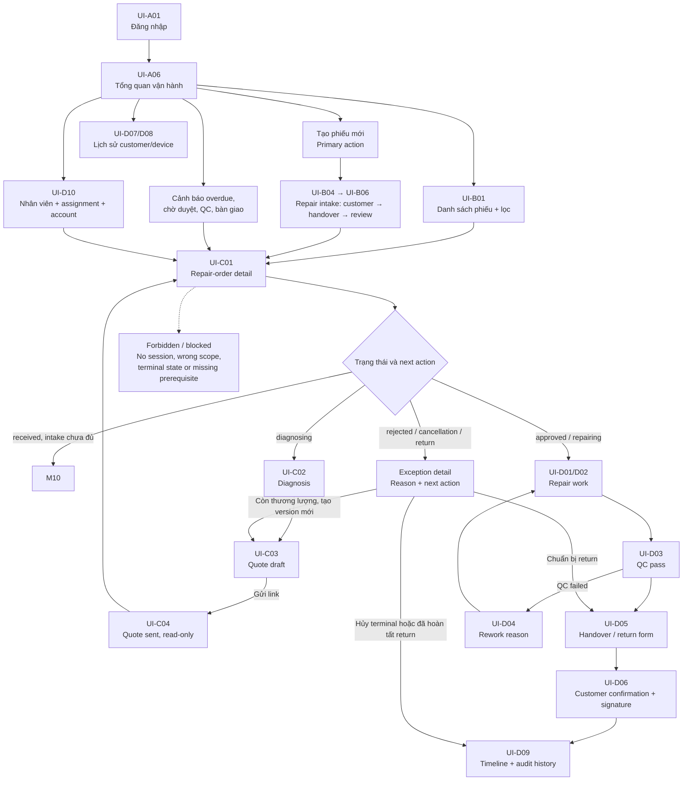
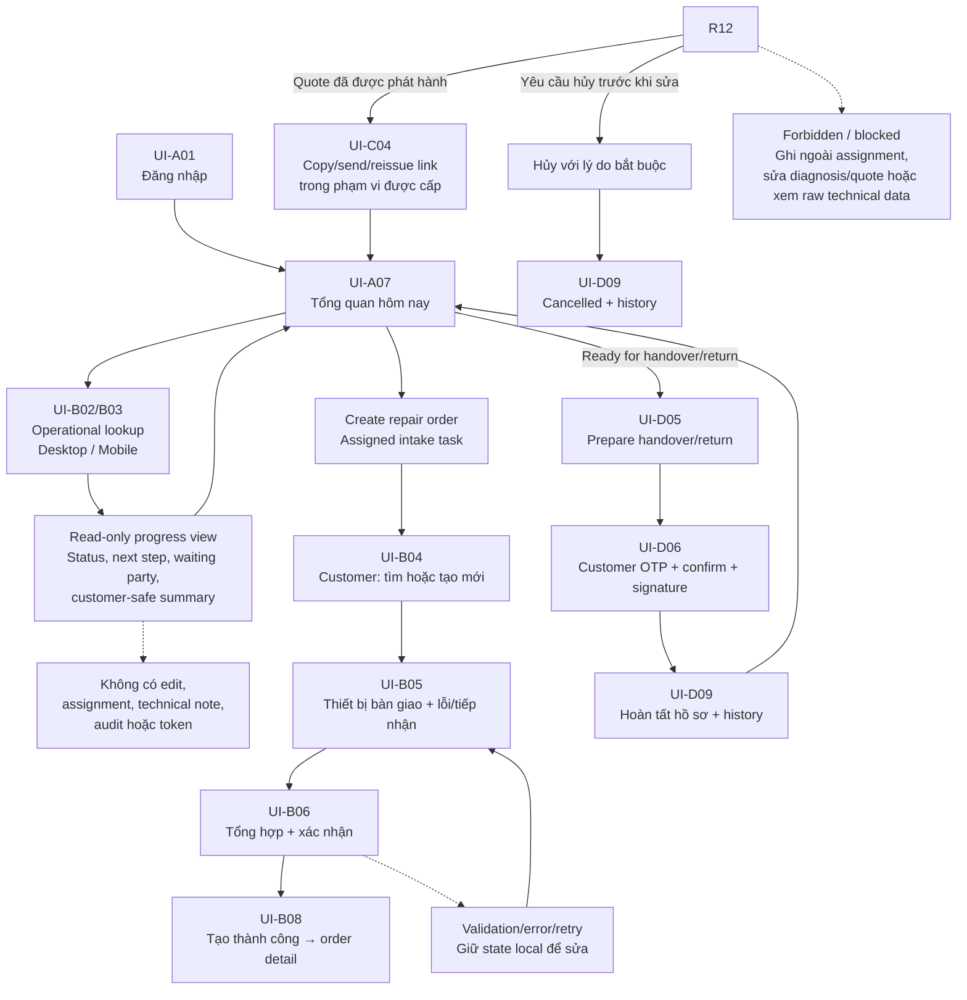
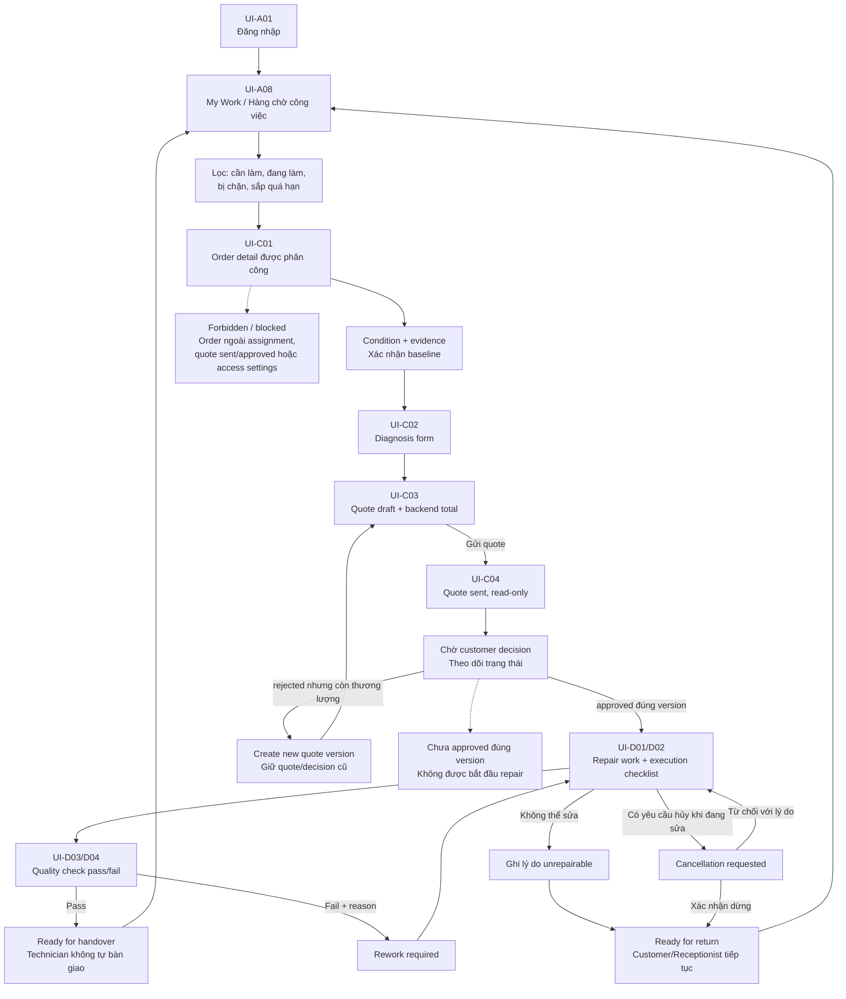
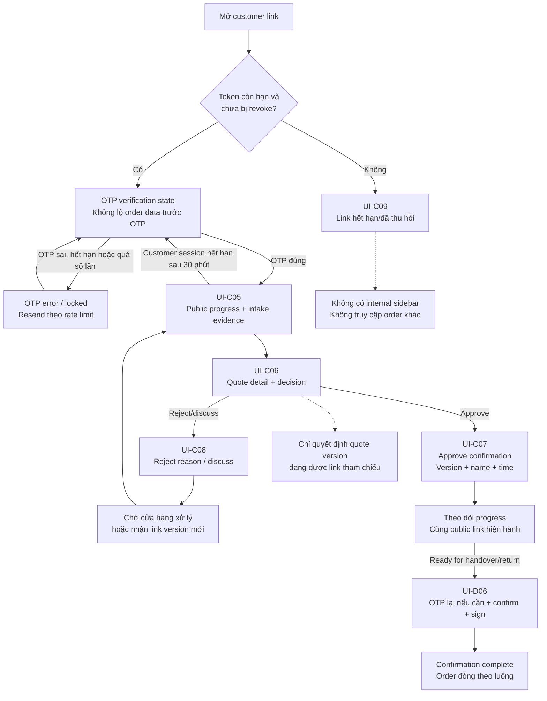

# RepairFlow — UX/UI Requirements

## 1. Document purpose

This document defines the UX/UI requirements for RepairFlow, a workflow management system for personal device repair. The interface must help the shop create a clear evidence trail from device intake through diagnosis, quotation, repair, quality check, and handover. Warranty is deferred to a later module and is not part of the v0 UI.

Each repair order is the central workspace. Customer, device, condition, quotation, work, quality-check, and handover information must be reachable from the same record.

## 2. Design principles

- Every status tells the user the next step and the responsible person.
- Important evidence such as photos, checklists, quotations, and customer decisions is easy to find again.
- Required steps cannot be skipped before a status transition.
- Staff UI contains the operational detail; customer UI shows only necessary, understandable information.
- Primary actions change with the current order status.
- UI copy uses clear terms for staff and customers and does not depend on internal status codes.
- The visual interface is redesigned from scratch for v0; the existing prototype is a functional reference only, not a visual constraint.
- The first visual design pass covers Manager, Receptionist, Technician, and Customer rather than designing only the current prototype routes.
- Vietnamese is the MVP display language.
- Strictly monochrome line SVG icons only; system emojis and multi-colored icons are prohibited across all interfaces to maintain the 85% Slate / 15% Sky Blue system and eliminate visual noise/clutter; avoid icon spamming and keep badges, buttons, and content typography-first.

## 3. Roles and primary entry points

### MVP access model

- Owner/Manager, Receptionist and Technician may see the login screen when an
  active account has been provisioned for them.
- Staff profiles without accounts have no session; the Manager can still
  operate the UI and select the correct staff profile for each step.
- Staff write operations are limited by the active role in the assigned role-set and assigned
  repair orders or tasks.
- Receptionist has a workspace-wide, read-only operational lookup projection so
  they can answer customer calls. This projection does not grant access to
  unrestricted technical notes, audit metadata, credentials, or write actions.
- Customers access a public link with a token and do not need an account.

### Receptionist/Front Desk

Priority tasks:

- Create an order.
- Record condition.
- Send a quotation link.
- Hand over the device.
- Look up the operational progress of any order when a customer asks for an update.
- Actions use the current account session when available; a Manager may still
  attribute an action to a staff profile when operating on their behalf.

### Technician

Priority tasks:

- View assigned work.
- Diagnose.
- Create and update quotations.
- Record repair work.
- Perform quality checks.
- A Technician may have an account with access limited to assigned orders; a
  Technician without an account remains a staff profile.

### Manager/Owner

Priority tasks:

- Monitor the dashboard.
- Assign staff.
- Track overdue and waiting orders.
- Review reports and activity history.

### Customer

No account is required in the MVP. The customer accesses information through a secure link issued for the correct order and quotation.

### Role-based entry screens

- Manager opens the Manager operational dashboard after login.
- Receptionist opens a compact “Today” dashboard after login.
- Technician opens the “My Work” task queue after login.
- Customer opens the public order progress page through a valid link.

### Role-to-screen/capability matrix

Bảng này mô tả phạm vi hiển thị và hành động ở tầng UI. Backend/API vẫn phải
kiểm tra lại mọi quyền; trạng thái `Forbidden` không được thay thế cho
authorization phía server.

| Persona/role | Màn hình mặc định | Quyền đọc | Quyền ghi chính | Phạm vi assignment | Forbidden/blocked state |
| --- | --- | --- | --- | --- | --- |
| Owner | Tổng quan vận hành | Toàn workspace và dữ liệu quản trị theo policy | Quản trị workspace/access, assignment và toàn bộ workflow | Toàn workspace | Chưa đăng nhập, workspace không hợp lệ, thao tác bị khóa bởi terminal state |
| Manager | Tổng quan vận hành | Toàn workspace và dữ liệu vận hành | Điều phối, assignment và xử lý workflow trong phạm vi vận hành | Toàn workspace | Quản lý credential của Owner nếu chưa được cấp quyền riêng; request ngoài workspace |
| Receptionist | Tổng quan hôm nay và operational lookup | Operational projection toàn workspace; không đọc raw technical/audit data | Intake, gửi/cấp lại link hoặc handover khi được giao; ghi nhận hủy trước sửa theo policy | Chỉ order/task được giao cho thao tác ghi; read lookup toàn workspace | Sửa diagnosis/quote, assignment, access settings, audit; order ngoài assignment khi ghi |
| Technician | Hàng chờ công việc / My Work | Order và dữ liệu trực tiếp được phân công | Diagnosis, quote draft, repair, evidence và QC khi có responsibility phù hợp | Assigned order và đúng responsibility | Order ngoài assignment/workspace, quote đã sent/approved, access settings và audit |
| Customer | Public order progress | Public subset của đúng order/link sau OTP hợp lệ | Approve/reject quote hiện hành; xác nhận/ký handover hoặc return | Chỉ order được public link tham chiếu | Internal shell, order khác, quote version cũ, hoặc mọi dữ liệu trước khi OTP hợp lệ |

Staff profile chưa có account không có màn hình, credential hoặc session. Profile
này chỉ được Owner/Manager chọn để assignment hoặc attribution khi thao tác thay
người khác.

### UI flow theo vai trò

Các flow dưới đây mô tả thứ tự màn hình và điểm vào của bốn nhóm persona trong
MVP. Screen ID tham chiếu danh mục tại
[08-ui-design-blueprint-and-stitch-handoff.md](./08-ui-design-blueprint-and-stitch-handoff.md).
Đây là UI flow, không thay thế state machine, permission matrix hoặc rule thực
thi ở Backend/API.

#### 3.2.1. Owner/Manager — điều phối vận hành

Owner/Manager có thể điều phối toàn workspace, nhưng UI vẫn phải hiển thị đúng
điều kiện của trạng thái hiện tại. Các hành động hủy, tạo quote version, revoke
link, thay assignment và xử lý ngoại lệ đều phải quay lại order detail để giữ
timeline/audit nhất quán.

#### 3.2.2. Receptionist — tiếp nhận, tra cứu và bàn giao

Operational lookup cho phép Receptionist đọc projection của mọi order trong
workspace, nhưng mọi thao tác ghi vẫn đi qua order/task được phân công. Luồng
mobile ưu tiên `UI-B03`, `UI-B07` và `UI-D06`; màn hình tra cứu không được biến
thành order detail có quyền chỉnh sửa.

#### 3.2.3. Technician — chẩn đoán, báo giá, sửa chữa và QC

Technician bắt đầu từ hàng chờ việc và chỉ mở order trong phạm vi assignment.
Luồng quote bị từ chối có thể quay lại tạo version mới khi order chưa returned;
luồng QC fail luôn quay lại repair và không được đi thẳng đến handover.

#### 3.2.4. Customer — public link, OTP, quyết định và xác nhận nhận máy

Customer chỉ sử dụng public layout, không đi qua internal shell. Cùng customer
link được dùng cho việc xem tiến độ, quyết định quote và xác nhận/ký handover
hoặc return; mọi dữ liệu public đều bị giới hạn theo order/link hợp lệ.

## 4. Overall business flow

~~~text
Dashboard
    → Create repair order
    → Intake customer and device
    → Record condition and evidence
    → Diagnose
    → Create quotation
    → Send customer link
    → Customer approves or rejects
    → Perform repair
    → Quality check
    → Ready for handover
    → Handover
    → Repair history
~~~

### Internal status flow

~~~text
received
    → diagnosing
    → waiting_for_approval
    → approved | rejected
    → repairing
    → quality_check
    → ready_for_pickup
    → handed_over
~~~

When quality check fails, the order returns to `repairing`.

## 5. Internal navigation

The internal navigation is role-aware but intentionally small:

- **Tổng quan:** role-specific dashboard and today’s priorities.
- **Phiếu sửa chữa:** searchable order list and order detail.
- **Hàng chờ công việc:** role-specific queue; Manager sees coordination work,
  Technician sees assigned tasks, and Receptionist sees intake/handover tasks.
- **Khách hàng:** customer profiles and repair history.
- **Thiết bị và lịch sử:** device lookup by serial number or identifier.
- **Quản trị:** staff, assignments, workspace, and workflow settings; Manager
  and Owner only.

`Tạo phiếu mới` is a prominent action in the shell, not a separate sidebar
item. Notifications remain in the header because they support the current task
instead of being a primary workspace.

The Customer surface has no internal sidebar. Customer and Receptionist
high-frequency mobile tasks use a mobile-first layout; Manager and Technician
workspaces use desktop-first layouts with responsive support.

## 6. Screen and flow requirements

### 6.1. Dashboard

The dashboard must answer quickly:

- How many orders are in each status?
- Which orders are waiting for customer approval?
- Which orders are past their expected completion time?
- Which orders are ready for handover?
- Which staff profiles have assigned work?

Suggested KPI cards:

- Intake/diagnosis in progress.
- Waiting for customer approval.
- Repairing.
- Waiting for quality check.
- Ready for handover.
- Overdue.

Each card links to the corresponding filtered list.

Role-specific dashboard emphasis:

- **Manager:** bottlenecks, overdue orders, waiting approval, unassigned work,
  ready-for-handover orders, and staff workload.
- **Receptionist:** today’s intake, draft orders, orders waiting for customer
  response, ready-for-handover orders, and a quick lookup action.
- **Technician:** the next assigned tasks, due work, blocked work, and pending
  quality checks. The default landing route remains the dedicated My Work
  queue rather than a management KPI dashboard.

### 6.1.1. Receptionist operational lookup

Receptionist can search by order code, customer phone, customer name, or device
identifier and open a read-only progress view for any order in the workspace.
The view must show:

- Current repair stage and plain-language status.
- Completed stages and the next expected stage.
- Whether the order is waiting for the customer, a Technician, QC, or handover.
- A customer-safe diagnosis/error summary when available.
- A summary of the approved or performed repair work when available.
- Expected completion time and last update time.
- Quote, QC, and handover status summaries when relevant.

The view must not show edit controls. Private audit metadata, credentials,
customer-link tokens, and raw internal technical notes remain restricted.

### 6.2. Repair-order list

Each order row displays:

- Order code.
- Customer name.
- Device.
- Status.
- Primary staff profile.
- Intake date.
- Expected completion date.
- An overdue indicator when applicable.

Minimum filters:

- Status.
- Staff profile.
- Intake date.
- Overdue orders.
- Orders waiting for the customer.

### 6.3. Create repair intake

The create flow is a three-stage workflow in one screen. The user must review
the complete intake before confirming. C2 keeps the state in the current
workflow and does not introduce server-side draft/resume semantics.

#### Stage 1: Search or create a customer

The same surface provides two explicit modes:

- Search by phone number or email and select an existing customer.
- Switch to a basic new-customer form with name, phone, email and notes.

The new-customer form is available by choice; it is not shown only after a
failed search. When a normalized phone already exists, suggest the existing
profile and prevent a duplicate record.

#### Stage 2: Record the device handed over and repair intake

The user always fills the device brought to the shop. The flow does not require
selecting a device from the customer's existing device list.

The form includes the fields frozen by the API/domain contract, such as:

- Device type, brand, model and serial/identifier when available.
- Handover condition, received accessories and handover notes.
- Customer-reported issue and intake notes.

Detailed condition checklist, evidence persistence/validation and intake
completion remain in the C3 boundary. The intake surface may collect initial
condition photos during Stage 2 as local evidence candidates; c2-007/c2-008
hand them to the C3 evidence boundary after the order exists. Stage 2 must not
complete evidence or transition the order to `diagnosing`.

#### Stage 3: Review and confirm

Show a compact summary of customer, device, handover and repair information.
The user can go back and edit local state. Only `Xác nhận tạo phiếu` submits the
atomic intake command. A successful response creates a human-readable,
workspace-unique order code such as `RF-20260911-001` and starts at `received`.

### 6.4. Record condition and evidence

This is required before diagnosis or repair begins. The interface combines a checklist, notes, and photos.

Suggested checks:

- Exterior: scratches, dents, cracks, and breaks.
- Screen.
- Camera.
- Speaker and microphone.
- Buttons.
- Charging port.
- Wi-Fi and Bluetooth.
- Power state.
- Included accessories.
- Additional notes.

The MVP requires at least one condition photo before intake can be completed.
There is no upper limit on the number of photos. Photos display as thumbnails,
support captions, and can be marked important. The UI may guide the user to
capture the front, back, edges, and damaged area without requiring every angle.

The initial photo capture entry point may be shown in Stage 2 for the person
receiving the device. C3 remains responsible for persisting and validating the
evidence, enforcing the minimum-photo rule, and deciding when the order may
move to diagnosis.

If the minimum checklist or evidence is incomplete, show:

~~~text
Condition record is incomplete. The order cannot move to diagnosis.
~~~

### 6.5. Repair-order detail

This is the central staff workspace.

#### Header

Display:

- Order code.
- Customer.
- Device.
- Current status.
- Primary and related staff profiles.
- Expected completion date.
- Primary action for the current status.

Suggested actions:

| Status | Display label | Primary action |
| --- | --- | --- |
| `received` | Received | Start diagnosis |
| `diagnosing` | Diagnosing | Create quotation |
| `waiting_for_approval` | Waiting for customer approval | Copy or send link |
| `approved` | Approved | Start repair |
| `repairing` | Repairing | Complete repair |
| `quality_check` | Quality check | Record result |
| `ready_for_pickup` | Ready for handover | Create handover record |

#### Order content

Use sections or tabs:

1. Overview.
2. Condition and evidence.
3. Diagnosis and quotation.
4. Repair work.
5. Quality check.
6. Handover.
7. History timeline.

The timeline should remain visible on the side or at the end of the page. It includes time, actor, action, note, and related documents.

Example:

~~~text
09:10 — Linh received the device
09:45 — Nam completed the diagnosis
10:20 — Quotation version 1 sent
11:05 — Customer approved the quotation
13:30 — Repair completed
14:00 — Quality check passed
~~~

### 6.6. Diagnosis and quotation

#### Diagnosis

The form includes:

- Test findings.
- Root cause.
- Proposed solution.
- Expected repair duration.
- Diagnosing staff profile.
- Technical photos or notes.

#### Quotation

Each quotation line includes:

- Type: part or labor.
- Description.
- Quantity.
- Unit price.
- Replacement or repair reason.
- Expected duration.

The quotation footer displays subtotal, total, customer note, and quotation version.

Quotation actions are **Save draft**, **Send customer link**, and **Create new version**. Sent or approved quotations are read-only. Any later change creates a new version and requires a new customer decision.

### 6.7. Customer link interface

Customers do not create accounts. The public page focuses on information to review and the decision to make.

Before showing any order information, the page must request an OTP sent to the
registered customer or authorized recipient phone number/email. A valid token
without a valid OTP must not reveal the order, quote, status, evidence or
handover/return confirmation form.

Suggested content:

1. Shop name, order code, and device.
2. Repair progress.
3. Device condition at intake.
4. Diagnosis result.
5. Quotation details.
6. Expected completion time.
7. Relevant photos.
8. **Approve repair** button.
9. **Reject or discuss** button.

When the customer approves, show a confirmation step with the confirming name, quotation version, and time. After recording the decision, disable the approval button to prevent duplicate submissions.

When the order is ready for handover or return, the same public link also
shows a confirmation step for the recipient to confirm receipt and sign. The
order cannot be closed as `handed_over` or `returned` without this confirmation.

### 6.8. Repair and quality check

#### Repair

The technical work screen includes:

- Approved work list.
- Execution checklist.
- Progress notes.
- Start and end time.
- After-repair photos.
- Actual parts used.

The UI clearly distinguishes four work states: **proposed**, **approved**, **performed**, and **checked**.

#### Quality check

The checklist should include:

- Whether the original issue was resolved.
- Whether the device starts normally.
- Whether related functions work.
- Whether new issues appeared.
- Exterior condition after repair.
- After-repair photos.
- Pass/fail conclusion.
- Remaining limitations.

When the check fails, return the order to `repairing`; it cannot go directly to handover.

### 6.9. Handover

The handover form includes:

- Recipient name.
- Handover date and time.
- Returned accessories.
- Final condition.
- Notes.
- Handover confirmation.
- Customer-link confirmation and signature.
- Handover staff profile.

After saving:

- Move the order to `handed_over`.
- Lock important order information.
- Add the order to customer and device history.

## 7. Error and exception states

UX must clearly handle:

- Expired or revoked customer links.
- Customer rejection.
- A quotation changed after customer approval.
- Incomplete condition checklist.
- Missing evidence photos.
- Failed quality check.
- An order past its expected completion time.
- A device with another open repair order.
- An inactive staff profile that still owns an assignment.

## 8. MVP screen list

1. Internal login by email for provisioned staff accounts.
2. Role-aware internal app shell.
3. Manager operational dashboard.
4. Receptionist compact Today dashboard.
5. Technician My Work task queue.
6. Repair-order list.
7. Receptionist operational lookup (read-only).
8. Repair intake workflow with customer search/create, device handover form and review/confirm.
9. Repair-order detail.
10. Condition and photo evidence.
11. Diagnosis.
12. Versioned quotation.
13. Customer public page.
14. Repair checklist.
15. Quality check.
16. Handover.
17. Customer profile.
18. Device profile.
19. Timeline and basic audit log.

## 9. UX/UI acceptance criteria

- Users always see the current order status and next step.
- Manager, Receptionist, and Technician land on role-appropriate entry screens.
- Receptionist can read the operational progress of any workspace order without
  receiving write access to that order.
- The repair-intake flow lets the user search/create the customer, record the
  handed-over device, review the complete data and confirm before saving.
- Intake cannot be completed without at least one condition photo; additional
  photos remain unlimited.
- Owner/Manager can create an order and attribute the Receptionist profile without leaving the flow.
- Managers can select and record only active Technician profiles; Technician accounts, when provisioned, remain limited to assigned work.
- Customers can understand the quotation and decide without an account.
- Repair cannot start without an `approved` decision for the correct quotation version.
- Handover cannot occur before the quality checklist passes.
- Users can trace an order to photos, quotations, customer decisions, checklists, and handover.
- The UI clearly handles expired links, new quotation versions, overdue orders, and failed quality checks.

## 10. Related documents

- [Product README](../../README.md)
- [Architecture and system requirements](./03-business-and-domain-requirements.md)
- [Authentication and authorization](./07-authentication-and-authorization.md)
