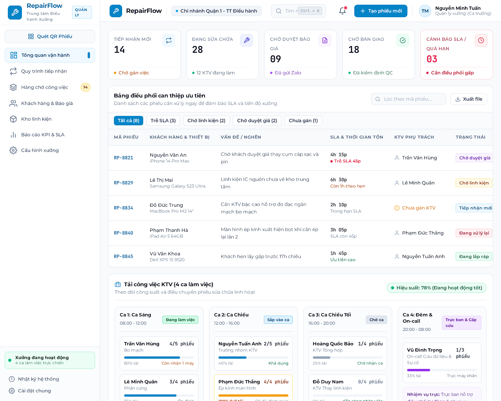
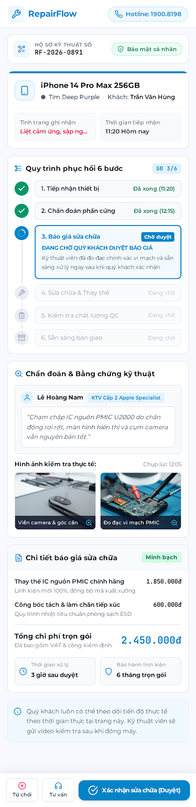

# RepairFlow v0 — UI design blueprint và Stitch/Antigravity handoff

> Trạng thái: `DECIDED — UI direction và handoff baseline`
>
> Ngày chốt: 2026-09-15

## 1. Mục đích và phạm vi

Tài liệu này là cầu nối giữa Product, Google Stitch và AI dev (Antigravity)
trước khi triển khai giao diện RepairFlow. Tài liệu chốt cách tổ chức UI,
persona, quyền hiển thị, viewport, danh sách hình mẫu và cách dùng hình Stitch
trong quá trình triển khai.

Tài liệu này **không thay thế** use case, business rule, database requirement,
authentication policy hoặc API contract. Khi có xung đột, đọc theo thứ tự:

1. [`02-use-cases.md`](./02-use-cases.md)
2. [`03-business-and-domain-requirements.md`](./03-business-and-domain-requirements.md)
3. [`06-ui-requirements.md`](./06-ui-requirements.md)
4. [`07-authentication-and-authorization.md`](./07-authentication-and-authorization.md)
5. Tài liệu này cho quyết định visual/handoff.

Hình Stitch là visual reference đã được Product duyệt. Hình không tự tạo ra
business rule, API field, permission mới hoặc state transition mới.

## 2. Các quyết định UI đã chốt

### 2.1. Hướng thiết kế

- Thiết kế lại giao diện từ đầu; không coi layout hoặc màu sắc của prototype
  hiện tại là ràng buộc.
- Giữ lại nghiệp vụ và chuỗi xử lý cốt lõi của RepairFlow.
- Thiết kế đủ bốn persona: Manager, Receptionist, Technician và Customer.
- Ưu tiên luồng chính end-to-end trước, sau đó mới hoàn thiện các ngoại lệ.
- MVP dùng tiếng Việt.
- Không có Google Login hoặc OAuth. Staff đăng nhập bằng email của account do
  Owner/Manager tạo.

### 2.2. Màn hình vào hệ thống theo vai trò

| Vai trò | Màn hình mặc định | Mục tiêu chính |
| --- | --- | --- |
| Manager/Owner | Tổng quan vận hành | Biết việc nào đang tắc, quá hạn, chờ duyệt, chưa phân công hoặc sẵn sàng bàn giao. |
| Receptionist | Tổng quan hôm nay | Tiếp nhận, tra cứu tiến độ khi khách gọi, theo dõi phiếu nháp và bàn giao. |
| Technician | Hàng chờ công việc / My Work | Biết việc tiếp theo cần làm, việc bị chặn và việc sắp quá hạn. |
| Customer | Public order progress qua link | Hiểu hiện trạng, lỗi, báo giá, tiến độ và quyết định sửa chữa. |

### 2.3. Điều hướng nội bộ

Sidebar dùng chung, tối giản và role-aware:

- **Tổng quan**
- **Phiếu sửa chữa**
- **Hàng chờ công việc**
- **Khách hàng**
- **Thiết bị và lịch sử**
- **Quản trị** — chỉ Manager/Owner

`Tạo phiếu mới` là primary action trong header hoặc màn hình Tổng quan, không
phải một mục sidebar riêng. Thông báo nằm ở header vì nó hỗ trợ công việc
hiện tại, không phải một workspace chính.

Nội dung của `Hàng chờ công việc` thay đổi theo vai trò:

- Manager: việc chưa phân công, phiếu quá hạn, phiếu chờ duyệt, QC cần xử lý,
  bàn giao cần điều phối.
- Receptionist: tiếp nhận, phiếu nháp, gửi link, theo dõi phản hồi, bàn giao.
- Technician: việc được giao, diagnosis, repair, evidence và QC.

Customer không dùng sidebar nội bộ.

### 2.4. Receptionist operational lookup

Receptionist được tra cứu mọi order trong cùng workspace ở chế độ read-only để
trả lời khách. Màn hình tra cứu phải cho biết:

- Mã phiếu, khách hàng và thiết bị.
- Giai đoạn hiện tại bằng ngôn ngữ dễ hiểu.
- Các giai đoạn đã hoàn thành.
- Bước tiếp theo.
- Đang chờ khách, Technician, QC hay bàn giao.
- Tóm tắt lỗi/chẩn đoán có thể trao đổi với khách.
- Tóm tắt phương án đã duyệt hoặc công việc đã thực hiện.
- Tiến độ sửa chữa.
- Thời gian cập nhật gần nhất và thời gian dự kiến hoàn thành.
- Trạng thái báo giá, QC và bàn giao khi liên quan.

Màn hình này không có nút sửa, đổi trạng thái, phân công, thêm/xóa ảnh hoặc
thay đổi báo giá. Không hiển thị raw internal notes, audit metadata, token,
credential hoặc session secret.

Quyền ghi của Receptionist chỉ áp dụng cho order/tác vụ được phân công và các
trách nhiệm đã được cấp như intake hoặc handover.

### 2.5. Tạo phiếu và hiện trạng

Luồng tạo phiếu là wizard bốn bước:

1. Tìm khách hàng bằng số điện thoại hoặc tạo khách hàng mới.
2. Tìm/tạo thiết bị và nhập lỗi khách mô tả.
3. Nhập thông tin tiếp nhận, checklist hiện trạng và ảnh.
4. Review, lưu nháp hoặc hoàn tất intake.

Mỗi bước có `Lưu nháp` và `Tiếp tục sau`. Phiếu nháp có thể thiếu dữ liệu và
được mở lại. Không được chuyển sang diagnosis khi chưa đủ điều kiện intake.

Intake cần tối thiểu một ảnh hiện trạng; không giới hạn số lượng ảnh thêm vào.
Hệ thống không bắt buộc người dùng phải chụp đủ mọi góc, nhưng có thể gợi ý
ảnh mặt trước, mặt sau, cạnh máy và vùng hư hỏng.

### 2.6. Viewport chuẩn

- Internal desktop: `1440 × 1024 px`.
- Customer mobile: `390 × 844 px`.
- Receptionist mobile: `390 × 844 px`.
- Kiểm tra responsive thêm ở `1280 × 800 px` và `768 × 1024 px`; không cần tạo
  toàn bộ frame Stitch riêng cho hai kích thước kiểm tra này.

Manager và Technician là desktop-first nhưng vẫn phải responsive. Receptionist
và Customer là mobile-first cho các tác vụ có tần suất cao.

## 3. Danh mục hình mẫu cần tạo bằng Stitch

Mỗi ID là một frame hoặc một trạng thái có thể bàn giao. Hình mẫu happy path
được tạo trước; các trạng thái đặc biệt phải có ghi chú acceptance ngay cả khi
chưa cần tạo frame riêng trong batch đầu.

### Batch A — Shell, access và dashboard

| ID | Frame | Viewport |
| --- | --- | --- |
| UI-A01 | Login bằng email | Desktop |
| UI-A02 | Login lỗi / email hoặc mật khẩu không đúng | Desktop |
| UI-A03 | Account inactive, locked hoặc session hết hạn | Desktop |
| UI-A04 | App shell nội bộ desktop | Desktop |
| UI-A05 | App shell mobile | Mobile |
| UI-A06 | Manager — Tổng quan vận hành | Desktop |
| UI-A07 | Receptionist — Tổng quan hôm nay | Desktop |
| UI-A08 | Technician — Hàng chờ công việc | Desktop |

### Batch B — Tra cứu và tạo phiếu

| ID | Frame | Viewport |
| --- | --- | --- |
| UI-B01 | Danh sách phiếu và tìm kiếm/lọc | Desktop |
| UI-B02 | Receptionist tra cứu tiến độ read-only | Desktop |
| UI-B03 | Receptionist tra cứu tiến độ | Mobile |
| UI-B04 | Wizard bước 1: tìm/tạo khách hàng | Desktop |
| UI-B05 | Wizard bước 2: tìm/tạo thiết bị | Desktop |
| UI-B06 | Wizard bước 3: lỗi, phụ kiện và thông tin tiếp nhận | Desktop |
| UI-B07 | Wizard bước 3: checklist và ảnh hiện trạng | Mobile |
| UI-B08 | Wizard bước 4: review và lưu nháp | Desktop |
| UI-B09 | Mở lại phiếu nháp để tiếp tục | Mobile |

### Batch C — Order detail, diagnosis, quotation và Customer

| ID | Frame | Viewport |
| --- | --- | --- |
| UI-C01 | Order detail — trạng thái received/diagnosing | Desktop |
| UI-C02 | Diagnosis form | Desktop |
| UI-C03 | Quote draft có thể chỉnh sửa | Desktop |
| UI-C04 | Quote đã gửi, read-only | Desktop |
| UI-C05 | Customer public page xem hiện trạng và chẩn đoán | Mobile |
| UI-C06 | Customer xem chi tiết báo giá và approve | Mobile |
| UI-C07 | Customer xác nhận approve thành công | Mobile |
| UI-C08 | Customer reject/discuss | Mobile |
| UI-C09 | Link hết hạn hoặc đã bị thu hồi | Mobile |

### Batch D — Repair, QC, handover và history

| ID | Frame | Viewport |
| --- | --- | --- |
| UI-D01 | Repair work và execution checklist | Desktop |
| UI-D02 | Repair work trên mobile cho tác vụ nhanh | Mobile |
| UI-D03 | Quality check — pass | Desktop |
| UI-D04 | Quality check — fail và rework | Desktop |
| UI-D05 | Handover form | Desktop |
| UI-D06 | Customer-link handover/return confirmation | Mobile |
| UI-D07 | Customer profile và repair history | Desktop |
| UI-D08 | Device profile và history theo identifier | Desktop |
| UI-D09 | Timeline nghiệp vụ và audit view theo quyền | Desktop |
| UI-D10 | Nhân viên, assignment và account settings | Desktop |

## 3.1. Các frame Stitch đã import

Các frame dưới đây được import từ `tmp/stitch_repairflow_v0` để làm visual
reference cho handoff. Ảnh preview được quản lý tập trung trong
[`assets/images/`](../../assets/images/); mã HTML gốc được lưu trong
[`ui-design/stitch/`](./ui-design/stitch/). Việc import frame không tạo thêm
business rule, API contract hoặc permission mới. Xem danh mục nhanh tại
[`ui-design/screen-index.md`](./ui-design/screen-index.md).

| ID | Persona và trạng thái | Viewport | Preview | Mã giao diện |
| --- | --- | --- | --- | --- |
| UI-A06 | Manager — tổng quan vận hành, happy path | Desktop `1440×1024` | [PNG](../../assets/images/UI-A06-manager-operations-overview-v1.png) | [HTML](./ui-design/stitch/batch-a/UI-A06-manager-operations-overview-v1.html) |
| UI-A08 | Technician — hàng chờ công việc, có cảnh báo SLA | Desktop `1440×1024` | Chưa có PNG hợp lệ trong export | [HTML](./ui-design/stitch/batch-a/UI-A08-technician-my-work-v1.html) |
| UI-B02 | Receptionist — tra cứu tiến độ read-only | Desktop `1440×1024` | Chưa có PNG hợp lệ trong export | [HTML](./ui-design/stitch/batch-b/UI-B02-receptionist-operational-lookup-v1.html) |
| UI-C05/C06 | Customer — theo dõi tiến độ và xem/duyệt báo giá | Mobile `390×844` | [PNG](../../assets/images/UI-C05-C06-customer-progress-quote-v1.png) | [HTML](./ui-design/stitch/batch-c/UI-C05-C06-customer-progress-quote-v1.html) |

### Preview nhanh





Acceptance baseline của các frame đã import:

- Màn hình Manager và Technician là desktop-first; Technician dùng danh sách
  ưu tiên, không dùng Kanban kéo-thả làm luồng chính.
- Màn hình Receptionist chỉ hiển thị operational progress ở chế độ read-only;
  không có action sửa, phân công, đổi trạng thái hoặc thay đổi báo giá.
- Màn hình Customer không dùng sidebar nội bộ và thể hiện được tiến độ, chẩn
  đoán, báo giá cùng hành động duyệt/từ chối hoặc trao đổi.
- Các trạng thái loading, empty, error, OTP, link hết hạn/thu hồi và các state
  đặc biệt khác vẫn tuân theo [06-ui-requirements.md](./06-ui-requirements.md),
  dù chưa có frame riêng trong batch import này.

## 4. Quy tắc tạo prompt cho Stitch

Không yêu cầu Stitch thiết kế toàn bộ sản phẩm trong một prompt. Tạo từng batch
và từng frame để giữ được sự nhất quán, dễ review và dễ truy vết.

### 4.1. Master prompt dùng cho mọi frame

```text
Thiết kế giao diện web cho RepairFlow, một hệ thống quản lý quy trình sửa chữa
thiết bị cá nhân. Đây là thiết kế mới hoàn toàn từ đầu, không sao chép layout
hoặc visual của prototype cũ.

Ngôn ngữ hiển thị: tiếng Việt. Sản phẩm có bốn persona: Manager, Receptionist,
Technician và Customer. Luồng nghiệp vụ trung tâm là: tiếp nhận → ghi hiện trạng
và ảnh → chẩn đoán → báo giá → khách duyệt/từ chối → sửa chữa → kiểm tra chất
lượng → bàn giao.

Ưu tiên thiết kế trực quan, ít thao tác thừa, luôn hiển thị trạng thái hiện tại,
bước tiếp theo, người/phía đang chờ và thời gian dự kiến. Dùng dữ liệu mẫu
thực tế bằng tiếng Việt, nhưng không dùng dữ liệu cá nhân thật.

Không thêm Google Login, OAuth, thanh toán, kho linh kiện, AI chẩn đoán hoặc
multi-branch. Không tự thêm business rule mới. Mỗi màn hình phải có primary
action rõ ràng và phân biệt read-only với editable.

Viewport của frame này sẽ được nêu trong prompt riêng. Tạo một frame hoàn chỉnh,
có thể dùng làm visual handoff cho AI dev, không chỉ là wireframe.
```

### 4.2. Template prompt cho từng frame

```text
Tạo frame [ID] — [TÊN MÀN HÌNH].

Persona: [Manager/Receptionist/Technician/Customer]
Viewport: [1440x1024 hoặc 390x844]
Điểm vào: [người dùng đến màn hình này từ đâu]
Mục tiêu: [một nhiệm vụ chính cần hoàn thành]

Dữ liệu cần hiển thị:
- [field 1]
- [field 2]
- [field 3]

Primary action: [tên hành động]
Secondary actions: [các hành động phụ]
Quyền của persona: [được xem gì, được sửa gì, bị khóa gì]
Trạng thái của frame: [happy path/loading/empty/error/read-only/success]

Yêu cầu UX:
- Hiển thị rõ trạng thái hiện tại và bước tiếp theo.
- Nếu là read-only, không render edit control; chỉ cho phép copy/search/open
  theo đúng phạm vi.
- Copy bằng tiếng Việt, ngắn, dễ hiểu với nhân viên cửa hàng.
- Không đưa thêm tính năng ngoài tài liệu RepairFlow v0.
```

### 4.3. Prompt mẫu cho Receptionist operational lookup

```text
Tạo frame UI-B02 — “Tra cứu tiến độ sửa chữa” cho Receptionist.

Persona: Receptionist/Front Desk
Viewport: 1440x1024
Điểm vào: Receptionist tìm bằng số điện thoại, mã phiếu, tên khách hoặc mã
thiết bị từ ô tìm kiếm toàn cục.
Mục tiêu: Trong vài giây có thể trả lời khách phiếu đang ở giai đoạn nào, đã
xử lý gì, đang chờ ai và khi nào dự kiến hoàn tất.

Thiết kế một trang đọc nhanh gồm:
- Thanh tìm kiếm và thông tin định danh phiếu.
- Thẻ trạng thái lớn: “Đang sửa chữa” và tiến độ hiện tại.
- Stepper các giai đoạn: tiếp nhận, chẩn đoán, báo giá, sửa chữa, QC, bàn giao.
- Timeline ngắn với thời điểm cập nhật gần nhất.
- “Tóm tắt để trao đổi với khách”: lỗi đã phát hiện, phương án đang xử lý,
  việc đang chờ và thời gian dự kiến.
- Tóm tắt báo giá/QC/bàn giao nếu liên quan.

Đây là màn hình read-only. Không hiển thị nút sửa, đổi trạng thái, phân công,
thêm ảnh hoặc thay đổi báo giá. Không hiển thị raw internal notes, audit log,
token hoặc thông tin credential. Giao diện phải rõ ràng, ít mật độ, ưu tiên đọc
nhanh khi đang nghe điện thoại.
```

### 4.4. Prompt mẫu cho Technician My Work

```text
Tạo frame UI-A08 — “Hàng chờ công việc” cho Technician.

Persona: Technician
Viewport: 1440x1024
Điểm vào: Technician đăng nhập và được đưa thẳng vào hàng chờ việc được giao.
Mục tiêu: Biết ngay việc nào cần làm tiếp theo và mở đúng phiếu để thao tác.

Dùng layout danh sách theo mức ưu tiên, không dùng Kanban kéo-thả làm layout
chính. Mỗi hàng gồm mã phiếu, khách/thiết bị, việc tiếp theo, trạng thái, hạn
xử lý, lý do bị chặn nếu có và một primary action như “Bắt đầu chẩn đoán”,
“Tiếp tục sửa” hoặc “Thực hiện QC”.

Có nhóm/lọc “Cần làm”, “Đang làm”, “Bị chặn”, “Sắp quá hạn”. Chỉ hiển thị các
phiếu và dữ liệu Technician được phép xem. Không hiển thị action quản trị,
phân công hoặc chỉnh sửa quote đã gửi/duyệt.
```

## 5. Quy trình bàn giao cho Antigravity

### 5.1. Gói bàn giao bắt buộc

Antigravity phải nhận đủ các thành phần sau:

1. `AGENTS.md` ở root project.
2. `docs/README.md`.
3. `docs/v0/README.md`.
4. `docs/v0/02-use-cases.md`.
5. `docs/v0/03-business-and-domain-requirements.md`.
6. `docs/v0/06-ui-requirements.md`.
7. `docs/v0/07-authentication-and-authorization.md`.
8. Tài liệu này.
9. Các frame Stitch đã Product duyệt, đặt tên theo ID `UI-A01`, `UI-A02`, ...
10. Ghi chú acceptance của các state chưa có frame riêng.

Ảnh nên được lưu trong cấu trúc đề xuất:

```text
docs/v0/ui-design/
├── stitch/
│   ├── batch-a/
│   ├── batch-b/
│   ├── batch-c/
│   └── batch-d/
├── approved/
└── screen-index.md
```

Tên file nên gồm ID, tên màn hình và version, ví dụ:

```text
UI-B02-receptionist-operational-lookup-v1.png
UI-A08-technician-my-work-v1.png
```

### 5.2. Prompt bàn giao sẵn cho Antigravity

```text
Bạn đang triển khai UI cho RepairFlow v0.

Trước khi sửa code, hãy đọc:
- AGENTS.md
- docs/README.md
- docs/v0/README.md
- docs/v0/02-use-cases.md
- docs/v0/03-business-and-domain-requirements.md
- docs/v0/06-ui-requirements.md
- docs/v0/07-authentication-and-authorization.md
- docs/v0/08-ui-design-blueprint-and-stitch-handoff.md

Mục tiêu: triển khai giao diện theo các frame Stitch đã được Product duyệt.
Frame Stitch là visual reference; business rule và permission lấy từ tài liệu
v0, không tự suy luận từ hình ảnh.

Nguyên tắc bắt buộc:
- Thiết kế mới từ đầu theo screen ID và prompt đã duyệt.
- Hiển thị tiếng Việt.
- Có đủ Manager, Receptionist, Technician và Customer.
- Manager vào Tổng quan; Receptionist vào Tổng quan hôm nay; Technician vào
  Hàng chờ công việc; Customer dùng public link mobile.
- Receptionist được tra cứu read-only operational progress của mọi order trong
  workspace, nhưng chỉ được ghi trên task/order được phân công.
- Tạo phiếu là wizard nhiều bước, có lưu nháp và tiếp tục sau.
- Intake cần tối thiểu một ảnh, không giới hạn ảnh bổ sung.
- Không thêm Google Login, OAuth, thanh toán, inventory, AI diagnosis hoặc
  multi-branch.
- Không sửa API, database hoặc business rule khi task chỉ yêu cầu UI.
- Không sửa file bundle được generate trực tiếp; sửa source và build theo rule
  của project.
- Nếu frame Stitch mâu thuẫn với tài liệu hoặc thiếu requirement, dừng ở điểm
  đó và nêu rõ mâu thuẫn; không tự chọn một phương án.

Trước khi code:
1. Lập bảng mapping screen ID → file/component/route dự kiến.
2. Xác định trạng thái loading, empty, error, disabled và read-only của frame.
3. Chỉ ra phần nào là mock boundary và phần nào cần API thật sau khi contract
   được Product chốt.
4. Chờ xác nhận nếu phát hiện xung đột product requirement.

Triển khai theo batch A → B → C → D. Sau mỗi batch, kiểm tra visual với frame
Stitch, kiểm tra responsive ở viewport chuẩn và báo cáo các điểm lệch.
```

### 5.3. Cách dùng Stitch và Antigravity theo từng batch

```text
Product chốt yêu cầu
  → Viết prompt theo screen ID
  → Stitch tạo frame
  → Product duyệt frame và state
  → Lưu ảnh + prompt + ghi chú acceptance
  → Antigravity đọc docs và frame
  → Antigravity lập mapping trước khi code
  → Implement một batch
  → Review visual và flow
  → Chốt batch rồi chuyển batch tiếp theo
```

Không gửi riêng một ảnh cho Antigravity mà thiếu screen ID, persona, viewport,
primary action, quyền và trạng thái. Những thông tin đó là phần bắt buộc của
handoff.

## 6. Tiêu chí nghiệm thu visual/handoff

- Mọi frame có ID duy nhất, persona, viewport và trạng thái rõ ràng.
- Visible copy dùng tiếng Việt và không sử dụng internal status code thay cho
  ngôn ngữ người dùng.
- Mỗi màn hình cho biết trạng thái hiện tại, bước tiếp theo và primary action.
- Manager, Receptionist và Technician có entry screen khác nhau đúng vai trò.
- Receptionist operational lookup không có quyền sửa và hiển thị đủ tiến độ để
  trả lời khách.
- Technician dùng danh sách hàng chờ, không dùng Kanban làm luồng chính.
- Wizard tạo phiếu có save draft/resume.
- Intake yêu cầu tối thiểu một ảnh và cho phép thêm ảnh không giới hạn.
- Customer mobile page có đủ xem tiến độ, báo giá, approve, reject/discuss và
  link expired/revoked.
- Customer link phải có bước OTP trước khi hiển thị dữ liệu; cùng link dùng để
  xác nhận và ký khi bàn giao hoặc hoàn trả.
- Antigravity không được coi hình Stitch là API contract hoặc permission
  contract.
- Mỗi batch được review trên frame Stitch trước khi mở batch tiếp theo.

## 7. Các điểm vẫn thuộc requirements closure

Tài liệu này là một phần của v0 baseline đã chốt và được dùng cho UI/handoff.
Các thay đổi mới về cancellation/reopen, retention, concurrency, deployment
hoặc chính sách nghiệp vụ phải được ghi nhận trong source-of-truth tương ứng;
hình Stitch không tự tạo thêm business rule hoặc permission. Warranty vẫn nằm
ngoài phạm vi v0 và sẽ có đặc tả riêng khi mở module sau này.

## 8. Tài liệu liên quan

- [v0 documentation index](./README.md)
- [Use cases](./02-use-cases.md)
- [Business and domain requirements](./03-business-and-domain-requirements.md)
- [UI requirements](./06-ui-requirements.md)
- [Authentication and authorization](./07-authentication-and-authorization.md)
